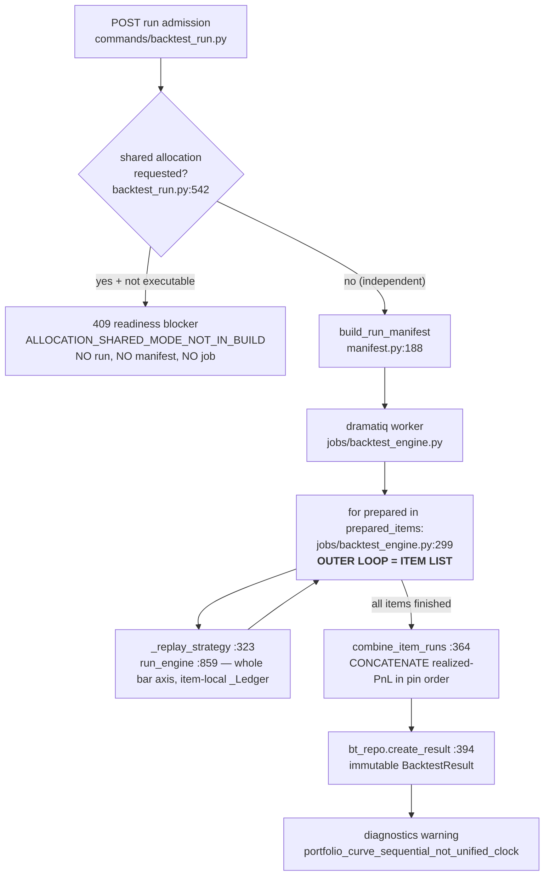
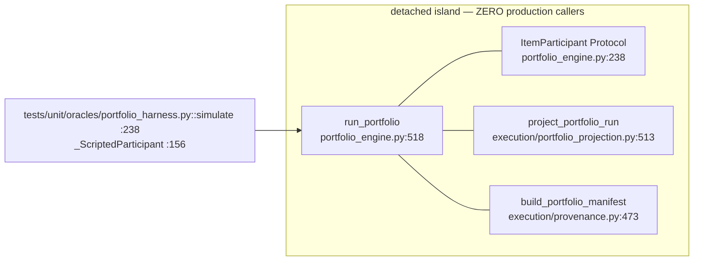
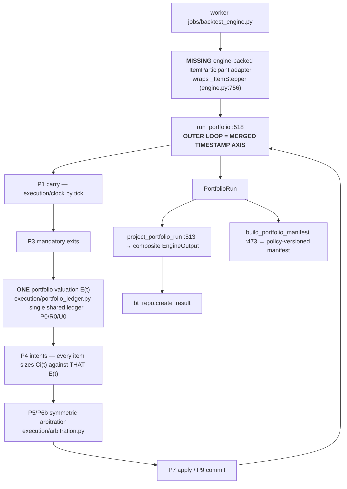

<!-- doc-status: historical -->
> **HISTORICAL RECORD — bu belge GÜNCEL GERÇEK DEĞİLDİR.** Yazıldığı andaki durumu
> kaydeder; SHA'lar, sayılar, alembic head'i ve "next" maddeleri bayat olabilir.
> Güncel otorite: `CLAUDE.md` §Current position + `docs/generated/repository_facts.md`
> (üretilmiş, CI'da `--check` ile kapılı).

# P-A1 — Shared portfolio subsystem, forensic re-verify

**Read-only audit. No production code, migration, test expectation, `ENGINE_VERSION`, feature
flag or issue state was changed.**

---

## Base SHA

| | |
|---|---|
| **Measured on** | `0d8bf8f7134d86d77a7eee10023dadd3d80aab0d` (`origin/main`) |
| Prompt's expected base | `31ed27dfc1f3bf7448b0e03c7c732d22d8b758c4` |
| Delta | **1 commit ahead** — `0d8bf8f docs: name the PR behind every landed slice heading (#702)`, docs-only |
| Consequence | The §0 table was re-measured line by line rather than accepted. `#702` touches no `backend/src` file, so no §0 row could have moved from it — and none did. |
| alembic head | `0043_i08_registry_strategy_fks` (unchanged) |
| `ENGINE_VERSION` | `backtest-engine-v18-gap-adjusted-stop-fill` (`domain/backtest/manifest.py:126`) |

---

## §0 verification table — every prompt measurement re-taken

| §0 claim | Verdict | Measured on `0d8bf8f` |
|---|---|---|
| `portfolio_engine.py:518  def run_portfolio` | **CONFIRMED** | `backend/src/entropia/domain/backtest/portfolio_engine.py:518` |
| `portfolio_engine.py:238  class ItemParticipant(Protocol)` | **CONFIRMED** | `portfolio_engine.py:238` |
| `engine.py:756  _ItemStepper` (definition) | **CONFIRMED** | `domain/backtest/engine.py:756` (`@dataclass(frozen=True)` at `:755`) |
| `engine.py:3263  production call` | **CONFIRMED, with a naming caveat** | `engine.py:3263` is the `_ItemStepper(...)` **construction**, the return statement of `_build_stepper` (`engine.py:793`). Its only caller is `run_engine` (`engine.py:3279`). It is a production call site, not a portfolio call site. |
| `portfolio_projection.py:513  project_portfolio_run` | **CONFIRMED, path corrected** | `domain/backtest/**execution**/portfolio_projection.py:513` — the prompt's path omits the `execution/` package |
| `provenance.py:473  build_portfolio_manifest` | **CONFIRMED, path corrected** | `domain/backtest/**execution**/provenance.py:473` |
| `application/jobs/backtest_engine.py:323  _replay_strategy` | **CONFIRMED** | `:323` is the **call site**; the definition is `:846`. The item outer loop itself is `:299`. |
| `application/jobs/backtest_engine.py:364  combine_item_runs` | **CONFIRMED** | `:364` (import at `:101`) |
| `domain/allocation/capability.py:105  SHARED_ALLOCATION_STATUS = "future_dev"` | **CONFIRMED** | `:105` |
| Tripwire `test_..._containment_gate.py:178-180  assert callers == []` | **DRIFTED (harmless)** | the comprehension spans `:175-179`; the assertion is at **`:180`** |
| Tripwire `:216  same for project_portfolio_run` | **DRIFTED (harmless)** | the comprehension spans `:212-217`; the assertion is at **`:218`** |

Two additional line-number drifts found in **documentation** (no code impact), recorded so a
future reader is not sent to the wrong line:

| Document | Says | Actual on `0d8bf8f` |
|---|---|---|
| ADR 0002 §12 amendment | `_build_stepper (engine.py:779)`, `_ItemStepper (engine.py:755)`, `run_engine (engine.py:3174)` | `:793`, `:756` (decorator `:755`), `:3279` |
| ADR 0002 §12 amendment | `jobs/backtest_engine.py:298` item loop, `:363` fold | `:299`, `:364` |
| GH **#582** body | `grep "def run_portfolio" → no match`; stepper "never written"; A17 carries "4 `xfail(strict=True)`" | all three are now **stale**: `run_portfolio` exists (ADIM 18), the stepper exists (`#602`), and the deliberate strict-xfail count is **1**. The issue's OPEN state remains correct; only its body is stale. |

---

## Current production flow





## Target canonical flow (ADR 0002 §8 / doc 13 §8.3)



---

## First divergence — exact file:line

> **`backend/src/entropia/application/jobs/backtest_engine.py:299`**
> ```python
> for prepared in prepared_items:
> ```

This is the single line at which the shipped path stops being the canonical path. Canon
(doc 13 §8.3, ADR 0002 §4/§8, `capability.py:76-77` removal condition 1) requires the outer
loop to be the **merged timestamp axis of all active items**. It is the item list. Everything
downstream — item-local `_Ledger`, per-item `E`, `combine_item_runs` concatenation, the
non-time-ordered composite curve, the 66 %-overstated `max_drawdown` — follows from this one
loop variable.

The second divergence, and the reason it cannot be repaired by swapping the loop alone, is
`backend/src/entropia/application/jobs/backtest_engine.py:323 → domain/backtest/engine.py:859`:
`_replay_strategy` calls `run_engine`, which runs an item **to completion**. The suspendable
alternative (`_build_stepper`, `engine.py:793`) exists and is production code, but nothing on
the portfolio path calls it.

---

## Answers to the eleven questions

### 1. Is `run_portfolio` called from production? — **NO. Zero callers.**

Exhaustive scan of `backend/src` for `run_portfolio`:

| File:line | Nature |
|---|---|
| `domain/backtest/portfolio_engine.py:1` | module docstring |
| `domain/backtest/portfolio_engine.py:518` | the definition itself |
| `domain/backtest/portfolio_engine.py:609` | `__all__` entry |
| `domain/backtest/execution/intents.py:15` | prose docstring reference |
| `domain/backtest/execution/arbitration.py:11` | prose docstring reference |
| `domain/backtest/execution/portfolio_ledger.py:20` | prose docstring reference |

No `import run_portfolio`, no `run_portfolio(` invocation anywhere in `backend/src`. The only
invocation in the repository is `backend/tests/unit/oracles/portfolio_harness.py:238`.

I searched under the alternate vocabularies the prompt names — *adapter / participant /
stepper / coordinator / runner / executor / facade / application service / worker*. The class
sweep over `backend/src` returns exactly three matches, none of them a portfolio driver:
`shared/errors.py:471 ResolverAdapterIncompatible`, `domain/esp/enums.py:30 RuntimeAdapter`,
and `domain/backtest/engine.py:756 _ItemStepper` (analysed in Q3).

**Classification: IMPLEMENTED-BUT-UNWIRED. Confidence: HIGH.**

### 2. Real `ItemParticipant` implementations? — **None in production. One test-owned.**

`ItemParticipant` appears in `backend/src` only at its own definition (`:238`), its two
internal type positions (`:284`, `:359`, `:519`), its `__all__` entry (`:601`) and one prose
mention (`:46`). **No class in `backend/src` implements it.**

| Implementation | Location | Owner | What it actually does |
|---|---|---|---|
| `_ScriptedParticipant` | `tests/unit/oracles/portfolio_harness.py:156` | **TEST-OWNED** | A lookup, not an engine. Each hook reads a hand-written script keyed by timestamp: `carry` reads `item.funding`/`item.fees`, `mandatory_exit` reads `item.exits` and *states* `gross_pnl`, `entry` reads `item.entries`. It decides nothing and computes no PnL. |

The harness discloses this itself (`portfolio_harness.py:1-22`): *"What is still test-owned, and
must stay disclosed: the DECISIONS."*

**Classification: TEST-ONLY. Confidence: HIGH.**

### 3. Is there a hidden/equivalent adapter under another name? — **NO, but the hardest half of one already ships.**

There is no adapter. There **is** a production symbol that supplies most of what an adapter
needs, and it is the single most important finding in this audit:

`domain/backtest/engine.py:756 _ItemStepper` — built by `_build_stepper` (`:793`), constructed
at `:3263`, consumed by `run_engine` (`:3279`) as a nine-line driver. It exposes the bar as
**separately callable phases**:

| `_ItemStepper` member | Line | Signature | Books? |
|---|---|---|---|
| `admit` | `engine.py:3268` | `(bar) -> None` | no |
| `carry` | `_phase_carry` `engine.py:1913` | `(bar) -> None` | **yes — charges funding/fee** |
| `open_fills` | `engine.py:3270` | `(bar) -> None` | yes |
| `held` | `_phase_held` `engine.py:2264` | `(bar) -> bool` | **yes — closes the position** |
| `entry` | `_phase_entry` `engine.py:2448` | `(bar, *, equity: Decimal \| None = None) -> None` | **yes — places the entry** |
| `tail` | `engine.py:3273` | `(bar) -> None` | yes |
| `open_position` | `engine.py:3260` | `() -> _Position \| None` | no |

`_phase_entry`'s `equity` keyword is documented verbatim as *"the SHARED `E(t)` for a portfolio
participant"* (`engine.py:786`, `engine.py:2454-2457`). The E(t) injection point **already
exists in shipped production code.**

What is missing is the *shape* of the three portfolio hooks. `ItemParticipant` needs
**descriptions the loop arbitrates before anything is booked**:

| `ItemParticipant` needs | `_ItemStepper` offers | Gap |
|---|---|---|
| `carry(view) -> CarryCharges \| None` | `carry(bar) -> None` | returns nothing; books immediately |
| `mandatory_exit(view, *, held) -> MandatoryExit \| None` | `held(bar) -> bool` | returns a flag; books the exit itself |
| `entry(view, snapshot, *, held) -> ItemIntent \| None` | `entry(bar, *, equity) -> None` | returns nothing; books the entry without arbitration |

This is exactly the *"book-etmeyen değerlendirme girişi"* blocker `CLAUDE.md` §4.1 records as
**(b)**. Blocker **(a)** — the phase-split bar — is **CLOSED** and has been since PR `#602`
(`ADIM 16 (ADR §12)`); this audit confirms it empirically.

**Classification of `_ItemStepper`: IMPLEMENTED-ACTIVE (single-item path) / PARTIAL as a
participant substrate. Confidence: HIGH.**

### 4. Worker outer loop — item or timestamp? — **ITEM.**

`application/jobs/backtest_engine.py:299` — `for prepared in prepared_items:`. Each pass calls
`_replay_strategy` (`:323`) → `run_engine` (`engine.py:859`), which consumes that item's **entire**
bar axis before the loop advances. `combine_item_runs` (`:364`) then folds the finished runs.
The O-06 cancellation checkpoint at `:303` is *between items*, not between ticks — which is why
ADR §14 **A21** cannot be closed on this path either.

**Confidence: HIGH.**

### 5. Does every item see the same `E(t)`? — **NO. Each item runs on its own capital basis.**

`resolve_allocation_execution` (`engine.py:614-649`) is called **per item**
(`jobs/backtest_engine.py:356` probe; the per-item value is resolved during preparation and
handed to `run_engine` as `prepared.allocation`). It returns
`AllocationExecution(initial_capital=p0, ...)` — the **full pool P0** — for *every* item, and
carries **no cross-item state whatsoever**. `_build_stepper` then seeds that item's ledger with
`initial_capital = portfolio_pool` (`engine.py:827`).

Under `COMPOUND_PORTFOLIO_EQUITY` each sleeve therefore compounds off **its own** equity and can
never observe a sibling's PnL, fees or funding. `capability.py:41-44` states this in the same
terms: *"the shared pool is shared in name only."*

**Confidence: HIGH.**

### 6. One shared ledger, or item-local? — **ITEM-LOCAL.**

`_build_stepper` constructs one `_Ledger` per item (`engine.py:812-829`), returned on the
`_ItemStepper.ledger` field (`engine.py:789`). The single shared `PortfolioLedger` holding
`P0`/`R0`/`U0` exists — `domain/backtest/execution/portfolio_ledger.py` — but is imported only
by `domain/backtest/portfolio_engine.py:90`, which has no production caller.

**Confidence: HIGH.**

### 7. Is simultaneous-intent arbitration in production? — **NO. Oracle-only.**

`domain/backtest/execution/arbitration.py` has exactly two importers in `backend/src`:
`domain/backtest/portfolio_engine.py:68` (uncalled) and
`domain/backtest/execution/provenance.py` (also uncalled). Symmetric §8.4.6 arbitration is
therefore reachable only through the oracle harness.

**What ships instead is a different, weaker mechanism, and it must not be mistaken for the
same thing:** `resolve_portfolio_rules` (`engine.py:652`) + `build_prior_intervals` +
`PriorItemInterval` produce **forward-only precedence** — an earlier item's closed-position
windows constrain *later* items, and an earlier item is never re-simulated because of a later
one (`jobs/backtest_engine.py:284-290`, `:314-322`, `:332-339`). That is order-dependent by
construction; ADR §12 row 19 explicitly says arbitration *"retires `PriorItemInterval`
forward-only precedence."*

**Classification: IMPLEMENTED-BUT-UNWIRED (canonical arbitration) + IMPLEMENTED-ACTIVE
(sequential approximation). Confidence: HIGH.**

### 8. Is `project_portfolio_run` on the real Result path? — **NO.**

The worker's Result comes from `output` (`jobs/backtest_engine.py:351` single-item / `:364`
folded) passed to `bt_repo.create_result(..., engine_output=output, ...)` at `:394`.
`portfolio_projection` is not imported by the worker, nor by any other module in `backend/src` —
an importer sweep shows the module has **zero importers anywhere in the source tree**.

**Classification: IMPLEMENTED-BUT-UNWIRED. Confidence: HIGH.**

### 9. Is `build_portfolio_manifest` on the real manifest path? — **NO.**

The shipped manifest is `build_run_manifest` (`domain/backtest/manifest.py:188`), called once
from `application/commands/backtest_run.py:573`. `execution/provenance.py` has **zero importers
in `backend/src`**. `test_the_manifest_carries_none_of_the_policy_fields_the_lift_requires`
(containment gate `:236-247`) pins the consequence: `manifest.py` contains none of
`engine_allocation_policy_version`, `clock_policy_version`, `arbitration_policy_version`,
`mark_staleness_policy`.

**Classification: IMPLEMENTED-BUT-UNWIRED. Confidence: HIGH.**

### 10. Why is shared mode contained, and where exactly does it fail closed?

Two enforcement points, deliberately independent of one another:

| # | file:line | Surface | Effect |
|---|---|---|---|
| **1 (the hard gate)** | `application/commands/backtest_run.py:542-556` | run admission | `if not shared_allocation_is_executable() and shared_allocation_requested(snapshot.capital_mode_snapshot): raise _readiness_blocked([...ALLOCATION_SHARED_MODE_NOT_IN_BUILD...])`. Sits **after** the snapshot load (where the pinned capital mode lives) and **before** `build_run_manifest` (`:573`) — so no run, no manifest and no job row is created. Every admission path (request + retry, human + Agent) funnels through it. |
| **2 (the diagnosable gate)** | `domain/allocation/rules.py:154-162` | `validate_allocation` | emits `SHARED_MODE_NOT_IN_BUILD` BLOCKER, surfaced on the Portfolio page, the plan-revision freeze and Ready Check. Only reached for `config.enabled` plans (`rules.py:150`). |
| (advisory, not a gate) | `application/queries/allocation_plan.py:59`, `:76` | Portfolio page | publishes `shared_allocation_capability_view()` so the browser renders server state. Presentation, never authorization. |

The single source of truth is `domain/allocation/capability.py:105`
(`SHARED_ALLOCATION_STATUS = "future_dev"`), read through
`shared_allocation_is_executable()` (`:152`). Guard 1 reads the immutable snapshot dict directly
so the refusal survives a bypassed, regressed or replaced readiness evaluation.

**Independent mode is untouched:** a disabled/absent plan resolves to `None` capital execution
and replays byte-identically (`capability.py:52-57`, `resolve_allocation_execution` `:630-631`).

**Classification: DELIBERATE-FUTURE-DEV. Confidence: HIGH.**

### 11. Containment-lift preconditions — met vs not met

`capability.py:66-93` states six conditions; ADR 0002 §14 expands them into A1–A22.

**MET**

| # | Condition | Evidence |
|---|---|---|
| — | The merged-axis clock primitive exists | `execution/clock.py` (ADIM 15, `#567`) |
| — | The single shared `PortfolioLedger` holding `P0`/`R0`/`U0` exists | `execution/portfolio_ledger.py` (ADIM 17, `#573`) |
| — | The per-tick phase loop exists as a real production entry point | `run_portfolio` `portfolio_engine.py:518` (ADIM 18) |
| — | Symmetric arbitration exists | `execution/arbitration.py`; `CONTENTION_SELECTION_POLICY == "pin_order_admission"` matches the OD-3 resolution |
| — | The Result projection exists | `execution/portfolio_projection.py:513` (ADIM 35) |
| — | The manifest builder exists | `execution/provenance.py:473` (ADIM 19, `#581`) |
| — | **The per-item replay is resumable and phase-split** | `_ItemStepper` `engine.py:756` + `_build_stepper` `engine.py:793` (`ADIM 16 (ADR §12)`, `#602`). Proof was 46 unmoved golden digests. **This closes `CLAUDE.md` §4.1 blocker (a).** |
| — | **The `E(t)` injection point exists** | `_phase_entry(bar, *, equity)` `engine.py:2448` |
| — | ADR 0002 is **Accepted** (2026-08-05, PO/maintainer); OD-1…OD-7 resolved at §13.1 | ADR header + §16 |
| A20 | Rollback provable | containment tests present and green (54/54 this session) |

**NOT MET**

| # | Condition (`capability.py` / ADR §14) | Status on `0d8bf8f` |
|---|---|---|
| **1 / A1** | Outer loop is the merged timestamp axis | **NO** — `jobs/backtest_engine.py:299` loops over items |
| **2 / A2** | ONE shared ledger holds `P0`, `R0`, `U0` on the shared path | **NO** — one `_Ledger` per item (`engine.py:812-829`) |
| **3 / A3** | Mandatory events first, then exactly one `E(t)` every item sizes against | **NO** — each item has its own valuation; no cross-item state |
| **4 / A9** | Symmetric arbitration; blocked item's share never transferred | **NO on the shipped path** — forward-only `PriorItemInterval` precedence |
| **5 / A5** | doc 13 §14 test 11 passes; curve time-ordered by construction | **NO** — `stamps != sorted(stamps)` is *asserted as the current defect* (containment gate `:129`) |
| **6 / A15** | `ENGINE_VERSION` bumped, `execution_key` namespace shifted | **NO** — `manifest.py:126` unchanged |
| A4 / A18 | Item-order and bar-chunking invariance on a real `EngineOutput` digest | **NOT EVALUABLE** — needs the real engine behind the loop |
| A16 | Manifest carries the four policy versions | **NO** — pinned absent by containment gate `:236-247` |
| A21 | Cancel lands on a **tick**-based safe checkpoint | **NO** — checkpoints are per-item (`jobs/backtest_engine.py:303`) |
| — | **The `ItemParticipant` adapter and the worker call site** | **NOT WRITTEN** — the whole of `CLAUDE.md` §4.1 blocker **(b)** |
| OD-2 / OD-3 label flips | `MARK_STALENESS_POLICY`, `CONTENTION_SELECTION_STATUS` | **`"undefined_pending_od2"` / `"recommended_pending_approval"`** — the divergence is **deliberate and documented** (ADR §13.1 closing note: ADIM 20 owns both flips, together with R-5). **NOT-A-GAP.** |
| GH **#544** (NET) | ADR §9.4: closed *before or with* ADIM 19 | **OPEN** (`product-decision`, `blocks-adim-19`) — ADIM 19 shipped anyway |
| GH **#559** (DST) | required before the axis spans mixed-zone sources | **OPEN** (`product-decision`, `blocks-mixed-zone-axis`) |
| GH **#582** | the ADIM 20 blocker issue | **OPEN** (reopened) — state correct, body stale |
| A17 | point-in-time parity green and **unweakened** | 1 deliberate `xfail(strict)` remains (`test_research_point_in_time_parity.py:583`, GH **#558**) — a product decision, not a bug |
| A22 | full backend suite green at `--cov-fail-under=90` | **NOT MEASURED THIS SESSION** — read-only audit, no Postgres; authority is CI |

---

## Implemented-but-unwired inventory

| Symbol | Definition | Production callers | Test callers |
|---|---|---|---|
| `run_portfolio` | `domain/backtest/portfolio_engine.py:518` | **NONE** | `tests/unit/oracles/portfolio_harness.py:238` (via `simulate`) |
| `ItemParticipant` (Protocol) | `domain/backtest/portfolio_engine.py:238` | **NO IMPLEMENTORS** | `_ScriptedParticipant` `portfolio_harness.py:156` |
| `project_portfolio_run` | `domain/backtest/execution/portfolio_projection.py:513` | **NONE** — module has zero importers in `backend/src` | `test_backtest_portfolio_projection.py`, containment gate |
| `build_portfolio_manifest` | `domain/backtest/execution/provenance.py:473` | **NONE** — module has zero importers in `backend/src` | `test_backtest_portfolio_provenance.py` |
| `execution/clock.py` | package module | only `portfolio_engine.py:74` + siblings inside `execution/` | oracles |
| `execution/intents.py` | package module | only `portfolio_engine.py:81` + siblings | oracles |
| `execution/portfolio_ledger.py` | package module | only `portfolio_engine.py:90` + siblings | oracles |
| `execution/arbitration.py` | package module | only `portfolio_engine.py:68` + `execution/provenance.py` | oracles |
| `execution/attribution.py` | package module | only `execution/provenance.py` (itself uncalled) | — |

Measured importer map (outside `execution/`):

```
attribution         <- execution/provenance.py            (provenance itself has no importer)
provenance          <- (none)
portfolio_projection<- (none)
arbitration         <- portfolio_engine.py, execution/provenance.py
clock               <- portfolio_engine.py, 5 siblings inside execution/
intents             <- portfolio_engine.py, 4 siblings inside execution/
portfolio_ledger    <- portfolio_engine.py, 3 siblings inside execution/
```

Every path terminates at `portfolio_engine.py`, which nothing calls. The island is closed.

## Test-only implementations

| Symbol | Location | Nature |
|---|---|---|
| `_ScriptedParticipant` | `tests/unit/oracles/portfolio_harness.py:156` | the **only** `ItemParticipant` in the repository; a timestamp→script lookup |
| `simulate` | `tests/unit/oracles/portfolio_harness.py:210` | the **only** `run_portfolio` invocation in the repository |
| `_item_run` | `tests/unit/oracles/test_oracle_portfolio_containment_gate.py:58` | hand-built `ItemRun` fixtures for the sequential fold |

## Confirmed missing

1. **An `ItemParticipant` implementation backed by the real engine** — the adapter that turns
   `_ItemStepper`'s booking phases into the loop's describe-then-arbitrate hooks.
2. **The worker call site** — `jobs/backtest_engine.py` still owns the item loop and the fold.
3. **A tick-based cancellation checkpoint** (A21).
4. **The four manifest policy fields** (A16) in `manifest.py`.
5. **An `ENGINE_VERSION` bump** (A15) — mandatory so no sequential-era Result is ever
   idempotently reused for a unified-clock re-run.

---

## Test forensics

### Source classification (read before running)

| File | Production code | Test-owned harness | Fake participant | Real worker | Real DB | Real Result persistence |
|---|---|---|---|---|---|---|
| `tests/unit/oracles/test_oracle_portfolio_containment_gate.py` | reads `capability.py`, `manifest.py`, `combine_item_runs`; **text-scans `backend/src`** | `_item_run` `:58` | via `simulate` | **no** | **no** | **no** |
| `tests/unit/oracles/portfolio_harness.py` | drives shipped `run_portfolio` | the whole module | `_ScriptedParticipant` `:156` | **no** | **no** | **no** |
| `tests/unit/test_backtest_portfolio_projection.py` | `project_portfolio_run` | fixtures via `portfolio_harness.simulate` | yes (transitively) | **no** | **no** | **no** |
| `tests/unit/test_backtest_portfolio_provenance.py` | `build_portfolio_manifest` | `dataclasses.replace` corruptions | n/a | **no** | **no** | **no** |

Zero references to `AsyncSession` / `session` / `db_` in all three test modules. **No test in
this set touches the worker, the database, or Result persistence.**

### Run

```
cd backend && uv run pytest -q --no-cov \
  tests/unit/oracles/test_oracle_portfolio_containment_gate.py \
  tests/unit/test_backtest_portfolio_projection.py \
  tests/unit/test_backtest_portfolio_provenance.py
```

| | |
|---|---|
| **exit code** | **0** |
| **result** | `54 passed` |
| containment gate | 5 |
| projection | 23 |
| provenance | 26 |

> Note: the prompt's command omits `uv sync --all-extras`. Without it the first invocation fails
> with **exit 4** — `pytest: error: unrecognized arguments: --cov=entropia … --no-cov`, because
> `pytest-cov` is not installed yet while `addopts` already names it. That is an environment
> error, not a test failure. Sync first, then run.

### What a green run means — stated plainly

**A passing containment-gate suite does NOT mean the shared engine is active. It proves the
exact opposite: it proves production never reaches `run_portfolio`.**

The two central tests are *negative* assertions — `assert callers == []`. They go red the day a
caller appears. Reading green here as "the unified clock works" inverts the evidence:

- `test_the_same_trades_read_5000_sequentially_and_3000_on_one_clock` (`:103`) passes because
  the shipped fold **still reports the wrong number** (`5000.00`). The day it reports `3000.00`,
  this test fails — and that failure is the acceptance proof.
- `test_the_containment_flag_and_engine_version_are_both_untouched` (`:225`) passes because
  `SHARED_ALLOCATION_STATUS == "future_dev"` and `ENGINE_VERSION` has not moved.

---

## Containment gate tripwire analysis

**File:** `tests/unit/oracles/test_oracle_portfolio_containment_gate.py`

### What it actually scans

| Assertion | Line | File set | Matched string | What breaks it |
|---|---|---|---|---|
| loop is defined exactly once | `:159-161` | `_SRC.rglob("*.py")` (all of `backend/src/entropia`) | `"def run_portfolio" in text` | a second definition |
| phase-loop modules have no outside importer | `:163-172` | same, **excluding** files whose parent dir is `execution` | `f"execution.{name} import" in text` | any importer of `clock`/`intents`/`portfolio_ledger`/`arbitration`/`attribution`/`provenance` **outside `execution/`** other than `portfolio_engine.py` |
| **no production caller of the loop** | `:175-180` | all of `backend/src/entropia` except `portfolio_engine.py` itself | `"run_portfolio(" in text` **or** `"import run_portfolio" in text` | **any** file that names `run_portfolio(` — including in a comment or docstring |
| worker is untouched | `:182-184` | `jobs/backtest_engine.py` | `"combine_item_runs("`, `"for prepared in prepared_items:"` | removing either |
| projection defined once | `:205-210` | all sources | `"def project_portfolio_run"` | a second definition |
| **no production caller of the projection** | `:212-218` | all sources except the projection module | `"project_portfolio_run("` or `"import project_portfolio_run"` | any caller |
| worker does not import the projection | `:222` | `jobs/backtest_engine.py` | `"portfolio_projection" not in worker` | the substring appearing **at all**, import or comment |
| flag + version untouched | `:230-233` | runtime values | — | flipping either |
| manifest lacks policy fields | `:240-247` | `manifest.py` text | four field names | adding any of them |

**Two brittleness notes.** These are *text* scans, not AST or import-graph analysis. A comment
in a production module that happens to write `run_portfolio(` trips `:180` with no wiring
change; conversely the current docstrings survive only because they write ``run_portfolio``
without a paren. And `:222` matches the bare substring `portfolio_projection`, so even a
commented-out import in the worker turns it red.

### How E5 wiring breaks it

An E5 that (i) adds an engine-backed `ItemParticipant`, (ii) calls `run_portfolio` from the
worker and (iii) persists `project_portfolio_run`'s output will fail **five** assertions:

1. `:180` — `run_portfolio` gains a caller (`application/jobs/backtest_engine.py`).
2. `:184` — `for prepared in prepared_items:` disappears, or `combine_item_runs(` does.
3. `:218` — `project_portfolio_run` gains a caller.
4. `:222` — `portfolio_projection` appears in the worker.
5. `:125` / `:129` — if the shipped fold is replaced, `max_drawdown` moves from `5000.00` to
   `3000.00` and `stamps != sorted(stamps)` inverts.

Additionally, `:170` fires **only if the adapter is placed outside `execution/`** and imports
one of the six modules — the check exempts `path.parent.name == "execution"`. Placing the
adapter at `domain/backtest/execution/participant.py` therefore avoids assertion 6 by
construction. It does **not** avoid assertions 1–5.

### Minimum safe change — do NOT delete the gate

The gate's value is that it names its expectation. Replace the *empty* expectation with a
*pinned* one, in three edits, and add one behavioural assertion that keeps the containment
meaningful once a caller legitimately exists:

```python
# module level — the ONLY production caller the lift authorises, by exact path.
_AUTHORISED_LOOP_CALLERS: tuple[str, ...] = ("application/jobs/backtest_engine.py",)
_AUTHORISED_PROJECTION_CALLERS: tuple[str, ...] = ("application/jobs/backtest_engine.py",)

# :180 —
assert callers == list(_AUTHORISED_LOOP_CALLERS), (
    f"run_portfolio gained an UNAUTHORISED production caller: {callers}"
)

# :218 —
assert callers == list(_AUTHORISED_PROJECTION_CALLERS), (
    f"the Result projection gained an UNAUTHORISED production caller: {callers}"
)
```

`:182-184` and `:222` must become **conditional on the flag**, not deleted — the independent-mode
fold does not go away when shared mode lifts:

```python
# the fold is still the INDEPENDENT-mode path; it must survive the lift.
assert "combine_item_runs(" in worker
```

and the new load-bearing assertion, which is what actually replaces "nothing calls it":

```python
# The containment is no longer "no caller"; it is "no caller reachable without the flag".
assert "shared_allocation_is_executable" in worker or "shared_allocation_requested" in worker
```

**What must NOT change at E5:** `test_the_containment_flag_and_engine_version_are_both_untouched`
(`:225-233`) and `test_the_same_trades_read_5000_sequentially_and_3000_on_one_clock` (`:103`).
Those two are the *lift* gate, not the *wiring* gate. E5 wires; ADIM 20 lifts. If E5 finds itself
editing `:230` or `:125`, it has silently become ADIM 20 and needs the ADR §16 human gate first.

**One-sentence summary:** the containment gate is a text-scan tripwire whose green state proves
production cannot reach `run_portfolio`, and E5 must *narrow* it to an authorised-caller
allowlist plus a flag-reachability assertion — never delete it, and never touch the two
assertions that pin `SHARED_ALLOCATION_STATUS` and the `5000.00` defect.

---

## Top 5 riskiest seams for E4/E5

| # | Seam | file:line | Why it is dangerous | Mitigation |
|---|---|---|---|---|
| **1** | **`_ItemStepper`'s phases book instead of describing** | `engine.py:1913` `_phase_carry`, `:2264` `_phase_held`, `:2448` `_phase_entry` | The adapter must report `CarryCharges` / `MandatoryExit` / `ItemIntent` **before** arbitration decides, then apply only what P7 authorises. Today each phase mutates `led` and `position` on the way through. Splitting evaluate-from-book touches the exact statements the **46 golden digests** cover — ADR §15 R-4's named risk, and the one thing PR `#602` bought separation for. | Land the describe/book split as a **pure refactor with zero digests moved**, in its own PR, before any wiring. If a digest moves, stop: that is a re-price, not a restructure. |
| **2** | **The containment tripwire's `assert callers == []`** | containment gate `:180`, `:218`, `:222`, `:184` | Five assertions go red on the first honest wiring commit. The temptation is to delete the tests — which removes the only executable statement of what keeps the mode closed. | Narrow to the authorised-caller allowlist above **in the same PR** as the wiring, with the flag-reachability assertion added. Never `-X theirs` a conflict here. |
| **3** | **`combine_item_runs` is the independent-mode path too** | `jobs/backtest_engine.py:348-372` | The `len(item_runs) == 1` byte-identical branch (`:348-351`) and the multi-item fold serve **independent** mode, which doc 13 §1.1 declares a complete, first-class mode. A wiring that routes *all* multi-item runs through `run_portfolio` silently re-prices every independent-mode composite Result — with no flag, no `ENGINE_VERSION` bump and no user-visible change. | The branch must be `alloc_probe is not None and shared_allocation_is_executable()`, decided at **one** place, and A14/A13 (single-Strategy byte-identical; 37 non-portfolio digests unchanged) proven before merge. |
| **4** | **Cancellation checkpoints move from per-item to per-tick** | `jobs/backtest_engine.py:303` (checkpoint #3), `:381` (checkpoint #4) | `run_portfolio` owns its own tick loop, so checkpoint #3 has nowhere to live unless the loop yields. Checkpoint #4 is the line that enforces doc 15 §16 (*a CANCELLED run produces no `BacktestResult`*). Wiring the loop without re-siting them silently makes a long shared run uncancellable — or worse, cancellable *after* the Result exists. | Treat A21 as a blocking sub-task of E5, not of ADIM 20. `run_portfolio` needs a caller-supplied tick callback before the worker can drive it. |
| **5** | **`PriorItemInterval` and canonical arbitration are two live answers to one question** | `jobs/backtest_engine.py:291`, `:314-322`, `:332-339` vs `execution/arbitration.py` | ADR §12 row 19 says arbitration *retires* forward-only precedence. If the wiring leaves `resolve_portfolio_rules` feeding `run_engine` while `run_portfolio` also arbitrates, the same conflict is adjudicated twice by two policies with different order-dependence — and GH **#544** (NET semantics) is still **OPEN**, so one of them has no canonical definition to be correct against. | Retire `PriorItemInterval` **on the shared path only** and in the same PR that wires arbitration. Do not lift while #544 is open — ADR §9.4 already required it closed *before or with* ADIM 19. |

---

## Requirement matrix

| Requirement | Canonical Source | Production Symbol | Production Caller | Tests | Docs | GitHub | Classification | Confidence |
|---|---|---|---|---|---|---|---|---|
| Outer loop = merged timestamp axis | doc 13 §8.3; ADR §4; `capability.py:76-77` | `run_portfolio` `portfolio_engine.py:518` | **NONE** | oracles via `portfolio_harness.simulate:238` | ADR §12 row 18 | #582 open | **IMPLEMENTED-BUT-UNWIRED** | HIGH |
| Engine-backed `ItemParticipant` | ADR §6; §12 correction note | — (Protocol only, `portfolio_engine.py:238`) | **NONE** | `_ScriptedParticipant` `portfolio_harness.py:156` | ADR §12 amendment | #582 open | **CONFIRMED-MISSING** | HIGH |
| Resumable, phase-split per-item replay | ADR §12 ADIM 16 (amended) | `_ItemStepper` `engine.py:756`; `_build_stepper` `engine.py:793` | `run_engine` `engine.py:3279` | `test_backtest_engine_stepper.py` (10) + 46 golden digests | ADR §12 amendment (PR #602) | — | **IMPLEMENTED-ACTIVE** (single-item) | HIGH |
| Shared `E(t)` reaching item sizing | doc 13 §8.3; ADR §7 | `_phase_entry(bar, *, equity)` `engine.py:2448` | `_step` `engine.py:3189` passes `equity=None` | oracles only | `engine.py:786` docstring | #582 open | **PARTIAL** (parameter ships, never fed a shared snapshot) | HIGH |
| ONE shared ledger `P0`/`R0`/`U0` | doc 13 §0.2, §6.1; `capability.py:78-79` | `execution/portfolio_ledger.py` | **NONE** (only `portfolio_engine.py:90`) | oracles | ADR §12 row 17 | #582 open | **IMPLEMENTED-BUT-UNWIRED** | HIGH |
| Per-item ledger seeded from full `P0` | — (the shipped defect) | `_build_stepper` `engine.py:812-829`; `resolve_allocation_execution` `engine.py:614` | `run_engine` (independent path only; shared refused at admission) | full engine suite | `capability.py:41-44` | #582 open | **IMPLEMENTED-ACTIVE** (the contained defect) | HIGH |
| Symmetric conflict/exposure arbitration | doc 13 §8.4.6, §13 | `execution/arbitration.py` | **NONE** | oracles | ADR §12 row 19 | #544 **open** | **IMPLEMENTED-BUT-UNWIRED** | HIGH |
| Forward-only precedence (shipped substitute) | — | `PriorItemInterval`, `resolve_portfolio_rules` `engine.py:652`, `build_prior_intervals` | `jobs/backtest_engine.py:291`, `:314-339` | worker + engine suites | ADR §12 row 19 ("retires") | — | **IMPLEMENTED-ACTIVE** | HIGH |
| Composite Result projection | ADR §14 A4/A18 | `project_portfolio_run` `execution/portfolio_projection.py:513` | **NONE** (module has zero importers) | `test_backtest_portfolio_projection.py` (23) | ADIM 35 record | #582 open | **IMPLEMENTED-BUT-UNWIRED** | HIGH |
| Sequential fold (shipped Result path) | — | `combine_item_runs` `execution/portfolio.py` | `jobs/backtest_engine.py:364` | worker + oracle suites | `capability.py:28-33` | — | **IMPLEMENTED-ACTIVE** | HIGH |
| Portfolio manifest with policy versions | doc 13 §13; M11 §10; ADR §10.1 / A16 | `build_portfolio_manifest` `execution/provenance.py:473` | **NONE** (module has zero importers) | `test_backtest_portfolio_provenance.py` (26) | ADR §10.3 (ADIM 20) | #582 open | **IMPLEMENTED-BUT-UNWIRED** | HIGH |
| Shipped run manifest | doc 15 §9.2 | `build_run_manifest` `manifest.py:188` | `commands/backtest_run.py:573` | contract + integration suites | `CODEMAPS/BACKEND_ROUTES.md` | — | **IMPLEMENTED-ACTIVE** | HIGH |
| Attribution block | ADR §10 | `execution/attribution.py` | **NONE** (only uncalled `provenance.py`) | — | ADR §10 | #582 open | **DEAD-UNREACHABLE** (no caller at any depth) | HIGH |
| Shared-mode fail-closed at admission | doc 14 §9.1; `capability.py` | `commands/backtest_run.py:542`; `capability.py:105`,`:152` | every admission path | `test_shared_allocation_containment.py`, containment gate `:225` | `CLAUDE.md` §Current position | — | **DELIBERATE-FUTURE-DEV** | HIGH |
| Shared-mode blocker on plan surfaces | doc 14 §9.1 | `domain/allocation/rules.py:154` | `validate_allocation` callers | allocation suites | doc 13 | — | **IMPLEMENTED-ACTIVE** | HIGH |
| `ENGINE_VERSION` bump / namespace shift | ADR §14 A15; `capability.py:90-91` | `ENGINE_VERSION` `manifest.py:126` | — | containment gate `:232` | ADR §10.3 | #582 open | **CONFIRMED-MISSING** | HIGH |
| Tick-based cancel checkpoint | M12 §8.2; ADR §14 A21 | — | — | — | ADR §14 | #582 open | **CONFIRMED-MISSING** | HIGH |
| NET cross-item policy semantics | doc 13 §8.4 step 6 (silent) | `CrossItemConflictPolicy.NET` | downgrade at `engine.py` (unreachable under containment) | allocation warning tests | issue body | #544 **open** | **PRODUCT-DECISION-REQUIRED** | HIGH |
| DST fold/gap rule for a mixed-zone axis | doc 12 §5.2 (silent) | `resolve_timestamp`, `parse_utc` | ingest + funding paths | characterization tests | `research_point_in_time_matrix.md` T-9 | #559 **open** | **PRODUCT-DECISION-REQUIRED** | HIGH |
| OD-2 / OD-3 policy label flips | ADR §13.1 | `MARK_STALENESS_POLICY = "undefined_pending_od2"` `provenance.py:80`; `CONTENTION_SELECTION_STATUS = "recommended_pending_approval"` `arbitration.py:195` | — | — | ADR §13.1 closing note: **ADIM 20 owns both flips** | — | **NOT-A-GAP** (deliberate, documented) | HIGH |
| #582 issue body currency | — | — | — | — | — | #582 **open**, body stale (`run_portfolio` now exists; stepper written; xfail 4→1) | **DOCUMENTATION-DRIFT** (state correct, body stale) | HIGH |
| Containment gate docstring `:146` | — | — | — | `test_oracle_portfolio_containment_gate.py:146` claims the ADIM 16 stepper "was never written" | superseded by ADR §12 AMENDMENT (PR #602) | — | **DOCUMENTATION-DRIFT** | HIGH |
| Full-suite green at the coverage gate | ADR §14 A22 | — | — | not run this session (read-only, no Postgres) | — | — | **NOT MEASURED — authority is CI** | LOW |

---

## Stopping condition

This audit stops here by design. Three of the eleven questions land on gates an agent cannot
discharge: GH #544 and #559 are `product-decision`, and ADR §16 makes the PO/maintainer gate a
precondition for the first slice that changes a shipped number. E4/E5 may proceed on the
**adapter** (seam 1) as a pure refactor; the **wiring** (seams 2–5) and the containment lift may
not proceed without those decisions.
