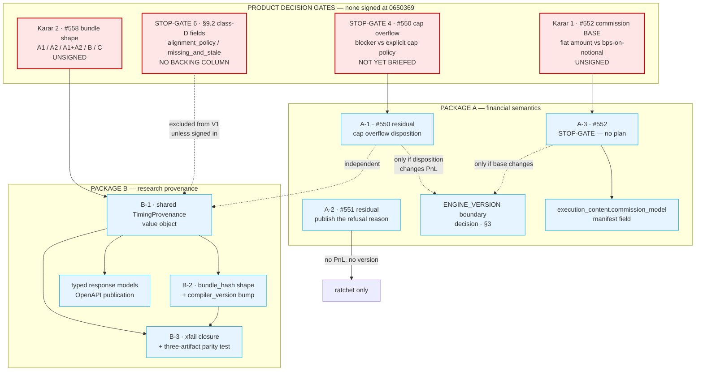
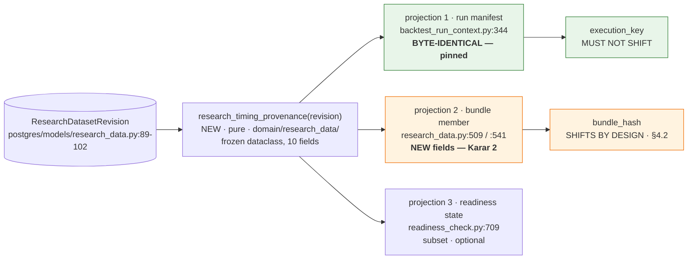

<!-- doc-status: historical -->
> **HISTORICAL RECORD — bu belge bir TASARIMDIR, canlı handoff DEĞİLDİR.** `0650369`'da
> ölçülen durumu kaydeder; SHA'lar, sayılar, alembic head'i ve "next" maddeleri bayat
> olabilir. Güncel otorite: `CLAUDE.md` §Current position + `docs/generated/repository_facts.md`
> (üretilmiş, CI'da `--check` ile kapılı).
>
> **`historical` işareti bu belgenin bulgularını geçersiz kılmaz** — `docs/implementation/*.md`
> globundaki her dosya `historical`'dır, çünkü `current` yalnız canlı kickoff'a aittir ve
> `check_classification` bunu CI'da zorlar.

# P-C1 — Design: financial semantics + research provenance

**NO PRODUCTION CODE WAS WRITTEN.** No file under `backend/src`, `frontend/src`,
`backend/migrations`, or any test tree was created or modified by this session. No
`ENGINE_VERSION` value was changed, no flag introduced, no issue opened or closed.

---

## §0 — Base, preconditions, and the one framing correction

### 0.1 Base

| | |
|---|---|
| **BASE_SHA** | `065036983c7575112f37c72b685184792f3b9786` (`Merge pull request #712 …ready-check-batching`) |
| **Expected base (prompt pack §3)** | `31ed27dfc1f3bf7448b0e03c7c732d22d8b758c4` |
| **Difference** | Base is **seven commits ahead** of the pack's expectation. Between them: `#709`, `#720` (financial fixes), `#721`, `#722` (P-B), `#723`, `#712`. **The delta is not cosmetic — it contains the entire Package A implementation.** Every measurement below was taken on `0650369`, not inherited. |
| **Branch** | `docs/closure-design-financial-research` |
| **alembic head** | `0043_i08_registry_strategy_fks` (unchanged; this design proposes no migration) |
| **`ENGINE_VERSION` at base** | `backtest-engine-v18-percent-sizing-per-fill-commission` (`manifest.py:145`) |

> **Prompt-line drift, recorded:** the prompt names `manifest.py:126` as the `ENGINE_VERSION`
> site. At `0650369` the assignment is at **`manifest.py:145`**; line 126 is inside the
> rationale comment block. The symbol name is authoritative, the line number is not — this is
> the exact reason `CLAUDE.md` says *"satır numarası yazma, sembol adı kullan"*.

### 0.2 Precondition 1 — P-B merged: **YES**

`docs/audit/final_closure_reconciliation_2026-08-13.md` exists at base, landed as `c70eeba`
(`#722`). Its §15 addendum is load-bearing for this document and is honoured below.

### 0.3 Precondition 2 — decisions signed: **NO. ALL THREE ARE UNSIGNED.**

`docs/decisions/closure_product_decisions_2026-08-13.md` exists (47 KB) and its own header
says: *"Bu belge KARAR BEKLİYOR. İmzalanmadan P-E1 ve P-E3 BAŞLATILAMAZ."* Measured state of
the three signature blocks:

| Decision | Signature line | Checkboxes | `karar veren:` | Verdict |
|---|---|---|---|---|
| **Karar 1** — commission model (#552) | `:276` | `[ ] A` `[ ] B` `[ ] C` `[ ] D` — **all empty** | blank | **UNSIGNED** |
| **Karar 2** — research bundle shape (#558) | `:467` | `[ ] A1` `[ ] A2` `[ ] A1+A2` `[ ] B` `[ ] C` — **all empty** | blank | **UNSIGNED** |
| **Karar 3** — DST fold/gap (#559) | `:706` | all empty | blank | **UNSIGNED** |

Consequences, applied literally as the prompt instructs:

- **#552 (A-3) carries a STOP-GATE stamp and NO implementation plan.** No option is invented,
  none is preferred, and no seam is specified beyond an inventory of the surfaces a signature
  would have to name. **This is not a formality:** PR #720 already shipped per-fill commission
  citing "PD-2", and P-B §7.1 measured that `PD-2` **is not recorded anywhere in the repo**.
  Designing an implementation on top of an unsigned decision would launder a second undocumented
  product choice through a design document.
- **#558 (Package B) is designed but every branch point that the signature owns is a
  STOP-GATE.** The design is written so that all four signature outcomes (A1 / A2 / A1+A2 / C)
  consume the *same* value object — the shared seam is decision-independent, only its
  projection differs. Option B (pin-and-deviate) needs no code at all, and the design says so.

### 0.4 The framing correction this design exists to make

**The prompt is written as if Package A were unimplemented. It is not.** `#550`, `#551` and
`#552` all landed in PR **#720** (`5e52465`), which is an ancestor of this base. Measured:

| Fix | Shipped at | Evidence |
|---|---|---|
| #550 percent sizing | `execution/sizing.py:171` `_percent_of_capital` | one conversion, three call sites (`:226`, `:230`, `:287`), plus public `max_position_size_cap` (`:236`) |
| #551 zero size | `engine.py:1469` `if size <= _ZERO:` | guard is unconditional; `alloc_on` only selects the *reason* |
| #552 per-fill commission | `execution/booking.py:111` `commission_lot = costs.commission` | entry charge at `engine.py:1592`, scale layer at `:3189`, stack at `:3007` |

So this document is **not** a greenfield design. It is a **residual design**: for each of the
three, what canon still asks for that the shipped code does not do, stated with the same
template. Writing a from-scratch design for already-shipped behaviour would produce a plan
that CI would reject as a no-op and would hide the two divergences that *are* still live
(§2.1 R-1, §2.2 R-2).

**Two residuals are genuinely open and are the substance of Package A:**

1. **R-1 (#550).** Master Ref §10.2 forbids a *silent clamp* on Max Single Position — it asks
   for *"blocker veya explicit cap policy"*. The engine silently clamps and no validator
   compares base against the cap. **STOP-GATE 4.**
2. **R-2 (#551).** The new refusal reason `size_resolved_to_zero` is a **bare string literal
   at one call site**, unlike its sibling `sleeve_zero_capacity` which is a named constant.
   It reaches no taxonomy, no contract, no OpenAPI schema, no frontend label.

---

## §1 — Dependency graph (mandatory)



**Read the graph this way.** Package A and Package B are **independent** — they share no file,
no table, no hash. The only cross-package coupling is scheduling: both touch reproducibility
identity (`execution_key` for A, `bundle_hash` for B) and neither should land while the other
is mid-flight, because a reviewer cannot then tell which shift moved which digest.

**Inside Package A** the ordering is forced: `A-3` cannot start (STOP-GATE), and `A-1`'s
`ENGINE_VERSION` question is *conditional* on which disposition is signed. `A-2` is the only
Package A item that is unconditionally safe to land today.

**Inside Package B** the ordering is forced differently: `B-1` is the seam, `B-2` is what
`B-1` does to the hash, `B-3` is what proves both. `B-3` cannot precede `B-1` — the xfail it
closes asserts on a field `B-1` introduces.

---

## §2 — PACKAGE A · Financial semantics

### 2.1 A-1 — #550 residual: the Max Single Position overflow disposition

**Problem.** #550 made the three sizing magnitudes percentages of resolved capital. That half
is done and correct. What it did **not** settle is what happens when a computed size *exceeds*
`max_position_size`. The engine silently pulls the size down to the cap. Master Ref §10.2 says
this specific thing must not be silent.

**Canonical requirement** — quoted, not paraphrased:

- **Master Ref §10.2** (`Entropia_V18_Master_Technical_Reference_v1_0.md:7562`), *Max Single
  Position* row: *"Tek position için nominal/sermaye yüzdesi limiti."* → validation column:
  **"Base veya formula sonucu bu limiti aşarsa `clamp değil` blocker veya explicit cap policy
  uygulanır."**
- **Doc 02 ⓘ Max Single Position** (`02_…:1920`): *"Tek bir pozisyonun ulaşabileceği maksimum
  büyüklüğü sınırlar. Base Position Size, Risk Per Trade veya Custom Formula daha büyük bir
  miktar hesaplamış olsa bile bu sınır aşılmaz. Örnek: Max Single Position %25 ise … tek
  pozisyon equity'nin %25'inden büyük açılamaz."*
- **Doc 02 field table** (`02_…:1015`): *"`sizing.base_position_size.percent` or typed unit;
  **<= Max Single Position** and subject to allocation/exposure cap."*

**The two canon sources disagree on disposition, and that is the whole finding.** Master Ref
says explicitly *clamp değil* — blocker, or a cap policy that is **explicit**. Doc 02 says only
that the bound *is not exceeded*, which a silent clamp satisfies. Doc 02 `:1015` even reads as
a *static* constraint (`<=`), which would be a Ready Check blocker, not a runtime clamp.

**And the sleeve precedent cuts the other way, deliberately.** Master Ref `:8168`: *"Bir
Strategy'nin talep ettiği size, bu sleeve sınırını aşıyorsa motor size'ı **capler veya orderi
reddeder**; kullanıcının veya Agent'ın niyet ettiği risk kuralı sessizce asla aşılır."* For the
**sleeve**, capping is canonically allowed. §10.2 withholds that permission from **Max Single
Position** specifically. So "the engine already clamps elsewhere" is not an argument.

#### Canonical formula — the full chain, as measured and as canon supports it

```
resolved capital  E                     ← ledger equity, or the SLEEVE under allocation
                                          (sizing.py:376 planned_size, :362 sleeve_capital)
percent           p = base_position_size ← §10.1 "Resolved capitalın yüzdesi"
notional          N = E * p / 100        ← doc 02 ⓘ: equity 10 000, %10 → 1 000 USD nominal
raw size          s = N / entry_price    ← sizing.py:171 _percent_of_capital, quantized _QTY
                                          entry_price is the EFFECTIVE fill (spread+slippage
                                          applied first, sizing.py:400 _effective_fill)
leverage          s = s * L              ← sizing.py:339, L from _leverage_multiplier (:162)
strength          s = s * m              ← §10.3 signal-strength multiplier
limits            s = clamp(s, min, max) ← sizing.py:188 _clamp_to_limits, bounds converted
                                          through the SAME _percent_of_capital
sleeve cap        s = min(s, C_i / px)   ← allocation only, sizing.py:348 _cap_to_sleeve
zero guard        s <= 0 → open nothing  ← engine.py:1469 (#551)
```

**Leverage ordering is EXTRACTED from canon, not guessed.** Doc 02 ⓘ Base Position Size
(`02_…:1875`): *"Örnek: Equity 10.000 USD ve Position Size %10 ise ilk pozisyon nominal olarak
1.000 USD üzerinden oluşturulur; **kaldıraç etkisi ayrıca uygulanır**."* — the percent
conversion produces the 1 000 nominal **first**, and leverage applies *ayrıca* (separately,
on top). That is exactly `_raw_position_size → * L`. **Canon is silent on where the limits sit
relative to leverage**; the shipped code clamps *after* leverage, and §10.2's own wording
(*"nominal/sermaye yüzdesi limiti"* — a limit on **nominal**) supports it, because post-leverage
size is what determines nominal. **This is a derivation from a canon noun, not a canon
sentence, and it is recorded as such.**

> **Second-order consequence, worth naming because no document names it:** with the clamp
> post-leverage, a configured Max Single Position makes leverage *inert above the cap*. A 10%
> base at 5× yields 50% notional → clamped to 25%. Both canon literals are satisfied, but a
> user who raises leverage and sees no change is looking at correct behaviour. If STOP-GATE 4
> is answered with "blocker", that user gets an error instead of silence — which is precisely
> what §10.2 asks for.

**base / min / max semantics — single and explicit, as shipped:**

| Field | Meaning | Unit | Site |
|---|---|---|---|
| `base_position_size` | target notional as % of resolved capital | percent | `sizing.py:287` |
| `position_size_limits.min_position_size` | floor on the final size, as % of capital at this price | percent | `sizing.py:230` |
| `position_size_limits.max_position_size` | ceiling on the final size, as % of capital at this price | percent | `sizing.py:226`, `:255` |

All three convert through **one** function. `min > max` fails closed to `0` **in percent space,
before conversion**, so the refusal does not depend on a price being readable (`sizing.py:223`).

**Current implementation (file:line).**
`sizing.py:171` `_percent_of_capital` · `:188` `_clamp_to_limits` (silent, no signal emitted) ·
`:236` `max_position_size_cap` · `:258` `_raw_position_size` · `:317` `_position_size` ·
`engine.py:2939` and `:3136` (ladder + stacking read the same cap) ·
`readiness/validators.py:471` `STRATEGY_SIZING_SEMANTICS_UNCONFIRMED`.
**Measured absence:** `grep max_position_size backend/src/entropia/domain/readiness/` returns
**one** hit — line `:466`, the `carries_magnitude` transition-gate predicate. **There is no
validator anywhere that compares `base_position_size` to `max_position_size`.**

**Reuse candidates.** `_clamp_to_limits` is already the single choke point — every disposition
can be expressed there without a new module. A blocker reuses `ReadinessIssue` +
`Code.STRATEGY_*` (`readiness/enums.py`) and the existing `Sev.BLOCKER`/`Scope.STRATEGY`
plumbing. An "explicit cap policy" reuses the `size_semantics` precedent (`config.py:742`): a
`Literal[…] | None` field whose `None` means *"saved before this question was asked"*, gated at
Ready Check rather than silently defaulted. **No new infrastructure is required under any
option** — this is the ponytail ladder's "kurulu bağımlılık" rung.

**Minimal code seam.** One of three, by signature:
- *blocker* → a new validator beside `validators.py:471`, comparing base (and the ladder's
  `add_size_value` if configured) against `max_position_size`, both already in percent. Engine
  untouched. **Zero PnL movement** for any configuration that was already legal.
- *explicit cap policy* → `PositionSizeLimits.overflow_policy: Literal["cap","block"] | None`
  (`config.py:782`), read at `_clamp_to_limits:188`, published into `execution_content`.
- *declare the shipped clamp canonical* → **zero code**; the deliverable is a signed deviation
  paragraph, exactly like D-10/D-11's precedent in `a11y_ci_ratchet_and_adjudication.md`.

**Compatibility impact.** Blocker option: strategies that today run clamped begin failing Ready
Check. That is a behaviour change for *saved* revisions and it interacts with the #550
transition gate — a revision that has already cleared `STRATEGY_SIZING_SEMANTICS_UNCONFIRMED`
would acquire a *new* blocker. Cap-policy option: `None` on every stored revision, so the gate
must decide whether `None` means "cap" (backwards compatible, silent again) or "unconfirmed"
(a second transition gate). **This is why it is a STOP-GATE and not a judgement call.**

**ENGINE_VERSION impact.** *Blocker* option: **NONE** — a run that is refused produces no
Result, and every run that still executes prices identically. *Cap-policy* option with default
`cap`: **NONE**, same reason. *Cap-policy* with default `block`: still none — refusals are not
re-pricings. **A-1 does not, under any of the three dispositions, move a single golden digest.**
That is the strongest reason to land it separately from anything that does.

**manifest-hash impact.** Only the cap-policy option touches it: `overflow_policy` belongs in
`execution_content` (`manifest.py:247`) because two runs that dispose of overflow differently
replay differently. Adding a key to `execution_content` shifts **every** `execution_key`
(`manifest.py:258`, `manifest_hash` = sha256 of canonical JSON) → no stored Result is
idempotently reused for a re-RUN. Acceptable and precedented (INF-04/INF-05), but it must be
*stated* in the PR, not discovered.

**migration impact.** **NONE** under all three. `StrategyConfig` is stored as a JSON payload
(`readiness_check.py:700` `StrategyConfig(**item.payload)`), so a new optional field needs no
DDL. alembic head stays `0043_i08_registry_strategy_fks`.

**OpenAPI impact.** Cap-policy option only: `PositionSizeLimits` is a published component, so a
new field appears in `docs/openapi.json` and the export drift guard
(`entropia.apps.api.openapi_export --check`) will demand the regenerated file in the same PR.

**historical Result impact.** **Immutable, and the mechanism is not new.** A stored
`BacktestResult` is never recomputed; reuse is keyed on `execution_key`, and any
`execution_content` change shifts the namespace so the old Result is simply never selected
again (`manifest.py:233` — *"two runs … must never share an `execution_key`"*). Nothing
rewrites a stored artifact. This answers the prompt's four questions for #550 directly:

| Prompt question | Answer, measured |
|---|---|
| Visible transition gate needed? | **Already shipped** — `STRATEGY_SIZING_SEMANTICS_UNCONFIRMED` (`validators.py:471`), scoped by `carries_magnitude` so risk/Kelly strategies with no limits are not blocked. |
| Will old semantics be replayed? | **No.** There is no unit-count code path left; `_raw_position_size` has no fallback branch. A pre-cutover revision is *blocked*, not re-interpreted. |
| New engine version namespace? | **Already taken** — `v18-percent-sizing-per-fill-commission`. A-1 does not need a further one. |
| How do old Results stay immutable? | `execution_key` namespace separation + never recomputing a stored artifact. **Non-negotiable and structurally satisfied.** |

**Test strategy.** Blocker: a Ready Check unit test with the negative control (base *under* the
cap must stay READY — otherwise the test proves only that the validator fires always). Cap
policy: a `_clamp_to_limits` unit test per branch **plus** a golden-digest run to prove the
50 scenarios are unmoved (`engine_golden_digests.json`, 50 scenarios, `engine_version` pinned
inside the file — a version bump without a digest refresh fails loudly, by design).

**Risks.** (1) Choosing *blocker* retroactively invalidates saved strategies that have run for
months; the blast radius is unmeasured and should be counted before signing. (2) Choosing *cap
policy* with a `None` default re-creates the silent clamp under a new name — the honest version
of that option is "unconfirmed", which costs a second transition gate.

**Human decision gates.** **STOP-GATE 4** (below). The `docs/decisions/` brief does not yet
contain this question — it briefs #552/#558/#559 only. **This design's first deliverable to a
human is that the brief needs a fourth entry.**

**Definition of Done.** Either a signed deviation paragraph naming the shipped clamp as the
"explicit cap policy" §10.2 asks for, or a landed PR implementing the signed disposition with
50/50 golden digests unmoved and a negative control on the new refusal.

**Rollback story.** Blocker: revert the validator; no data is touched. Cap policy: revert the
field; stored payloads carrying `overflow_policy` remain valid JSON and are ignored by the older
model (pydantic ignores unknown keys by default in this codebase's config models — **verify
before relying on it**), and `execution_key` returns to its previous namespace, which means
post-revert runs stop matching the interim Results. **Cheapest rollback is not shipping the
field at all until signed.**

---

### 2.2 A-2 — #551 residual: the refusal is correct but unpublished

**Problem.** The zero-size guard is right and complete. Its *reason* is a bare string literal
that no contract knows about.

**Canonical requirement.** Master Ref §10.1 (`:7551`): Base Position Size — *"**Pozitif
olmalı**; Max Single Position ve Max Total Exposure ile uyumlu olmalı."* Doc 02 `:1014`: *"When
selected, Position Size required >0."* Canon requires positivity; it does not name a wire code
for the runtime refusal. The refusal taxonomy in force is the F-10 **restriction trace**, not
the HTTP error envelope.

**Current implementation (file:line).**
`engine.py:1469` — `if size <= _ZERO:` — unconditional; the pre-#551 form was
`if alloc_on and size <= _ZERO`. `engine.py:1499` sets
`led.portfolio_block_reason = "size_resolved_to_zero"` **only when `not alloc_on`**, so the more
specific `sleeve_zero_capacity` (`sizing.py:438`, constant at `portfolio_ledger.py:131`) wins
under allocation. `sizing.py:414` `blocked_reason` is the ladder that resolves the final value.

The prompt's five sub-requirements, each measured rather than assumed:

| Requirement | State | Evidence |
|---|---|---|
| `size <= 0` fail-closed in **all** modes, independent of `alloc_on` | **DONE** | `engine.py:1469`; the `alloc_on` test survives only inside the *reason* branch at `:1498` |
| no zero-notional interval produced | **DONE, twice over** | the position is never created, so no interval is emitted; and `build_prior_intervals` (`engine.py:706`, `:724`) drops any window whose `peak_notional` is not `> 0` |
| trade count not polluted | **DONE** | no position → no lot → `total_trades` unmoved |
| win-rate not polluted | **DONE** | a 0-PnL lot used to land in the `else` branch at `booking.py:124` and inflate the **denominator**; it can no longer be produced |
| cross-item conflict not triggered by zero notional | **DONE — but NOT by #551** | `execution/rules.py::conflicts_with_prior` reads intervals by `direction` alone; it is protected by `build_prior_intervals`' positive-notional filter, which predates #551. **The engine comment at `engine.py:1486-1492` states this correctly and explicitly retracts an earlier claim to the contrary.** |

**Reason taxonomy — the prompt's question answered precisely.** *"Hangi hata kodu?
`shared/errors.py`'de var mı, yeni mi?"*

**Neither, and that is the finding.** `size_resolved_to_zero` is **not** an HTTP error and must
not become one: no request fails: a run completes normally having declined an entry. It belongs
to the F-10 restriction-trace vocabulary alongside `no_fill`, `sizing_unsupported`,
`leverage_unsupported`, `signal_strength_unsupported`, `capability_not_in_build`,
`sleeve_zero_capacity`, `portfolio_conflict_blocked`, `portfolio_max_total_exposure`. Therefore
**`ErrorCategory` (O-02) does not apply** — that contract governs `ErrorBody`, and no `ErrorBody`
is emitted on this path. Declaring a category here would advertise `retryable` semantics for
something that never reaches an HTTP response.

**What *is* wrong:** the value is a **bare literal at one call site** while its nearest sibling
is a module constant. Measured:

```
portfolio_ledger.py:131   SLEEVE_ZERO_CAPACITY = "sleeve_zero_capacity"     ← named
engine.py:1499            led.portfolio_block_reason = "size_resolved_to_zero"  ← literal
```

and `grep -rn "size_resolved_to_zero" backend/src frontend/src docs/openapi.json` returns
**exactly one hit** — the assignment itself. No constant, no enum, no contract test, no
frontend label, no schema. A user reading a restriction trace sees a raw token the product
never defined.

**Minimal code seam.** Promote the literal to a constant beside its sibling
(`portfolio_ledger.py:131`) and reference it at `engine.py:1499`. If the trace vocabulary is
surfaced to the UI (**verify first — this design did not measure the frontend's rendering of
`portfolio_block_reason`**), add the label in the same PR. Optionally add a contract test that
enumerates the vocabulary so a tenth reason cannot be added as a literal again.

**Compatibility impact.** **NONE.** The emitted string is byte-identical; only its *definition
site* moves.

**ENGINE_VERSION impact.** **NONE.** No arithmetic changes. Do **not** bump — a bump would
invalidate 50 golden digests and every stored Result's reuse namespace to rename a constant.

**manifest-hash impact.** NONE. **migration impact.** NONE. **OpenAPI impact.** NONE unless the
vocabulary is published as an enum, which would be a genuine (and welcome) contract addition.

**historical Result impact.** NONE. Results produced before #551 that contain phantom 0-size
trades **stay wrong and stay immutable** — they were produced by a different engine version and
are namespaced away by `execution_key`. **No backfill is proposed; correcting a stored Result
would break immutability, which is non-negotiable.**

**Test strategy.** A single unit test asserting the constant's value (so the wire token is
pinned by *value*, not by symbol — the O-31 lesson: asserting the type or symbol lets the
spelling drift silently). Negative control: assert the allocation path still reports
`sleeve_zero_capacity`, not the new constant.

**Risks.** Low. The only real risk is scope creep — publishing the whole trace vocabulary as an
OpenAPI enum is a larger, separately valuable change and should not ride along unannounced.

**Human decision gates.** None. **A-2 is the only Package A item that needs no signature.**

**Definition of Done.** `grep -c '"size_resolved_to_zero"' backend/src` returns 1 and that one
hit is a constant definition; the value is pinned by a test.

**Rollback story.** Trivial single-commit revert; no data, no hash, no version touched.

---

### 2.3 A-3 — #552 commission

# 🛑 STOP-GATE — KARAR BEKLİYOR. NO IMPLEMENTATION IS PLANNED HERE.

**`docs/decisions/closure_product_decisions_2026-08-13.md:276` is UNSIGNED.** All four boxes
(`A` per-fill · `B` one round-trip allocation · `C` bps on notional · `D` sign the shipped
behaviour as a deviation) are empty and `karar veren:` is blank.

**Per the prompt's instruction, no model is chosen, no option is invented, and no seam is
designed.** What follows is inventory only — the surfaces a signature would have to reach —
so that whoever signs knows the blast radius. It is deliberately not a plan.

**Problem, stated neutrally.** Two questions are entangled and only one has been answered in
code:

1. **Incidence** — *per fill* or *per round trip*? PR #720 shipped **per fill**
   (`booking.py:111`), citing "PD-2". **P-B §7.1 measured that `PD-2` is not recorded anywhere
   in this repository.** So the shipped answer to question 1 has no written adjudication.
2. **Base** — is `commission` a **flat currency amount** or **bps on notional**? **This
   question is untouched by #720 and is entirely open.** The shipped schema says flat
   (`config.py:313`, `description="Per-trade fee"`); the only concrete canon example says
   rate-based.

**Canonical requirement — the four literals, none of which settles it:**

| # | Source | What it fixes | What it leaves open |
|---|---|---|---|
| K1 | Master Ref Modül 6 §8 (`:7513`) | the commission **distribution must be explicit in the engine manifest** | the distribution itself |
| K2 | Master Ref Modül 6 §6.2 (`:7425`) | commission is a **numeric input**; unit/currency format must be explicit in config; when blank, a **resolved default** travels in the manifest | the unit |
| K3 | Master Ref Modül 4 §2.3 (`:3110`) | the only concrete example: *"**Notional üzerinden bps bazlı** işlem komisyonu"* | whether that example is normative |
| K4 | Master Ref Modül 6 §7 item 7 (`:7738`) | costs apply at the **simulated fill event** | still not the base |

**K3 contradicts the shipped schema** (`config.py:313` — flat `Decimal`, "Per-trade fee"). That
contradiction is Karar 1 / Option C's subject and **this document does not resolve it.**

**Current implementation (file:line), for the signer's blast radius:**

| Site | What it charges |
|---|---|
| `booking.py:111` | `commission_lot = costs.commission` — one flat charge per close (full or partial) |
| `engine.py:1592` | entry fill charges `commission` against `led.equity` |
| `engine.py:3007` | stacking tranche charges one commission at its fill |
| `engine.py:3189` | accepted scale layer charges one commission at its fill |
| `booking.py:209` `absorb_remainder` | the absorbed remainder charges its own |

`engine.py:2020` also debits `led.equity`, but that is the **funding** charge, not commission —
named here so a signer counting charge sites does not miscount it as a fifth.

**Measured documentation debt inside the shipped fix, recorded because it will mislead the
next reader:** **three** comments still describe the retired model, all with the same phrase
*"the close still books one round trip"* — `engine.py:2993` (stacking tranche),
`engine.py:3058` (the ladder docstring) and `engine.py:3186-3188` (the scale layer, the one
sitting directly above the charge at `:3189`). After #720 the close books **one fill**, not a
round trip. The code is right; the comments are stale. **Whoever executes Karar 1 must fix all
three in the same PR** regardless of which option wins, because they describe behaviour that no
longer exists under any of the four options.

**What a signature must specify** (checklist for the signer, not a recommendation):

1. Incidence — ratify per-fill, or change it.
2. **Base — flat amount or bps on notional.** If bps: the config field's *type and meaning*
   change, which is a second transition-gate problem exactly like #550's (a stored `5` means
   $5 or 5 bps and the number does not say which). **The #550 `size_semantics` precedent
   (`config.py:742`) is the shape that problem already has a solution in.**
3. The **mandatory manifest addendum** the decision doc itself already requires
   (`:460-465`): `execution_content.commission_model`, *"aksi halde iki farklı ücret modeliyle
   üretilmiş iki run aynı reprodüksiyon kimliğini paylaşır"* — this is K1's *"manifestte açık"*
   requirement and it is **independent of which model wins**. It is not satisfied today:
   `execution_content` (`manifest.py:247`) carries no commission descriptor at all.

**Everything else about A-3 — seam, tests, migration, rollback — is deliberately blank.**
Filling it in would require assuming an answer.

---

## §3 — The `ENGINE_VERSION` boundary question, answered explicitly

**Question asked:** are the three fixes one boundary or three? How does the value change? What
does code that reads old Results do?

### 3.1 Are they one boundary or three?

**Shipped answer: ONE. That was correct for #720, and the reason generalises.**

The rationale is in the code (`manifest.py:126-144`): *"three financial-logic fixes land
together because each of them alone moves PnL, and a single namespace shift covers all
three."*

**A namespace is not a changelog.** `ENGINE_VERSION` has exactly one job: make
`execution_key` (`manifest.py:258`) differ between two engines that price the same config
differently, so a stored Result is never idempotently reused across a re-pricing
(INF-04/INF-05). Three simultaneous re-pricings need **one** separation, not three — three
sequential bumps would create two intermediate namespaces that **no Result was ever produced
under**, i.e. two dead partitions. The version string is *descriptive of the boundary*, not an
enumeration of fixes.

**The rule this design proposes for the residuals** — and it is a rule, not a case-by-case
judgement:

> **Bump if and only if a config that was previously LEGAL now produces a DIFFERENT number.**
> Refusing to run is not a different number. Renaming a constant is not a different number.
> Adding a field to `execution_content` is not a different number — but it *does* shift
> `execution_key` by itself, which is a **separate** and weaker guarantee that must be stated
> independently.

Applying it:

| Item | Re-prices a legal config? | `ENGINE_VERSION` | `execution_key` |
|---|---|---|---|
| **A-1** blocker disposition | No — refusal, not re-pricing | **NO BUMP** | unchanged |
| **A-1** cap-policy field | No | **NO BUMP** | **shifts** (new `execution_content` key) |
| **A-2** constant promotion | No | **NO BUMP** | unchanged |
| **A-3** if incidence ratified as-is | No | **NO BUMP** | unchanged |
| **A-3** if base changes to bps | **Yes, on every commissioned run** | **BUMP** | shifts with it |
| **A-3** `commission_model` manifest field alone | No | **NO BUMP** | **shifts** |
| **Package B** entirely | No — bundles are not engine inputs | **NO BUMP** | **must stay unchanged — see §4.3** |

### 3.2 How would the value change?

`manifest.py:145` currently reads
`ENGINE_VERSION = "backtest-engine-v18-percent-sizing-per-fill-commission"`.

The established convention (measured across the comment block, `manifest.py:100-144`) is a
`v18-<semantic-change>` suffix naming *what re-priced*, with a comment paragraph above the
assignment explaining why. **If Karar 1 changes the base**, a compliant successor would be
shaped like `backtest-engine-v18-<new-commission-base>` — but **the string is chosen by whoever
implements the signed decision, not here**, because it must name the decision that was actually
made. Naming it now would smuggle in an answer to an unsigned question.

**Non-negotiable mechanics that come with any bump:**
1. `engine_golden_digests.json` carries `engine_version` *inside the file* alongside its 50
   digests. A bump without a digest refresh fails loudly — that is the intended tripwire.
   **Refresh the digests only after verifying that each moved digest moved for the signed
   reason.** #720's own record is the model here: 46 → 50 scenarios, and it was measured that
   the commission change moved **0 of the original 46** because the matrix never configured a
   commission — the four new scenarios were added *with a proven negative control*.
2. `docs/generated/repository_facts.md` publishes `ENGINE_VERSION` and its `--check` is
   blocking in CI. **Regenerate in the same commit.**

### 3.3 What does code that reads old Results do?

**Nothing changes for it, and no code needs to be written.** Measured:

- A stored `BacktestResult` is **never recomputed**. Reuse is a *lookup* keyed on
  `execution_key`; a bumped version simply never matches, so a re-RUN produces a **new** Result
  beside the old one.
- The old Result stays readable, comparable within its own namespace, and byte-identical.
  Result-reading surfaces (Results History, Analysis Lab, per-item and leave-one-out
  projections) join on stored artifact content, not on the live engine.
- `mainboard_item_labels` sits **outside** `execution_content` on purpose (`manifest.py:183`)
  so display changes never fork reproducibility. Anything added for A-1/A-3 must be classified
  the same way, deliberately: **reproducibility content → inside; presentation → outside.**

**The one honest caveat:** cross-version *comparison* surfaces (artifact comparison, digest
parity) treat differently-namespaced Results as non-comparable, which is correct but is a
**user-visible consequence** — a user comparing a pre-bump and post-bump run of the same
composition is comparing two different engines. This is contracted behaviour today, not a new
risk, and it is the reason the bump exists at all.

---

## §4 — PACKAGE B · Research provenance

### 4.1 B-1 — one shared timing-provenance value object

**Problem.** The same timing vocabulary is expressed **four** different ways across four
surfaces, and the two that canon calls "immutable evidence" are the two poorest.

**Measured inventory — this is the core finding of Package B:**

| # | Surface | Site | Timing fields carried |
|---|---|---|---|
| 1 | **Run Context Manifest** | `backtest_run_context.py:344` `_research_entries` | **10** — `available_time_policy`, `available_delay_seconds`, `event_time_semantics`, `frequency_policy`, `source_timezone_mode`, `source_timezone_iana`, `linked_market_dataset_revision_id`, `instrument_mapping_ref`, `field_definition_version`, `feature_definitions[]` |
| 2 | **Ready Check** | `readiness_check.py:709` `_resolve_research_sources` → `ResearchSourceState` | **4** — policy, delay, linked market, instrument mapping (validation subset, not persisted provenance) |
| 3 | **Agent Data Bundle** | `research_data.py:487` `compile_agent_data_bundle` | **0** — members carry 5 fields, none of them timing |
| 4 | **Backtest Evidence Bundle** | `research_data.py:519` `compile_backtest_evidence_bundle` | **0** — identical member shape to #3 |
| 5 | **Agent gateway context manifest** | `agent_tools.py:376` `_handle_data_bundle_resolve` | **0** — and no content hashes either; it returns a bare `research_revision_ids` list under a freshly minted `agtbundle` id |

Both bundle compilers build their member dict **inline and identically** (`research_data.py:509`
and `:539` are field-for-field the same five keys), then seal through one shared
`_seal_bundle` (`:553`). **The sealing is already shared; the vocabulary is not.**

**Canonical requirement.**
- **doc 12 §9.1** (`12_…:814`): *"Agent Data Bundle exact revision IDs, **usage scope and time
  policy** pinler. 'Latest approved' dynamic resolution forbidden."*
- **doc 12 §9.2** (`12_…:834`), `BacktestEvidenceBundle` field list, verbatim:
  `primary_market_dataset_revision_id` / `research_dataset_revision_ids[]` /
  `feature_definition_revision_ids[]` / `instrument_mapping_revision_ids[]` /
  `alignment_policy_versions[]` / **`available_time_policies[]`** / `missing_and_stale_policies[]`
  / `resolved_at, compiler_version, bundle_hash`.

Note the **shape disagreement inside canon itself**: §9.1 wants the policy pinned *per member*
("exact revision IDs … and time policy"), §9.2 lists `available_time_policies[]` as a
**top-level array**. That is Karar 2's `A1` vs `A2` vs `A1+A2` — **STOP-GATE 5**.

#### The design: one value object, three projections

> **This is the answer to the prompt's first question — "tek paylaşılan value object mü, üç
> ayrı projeksiyon mu?" — and it is BOTH, in a specific order: one object, three projections.**

Neither pure alternative survives contact with the measurements:

- *Three independent projections* is what exists today, and it is exactly the defect: the
  richest surface (#1) and the evidence surfaces (#3/#4) drifted apart with nothing to hold
  them together. Adding fields to #3/#4 by hand reproduces the drift the moment an eleventh
  field appears.
- *One shared object used verbatim everywhere* would force surface #1 to change shape — and
  surface #1's dict is inside `data_time_context` → inside `execution_content`
  (`manifest.py:255`) → inside `execution_key`. **Reshaping it silently repartitions every
  Result's reproducibility namespace for a refactor.** Unacceptable.

So: a pure domain function reading a `ResearchDatasetRevision` and returning a frozen value
object, plus **three thin projections whose shapes are pinned by tests** — one of which is
required to be **byte-identical** to today's manifest dict.



**Reuse candidates — the ponytail ladder, applied.**
1. *Is it needed?* Yes — four surfaces, one vocabulary, one already-failing strict xfail.
2. *Does it exist?* **The read logic exists at `backtest_run_context.py:361-397` and must be
   extracted, not rewritten.** `_enum()` (`:400`) is the existing null-safe enum stringifier and
   the new function must use it, or the manifest projection stops being byte-identical.
3. *stdlib* — `dataclasses.dataclass(frozen=True, slots=True)`, the codebase's existing idiom
   (`manifest.py:150`). **No pydantic model, no new base class.**
4. `admit_bundle_member` (`research_data.py:436`) stays the single admission gate; B-1 adds no
   gate and changes no permission.
5. `manifest_hash` (`shared/manifest.py:15`) stays the single hasher.

**Minimal code seam.** One new pure function + one frozen dataclass in the research-data domain
package; three call sites replaced by projections of it. `_seal_bundle` gains the
`compiler_version` bump of §4.2. **No new module tree, no new table, no new endpoint.**

**Compatibility impact.** Bundle responses gain keys. Both bundle endpoints are
`POST`-and-return with **no persistence** (measured: `grep compile_agent_data_bundle
backend/src` returns only the definition and `routes/research_data.py:397`; there is no bundle
table, and `capability.py:194 input_bundle_refs` — the only bundle-shaped column in the schema
— has **no writer and no reader anywhere in `backend/src`**). **So the prompt's "mevcut kayıtlı
bundle'lar" question has a measured answer: there are none.** No dual-read, no backfill, no
migration — for the compilers. The design must **not** invent a migration for a table that does
not exist.

> **Caveat, stated rather than assumed:** the Agent gateway (surface #5) mints a
> `context_manifest_id` and emits a `data_bundle_pinned` domain event (`agent_tools.py:460`).
> This design did **not** trace where that id and event are persisted or what consumes them.
> **Before B-1 lands, that trace must be done** — if a durable agent-task record stores the
> pinned shape, then surface #5 *does* have stored artifacts and the dual-read question
> reopens for it alone. Recorded as an explicit open item, not silently assumed away.

**ENGINE_VERSION impact.** **NONE.** A bundle is not an engine input; the engine reads the run
manifest. **Do not bump for Package B.**

**manifest-hash impact.** **This is the load-bearing constraint of the whole package.**
`execution_key = manifest_hash(execution_content)` and `execution_content["data_time_context"]`
contains projection 1. `manifest_hash` is sha256 over **canonical JSON** (`shared/manifest.py`
→ `shared/hashing.content_hash`), so **adding, removing or renaming a single key in projection
1 shifts every `execution_key` in the system** — for a refactor that changes no behaviour.

> **Therefore: projection 1 must be byte-identical, and that must be PROVEN, not intended.**
> The proof is a test that builds the manifest dict before and after and asserts equal
> `manifest_hash` on a fixture revision with **every one of the 10 fields populated and again
> with all of them null** — an all-null fixture would pass even if a key were dropped, so the
> populated fixture is the real control and the null fixture guards the `_enum()` null path.

**migration impact.** **NONE.** All 10 fields already exist as columns
(`postgres/models/research_data.py:89-102`). alembic head unchanged.

**OpenAPI impact — a real gap this design should close.** Measured from `docs/openapi.json`:
both bundle endpoints publish

```json
{"additionalProperties": true, "type": "object",
 "title": "Response Compile Agent Bundle Api V1 Research Datasets Bundles Agent Post"}
```

because both route handlers are annotated `-> dict[str, Any]`
(`routes/research_data.py:396`, `:409`). **The bundle contract is invisible in the schema, so
adding fields to it is invisible to the drift guard.** This is the precise anti-pattern
`CLAUDE.md` §O-30 names: *"bare `dict` döndüren bir route drift guard'ı yeşil tutarken
sözleşmeyi görünmez bırakıyordu"*. **B-1 should declare typed response models** (`AgentDataBundle`,
`BacktestEvidenceBundle`, `BundleMember`) so the new fields land *in the published schema* and
`openapi_export --check` starts guarding them. Doing the field work without this leaves the
contract exactly as unguarded as it is now.

**historical Result impact.** **NONE** — provided projection 1 stays byte-identical. If it
does not, every stored Result silently leaves its own reuse namespace. That is the failure mode
the byte-identity test exists to prevent.

**Test strategy.** (a) the byte-identity hash test above, both fixtures; (b) a unit test per
projection; (c) the three-artifact parity test of §4.3; (d) the strict xfail flips to passing.

**Risks.** (1) Byte-identity is easy to *believe* and easy to break — key **order** is
normalised by the canonical serializer, but key **presence** and **value formatting** are not.
(2) Scope creep into surface #5 (see caveat). (3) Landing field work without the typed models
leaves the guard blind.

**Human decision gates.** **STOP-GATE 5** — Karar 2 owns *which* projection shape the bundle
gets (`A1` per-member / `A2` top-level array / `A1+A2` / `C` policy token only). The value
object and its extraction are **shape-agnostic** and identical under all four; only projection 2
differs. Option `B` (pin-and-deviate) means projection 2 is not written at all.

**Definition of Done.** One function is the sole reader of the 10 columns; the manifest hash is
provably unmoved; the bundle contract is typed and published; the xfail passes.

**Rollback story.** Revert the projection-2 wiring and the compiler-version bump; the value
object may stay (it is inert without callers). Since nothing is persisted and no migration ran,
rollback is a code revert with **no data consequence** — the strongest rollback story in this
document, and a direct consequence of the compilers being stateless.

---

### 4.2 B-2 — `bundle_hash` shape and versioning

**Problem.** Adding fields to a member changes `bundle_hash` for the *same* pinned revisions.
Two bundles over the same revisions, compiled before and after, will not match. Is that a
break?

**Canonical requirement.** doc 12 §9.2 lists `resolved_at, compiler_version, bundle_hash` as
bundle fields. **Canon already anticipated this** — `compiler_version` exists precisely so the
hash can be read within a compiler generation.

**Current implementation.** `research_data.py:553` `_seal_bundle`; `:58`
`_BUNDLE_COMPILER_VERSION = "research-bundle-v1"`; `:563` `bundle_hash = manifest_hash(body)`
over `{bundle_kind, members, compiler_version, **extra}`. **`compiler_version` is already
inside the hashed body** — so bumping it *by itself* re-partitions the hash space cleanly.

**Design — the prompt's "versioned hash mi?" answered: yes, and the mechanism already exists.**

> **Do not invent a versioned-hash scheme. Bump `_BUNDLE_COMPILER_VERSION` to
> `research-bundle-v2` in the same commit that changes the member shape.**

Because `compiler_version` is hashed, a v2 bundle can never collide with a v1 bundle even over
identical revisions, and the *reason* they differ is legible on the artifact itself. A separate
`hash_version` field would be a second mechanism for a job canon already assigned.

**The rule, stated so it survives this slice:** *any change to what `_seal_bundle` hashes —
member keys, kind, extras — requires a `_BUNDLE_COMPILER_VERSION` bump in the same commit.*
That belongs in the docstring at `research_data.py:553`.

**Compatibility / migration / historical impact.** Nothing is stored (§4.1), so there is **no
v1 corpus to dual-read**. The bump is *precautionary and legible*, not a data migration. **If
the surface-#5 trace (§4.1 caveat) finds persisted bundle payloads, this section's conclusion
changes and dual-read must be designed then** — flagged, not hand-waved.

**ENGINE_VERSION impact.** NONE. **`execution_key` impact.** NONE — `bundle_hash` and
`execution_key` are computed by the same hasher over **disjoint** inputs.

**OpenAPI impact.** `compiler_version` becomes visible once the typed models of §4.1 land.

**Test strategy.** Assert v1 and v2 bundles over an identical revision set produce **different**
`bundle_hash` (the negative control that proves `compiler_version` is really hashed), and that
two v2 compilations of the same set are **identical** except `resolved_at` (which is outside the
hashed body — `:564` adds it after hashing; **this is correct and must be pinned by a test, or
a future edit that folds `resolved_at` into the body would make every bundle hash unique and
destroy content-addressing**).

**Risks.** The `resolved_at`-outside-the-hash property is subtle, undocumented, and one careless
edit from silently breaking content-addressability. Pinning it is cheap.

**Human decision gates.** None — this is mechanism, and it follows whatever Karar 2 decides.

**Definition of Done.** Version bumped with the shape change; both hash tests green; the rule
written where the next author will read it.

**Rollback story.** Revert both together. A v2 bundle held by a caller becomes unrecognisable
to a reverted compiler, but since none are stored, the exposure is limited to in-flight
responses.

---

### 4.3 B-3 — closing the strict xfail, and the three-artifact parity test

**Problem.** `test_research_point_in_time_parity.py:583` is a `strict=True` xfail — the repo's
**only** deliberate one (`CLAUDE.md`: *"Bilinçli `xfail(strict)` sayısı 1'dir"*, tracked as
#558). It must be closed *by the product changing*, not by editing the test.

**Current implementation.** The xfail's reason text is precise and pins the whole defect:

> *"GH #558 — neither bundle member carries the available-time policy, though doc 12 §9.1
> requires the Agent Data Bundle to pin 'exact revision IDs, usage scope and time policy' and
> §9.2 lists `available_time_policies[]` as a `BacktestEvidenceBundle` field. **The Run manifest
> DOES pin it, so the two execution-evidence surfaces disagree.**"*

Its body already asserts the exact three-way shape this design implements:

```python
assert manifest_entry["revision"]["available_time_policy"] == "fixed_delay"
assert agent_bundle["members"][0]["available_time_policy"] == "fixed_delay"
assert evidence["members"][0]["available_time_policy"] == "fixed_delay"
```

**Design.**

1. **`strict=True` makes the flip automatic and loud.** When B-1 lands, this test **passes**,
   and a strict xfail that passes is reported as `XPASS` → **failure**. That is not a
   regression: it is the mechanism working. **The `@pytest.mark.xfail` decorator is removed in
   the same commit as the fix, never before and never separately.**
2. **The assertion shape survives only under Karar 2 = `A1` or `A1+A2`.** It reads
   `members[0]["available_time_policy"]` — a **per-member** field. Under `A2` (top-level array
   only) the test must be rewritten to read `bundle["available_time_policies"]`, and under `C`
   (policy token only) to read whatever token is signed. **STOP-GATE 5 owns this**; the test is
   not rewritten speculatively.
3. **Do not weaken `strict`.** Turning it off to "make CI green while deciding" converts a
   blocking gate into a silent one. The correct interim state is the xfail **exactly as it is**.

**The parity test — the prompt's "üç artefakt arasında PARITY testi nasıl yazılır?"**

The xfail above is a *value* check on one field. Parity needs a **structural** check that a
future eleventh field cannot escape:

```
for each of the 10 timing fields:
    manifest_projection[field] == bundle_member_projection[field]   (per Karar 2's shape)
and: set(TimingProvenance fields) == set(keys the manifest projection emits)
```

**The second assertion is the one that matters.** Deriving the field list **from the value
object** rather than from a hand-written literal means a new column added to the object without
being projected fails the test. A hand-written list is a snapshot that rots — this is the same
lesson `screenshotMatrix.ts::TARGET_PAGES` taught the visual gate (*"elle liste yazma"*) and the
same lesson `check_codemap_coverage` enforces for modules.

**Placement.** Beside the existing xfail in `test_research_point_in_time_parity.py` — the file
already builds all three artifacts in one fixture (`_seed`, `_approved_market`, `_research`), so
the harness is **reuse, not new scaffolding**.

**Negative control — mandatory, per `CLAUDE.md`'s "işaretlemek ≠ kapsamak".** Blank one field on
the fixture revision and assert the parity test **fails**. A parity test that passes against a
mutilated fixture proves nothing. **Run the negative control against a pristine checkout** — a
prior slice (ADIM 62) recorded that an in-place-edited negative control produced a **false
green**.

**ENGINE_VERSION / manifest-hash / migration impact.** NONE, NONE, NONE. Tests only.

**OpenAPI impact.** None directly; the typed models of §4.1 are what the schema sees.

**historical Result impact.** NONE.

**Risks.** (1) Flipping the xfail in a separate commit from the fix leaves a red main. (2) A
parity test written against a literal field list rots silently. (3) Karar 2 = `B` means the
xfail **stays**, and the decision doc requires that outcome to be *written*: reason text updated
to *"GH #558 — imzalı sapma, karar tarihi ____"*, strict xfail count stays 1.

**Human decision gates.** **STOP-GATE 5** (shape) — and note that Karar 2 = `B` is a legitimate
signed outcome under which **B-1, B-2 and B-3 are all cancelled** and the only deliverable is
the deviation paragraph.

**Definition of Done.** Strict xfail count returns to the documented invariant (0 for #558, or
1 with a rewritten signed-deviation reason); parity test derives its field list from the value
object; negative control proven on a pristine tree.

**Rollback story.** Revert with B-1; restore the xfail decorator verbatim from git history —
**do not retype it**, the reason text is the tracked record of the defect.

---

### 4.4 The two canon fields with no backing column

# 🛑 STOP-GATE 6 — `alignment_policy_versions[]` and `missing_and_stale_policies[]`

doc 12 §9.2 lists both as `BacktestEvidenceBundle` fields. **Measured:**

```
grep -rn "alignment_policy|missing_and_stale|missing_or_stale" backend/src frontend/src
→ 0 hits
```

There is **no column, no enum, no field, no validator** behind either, on any model. The
decision doc reached the same conclusion independently (`:455`: *"ikisi … arkasında sevk edilmiş
bir alan olduğu **doğrulanmadı** — doğrulanmazsa bunlar sınıf-D'dir ve hiçbir test kapatamaz"*).
**Independently confirmed here by direct measurement.**

**Consequence, stated plainly: these two fields cannot be added by projecting anything.** They
would require new columns, new ingest-time capture, new approval-time validation and new UI —
i.e. a feature, not a provenance fix. **They are class D (implementation gap) and are OUT OF
SCOPE for Package B.** The decision doc's third sub-decision (`:472`, *"§9.2'nin kalan dört
alanı V1'de: `[ ] hepsi içeri` `[ ] yalnız türetilebilir ikisi` `[ ] dördü de V1 dışı`"*) owns
this and is **unsigned**.

Of §9.2's four "extra" fields, measurement splits them cleanly:

| Field | Backing data | Class |
|---|---|---|
| `feature_definition_revision_ids[]` | **exists** — `research_repo.list_feature_definitions`, already projected at `backtest_run_context.py:355` | derivable today |
| `instrument_mapping_revision_ids[]` | **exists** — `revision.instrument_mapping_ref` | derivable today |
| `alignment_policy_versions[]` | **none** | **D** |
| `missing_and_stale_policies[]` | **none** | **D** |

**Do not add a placeholder.** An empty `alignment_policy_versions: []` on a bundle that claims
to be immutable evidence asserts *"no alignment policy applies"*, which is not known to be true.
That is the `CLAUDE.md` P-09 rule (*"honest null, never a fabricated span"*) applied to a list.

---

## §5 — STOP-GATE register

| # | Gate | Owner | Blocks | Recorded where |
|---|---|---|---|---|
| **1** | **#552 commission — INCIDENCE.** Per-fill shipped in #720 citing an unrecorded "PD-2". Ratify or change. | Karar 1 (`decisions:276`) | A-3 entirely | decision doc, **UNSIGNED** |
| **2** | **#552 commission — BASE.** Flat amount (shipped, `config.py:313`) vs bps on notional (Master Ref §2.3 `:3110`). Untouched by #720. | Karar 1 / Option C | A-3, and the only Package A item that could bump `ENGINE_VERSION` | decision doc, **UNSIGNED** |
| **3** | **`execution_content.commission_model`** manifest field — required by Master Ref §8 `:7513` **regardless of which model wins**; absent today. | Karar 1 mandatory addendum (`decisions:460`) | manifest completeness | decision doc, **UNSIGNED** |
| **4** | **#550 cap overflow disposition.** Master Ref §10.2 says *"clamp değil"*; the engine clamps silently and no validator checks. | **NOBODY — not briefed** | A-1 | **first recorded here; the decision brief needs a fourth entry** |
| **5** | **#558 bundle shape.** `A1` per-member / `A2` top-level array / `A1+A2` / `B` deviate / `C` token only. | Karar 2 (`decisions:467`) | B-1 projection 2, B-3 assertion shape | decision doc, **UNSIGNED** |
| **6** | **§9.2's two class-D fields.** No backing column exists. | Karar 2 sub-decision (`decisions:472`) | nothing — **excluded from scope** | decision doc, **UNSIGNED** |
| **7** | **#559 DST fold/gap.** Not in this design's scope; recorded because `blocks-mixed-zone-axis` may gate the same research axis. | Karar 3 (`decisions:706`) | possibly E4/E5, per P-B §9b | decision doc, **UNSIGNED** |

**Seven gates. Not one is signed.** Two items in this design (A-2, and B-1's *extraction* half)
can proceed without any of them.

---

## §6 — What can proceed today, and what cannot

| Item | Blocked by | Can start? |
|---|---|---|
| **A-2** constant promotion + value pin | nothing | **YES** |
| **B-1** value-object extraction + byte-identity hash proof + typed response models | nothing (projection 2 is the gated half) | **YES, up to projection 2** |
| **B-2** compiler-version rule + `resolved_at` pin | nothing | **YES** |
| A-1 | STOP-GATE 4 (not yet briefed) | no |
| A-3 | STOP-GATEs 1, 2, 3 | no |
| B-1 projection 2 · B-3 | STOP-GATE 5 | no |
| §9.2 class-D fields | STOP-GATE 6 — and out of scope regardless | no |

> **The single highest-value unblocked action is B-1's byte-identity proof.** It is a test, it
> changes no behaviour, and it converts the most dangerous risk in this entire design — silently
> repartitioning every stored Result's reproducibility namespace during a refactor — into a
> gate that fails loudly. It should land **before** any bundle field work, not with it.

---

## §7 — What this document does NOT claim

Recorded so the next reader does not have to re-derive the boundary:

1. **It does not claim #550/#551/#552 are unfixed.** They shipped in #720. Two *residuals*
   (A-1, A-2) are named with evidence; everything else in Package A is closed.
2. **It does not decide any product question.** Seven gates are named and none is answered.
   Where the prompt asked for a design behind an unsigned decision (#552), the design is
   deliberately absent, not deferred to a "recommended option".
3. **It ran no tests and no suite.** No `pytest`, no `npm test`, no coverage figure is asserted
   anywhere above. Every claim is a **source measurement** (`grep`/read at `0650369`) and is
   cited as `file:line`. **CI is the authority for anything that runs.**
4. **It did not trace surface #5's persistence** (`agent_tools.py:460`, `data_bundle_pinned`,
   `context_manifest_id`). §4.1 states the consequence if that trace finds stored payloads
   rather than assuming it will not.
5. **It did not measure the frontend's rendering** of `portfolio_block_reason`, so A-2's
   optional label work is stated as conditional on a check, not as a task.
6. **It did not count how many stored strategy revisions would newly fail** under A-1's blocker
   option. That number should exist before STOP-GATE 4 is signed.
7. **The `ENGINE_VERSION` string for any future bump is not proposed here** — naming it would
   presuppose the decision it is supposed to record.
