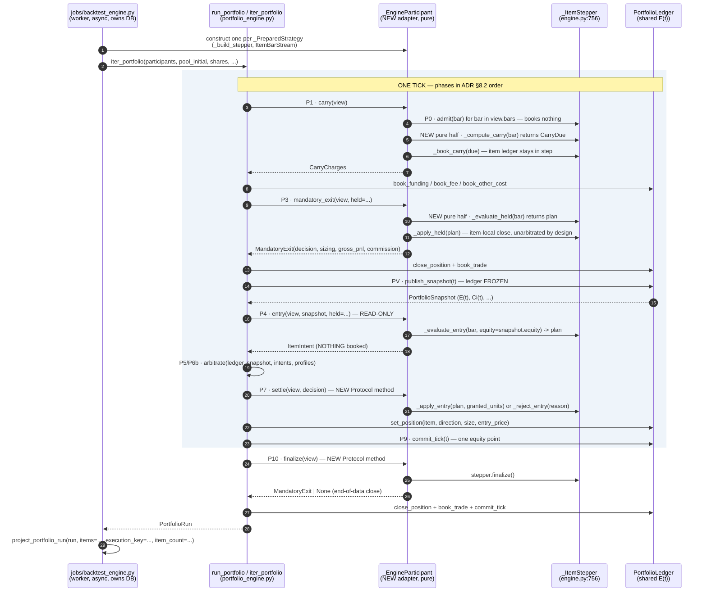
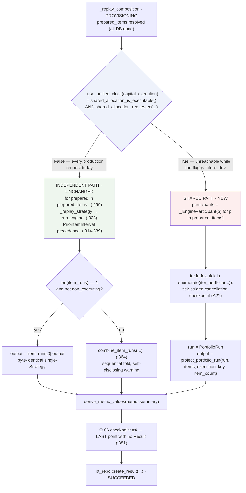
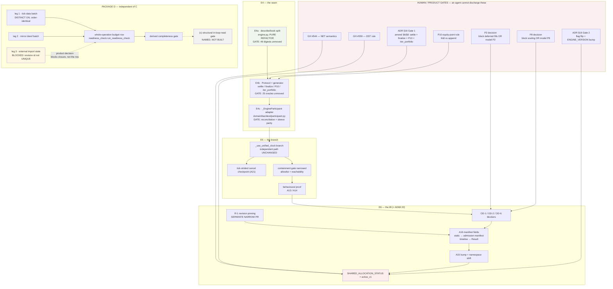

<!-- doc-status: historical -->
> **HISTORICAL RECORD — bu belge GÜNCEL GERÇEK DEĞİLDİR.** Yazıldığı andaki durumu
> kaydeder; SHA'lar, sayılar, alembic head'i ve "next" maddeleri bayat olabilir.
> Güncel otorite: `CLAUDE.md` §Current position + `docs/generated/repository_facts.md`
> (üretilmiş, CI'da `--check` ile kapılı).

# P-C2 — Solution design: shared portfolio wiring + performance coverage

**DESIGN ONLY. No production implementation.** No file under `backend/src`, `frontend/src`,
`backend/alembic`, `backend/tests` or `frontend/e2e` was changed by this slice; `ENGINE_VERSION`,
`SHARED_ALLOCATION_STATUS` and every feature flag are untouched; no GitHub issue state was moved.

**Precondition met:** P-B merged (`c70eeba`, PR #722). P-E2 merged (`bb1e76c`, PR #712) — so
Package D's first question is answered against a tree where the two ADIM 62 legs are already
batched.

---

## Base

| | |
|---|---|
| Base SHA | **measured at** `0650369` (`origin/main`, merge of PR #712); **rebased onto** `138d4be` (**P-C1**, #724) before merge, via `d012a63` (#719), `fb3a9dc` (ADIM 64, #704), `6dc059c` (ADIM 65, #700) and `62b8830` (#726). None of the five intervening commits touches a source line this document cites — #719 is docs-only (a11y checklist wording), #704 adds `tests/integration/test_result_row_immutability.py` plus regenerated artefacts, #700 is an audit record plus a generated frontend matrix, #726 mirrors plugin agents/skills into `.claude/` and extends `scripts/agent-config-gate.mjs`, #724 is P-C1's own design document — so every measurement below stands unchanged at the new base. **P-C1 (#724) is this slice's sibling** and landed first; the two were written in parallel against the same base and neither reads the other. |
| alembic head | `0043_i08_registry_strategy_fks` (this slice adds no migration) |
| `ENGINE_VERSION` | `backtest-engine-v18-percent-sizing-per-fill-commission` (unchanged) |
| `SHARED_ALLOCATION_STATUS` | `future_dev` (unchanged) |
| Inputs read | ADR `0002`; `docs/decisions/2026-08-03_shared_portfolio_containment.md` §6; `docs/audit/closure_w0_shared_portfolio_2026-08-13.md`; the source files named below |

### §0 — What was measured in this session, and what was only read

| Claim | How established | Confidence |
|---|---|---|
| `run_portfolio` has zero production callers | re-read `test_oracle_portfolio_containment_gate.py:180` + W0 §1 | HIGH (gate is green in CI) |
| `_ItemStepper` exposes six separately callable bar phases | read `engine.py:756-792`, `:3319-3332` | HIGH |
| `_phase_entry(bar, *, equity)` is the shared-`E(t)` injection point | read `engine.py:2498-2514` → `:1413` → `sizing.py:376-411` | HIGH |
| The injected value is `E(t)`, and the engine re-derives `Ci(t)` itself | `sizing.py:398,406-410` (`sleeve_capital(ctx, sizing_equity)`) | HIGH — **and this is a new risk, see §C.3.5** |
| `_Bar` and `_normalize` are SHARED by the clock and the engine | `execution/clock.py:59` and `engine.py:159` both import from `execution/state.py` | HIGH |
| `run_portfolio` + all of `execution/` + `engine.py` touch no DB | `grep -rEn "AsyncSession\|sqlalchemy\|async def\|await \|_repo\.\|infrastructure"` over those paths → **0 matches** | HIGH |
| `ItemParticipant` has no P7/finalize callback | read the Protocol, `portfolio_engine.py:251-294` | HIGH |
| Three Ready Check legs still read per item | read `readiness_check.py:340,346,473` | HIGH (source-level; **not run** — no Postgres in this container) |
| `test_every_registered_surface_has_a_budget` closes over a hand-written literal set | read `test_query_budgets.py:537-553` | HIGH |
| Full backend suite state | **not run** — authority is CI | — |

---

# PACKAGE C — Shared portfolio (E4 + E5 + E6 design)

## C.0 The non-negotiable, restated as a constraint on this design

No new engine. No second parallel loop. Every symbol below already exists and is reused:

| Symbol | Location | Role in this design |
|---|---|---|
| `_ItemStepper` | `engine.py:756` | the per-item substrate; its phases become describe+apply pairs |
| `_build_stepper` | `engine.py:794` | unchanged constructor; the adapter calls it with exactly `_replay_strategy`'s arguments |
| `run_portfolio` | `portfolio_engine.py:531` | the tick loop; gains **two** phases (P7 settle, P10 finalize) and a generator form |
| `ItemParticipant` | `portfolio_engine.py:251` | the Protocol; gains **two** methods |
| `execution/clock.py` `iter_ticks` | `clock.py:232` | untouched |
| `execution/intents.py` `form_intent` | — | the adapter's intent former; untouched |
| `execution/portfolio_ledger.py` | — | untouched |
| `execution/arbitration.py` `arbitrate` | — | untouched |
| `execution/attribution.py` | — | untouched; reached via provenance |
| `project_portfolio_run` | `portfolio_projection.py:513` | the Result projection; untouched |
| `build_portfolio_manifest` | `provenance.py:473` | the provenance block; untouched |

**Exactly one new production module** is proposed: the adapter. Everything else is an additive
change to a symbol that already ships.

## C.1 The E4 seam, in one picture



## C.2 The two shape gaps — this is the whole of E4

W0 named one gap: `_ItemStepper`'s phases **book** where `ItemParticipant` needs them to
**describe**. Reading the Protocol against `_run_tick` this session surfaces a **second**,
which no document has recorded:

> **`ItemParticipant` is write-only from the loop's side. There is no P7 callback and no
> finalize callback.** `_phase_7_apply` (`portfolio_engine.py:469-487`) writes the admitted
> position into the `PortfolioLedger` and tells the participant nothing. An engine-backed
> participant therefore never learns that its entry was admitted, at what size, or that it was
> rejected — so its own `_ItemStepper` stays flat, and every subsequent bar evaluates stops,
> exits and scaling against a book that does not exist.

That is a correctness hole, not an ergonomics one, and it is why "just write an adapter" does
not work. Both gaps are addressed below; both are **additive**.

### Gap 1 — describe/book split (three pure refactors inside `engine.py`)

| Today | After E4a | Called by |
|---|---|---|
| `_phase_carry(bar) -> None` | `_compute_carry(bar) -> _CarryDue` + `_book_carry(due) -> None` | `_phase_carry` = the two in sequence |
| `_phase_held(bar) -> bool` | `_evaluate_held(bar) -> _HeldOutcome` + `_apply_held(outcome) -> bool` | `_phase_held` = the two in sequence |
| `_phase_entry(bar, *, equity) -> None` | `_evaluate_entry(bar, *, equity) -> _EntryPlan \| None` + `_apply_entry(plan) -> None` | `_phase_entry` = the two in sequence |

`_ItemStepper` gains six fields (the halves) and keeps the three existing ones, so
`run_engine`'s `_step` (`engine.py:3233-3247`) is **character-identical** and every existing
caller of `.carry` / `.held` / `.entry` keeps working.

**Acceptance for E4a is a single number: 46 golden digests unmoved and
`backend/tests/unit/engine_golden_digests.json` itself unchanged.** This is ADR §15 R-4, and it
is the entire reason PR #602 bought the restructure/re-price separation. If a digest moves, E4a
is wrong — it has become a re-price and must stop.

### Gap 2 — two new Protocol methods

```
class ItemParticipant(Protocol):
    ...                                   # carry / mandatory_exit / entry unchanged
    def settle(self, view, decision) -> None: ...        # P7  — what arbitration granted
    def finalize(self, view) -> MandatoryExit | None: ...# P10 — end-of-data close
```

**Why required rather than optional.** `hasattr`-probing is fail-open: a participant that
forgets `settle` would silently run flat. A required Protocol member is structural — mypy fails
the day someone writes a participant without it. The cost is one no-op pair added to
`_ScriptedParticipant` (`tests/unit/oracles/portfolio_harness.py:156`), which books nothing and
therefore **cannot move any of the 25 portfolio oracles**. That invariance is E4b's acceptance.

**`settle` is called for admitted AND rejected decisions.** A rejection is information the item
needs — its decision trace has to record *why* nothing opened, and today `blocked_reason`
(`sizing.py:414`) is the item's own answer to that question. Calling `settle` only on admission
would leave a rejected entry indistinguishable from a bar where the strategy wanted nothing.

## C.3 The twelve headings

### 1. Participant lifecycle

**Creation.** One `_EngineParticipant` per `_PreparedStrategy`, constructed in the worker at the
PROVISIONING/RUNNING boundary — after `_prepare_strategy` has done every DB read
(`jobs/backtest_engine.py:256`, and `_PreparedStrategy`'s docstring already states *"nothing here
touches the database"*). The constructor takes exactly `_replay_strategy`'s arguments
(`jobs/backtest_engine.py:846-870`) and calls `_build_stepper` with them, so the shared path and
the independent path resolve the same pins from the same snapshot.

**Ordering.** Delegated entirely to `_ordered` (`portfolio_engine.py:297-319`), which already
sorts by `(pin_ordinal, item_id)` and already refuses a duplicate `item_id`, an identity/stream
mismatch and an ordinal mismatch. The adapter contributes `pin_ordinal` from the **manifest** pin
order, never from `prepared_items` list position — `ItemBarStream`'s docstring
(`clock.py:106-109`) makes that explicit and `_ordered` enforces the identity/stream agreement.
The worker's `_manifest_item_labels` (`jobs/backtest_engine.py:296`) already reads the manifest;
the ordinal comes from the same read.

**Termination.** `finalize` (heading 10). Nothing is destroyed — the participant is a value that
goes out of scope with the run.

**Refusals inherited for free:** `InvalidParticipantError` for a missing share, an unknown
`max_position_notional` key, an empty participant list. None of them needs new code.

### 2. Bar/timestamp advancement — what advances the stepper?

**Nothing in the loop calls `stepper.step`.** `step` runs a whole bar body and books; on the
shared path it must never be called. The adapter advances the item **phase by phase**, driven by
the tick.

`ItemTickView.bars` (`clock.py:135`) is already a tuple of `_Bar` — the *same* `_Bar` the stepper
consumes, because `clock.py:59` and `engine.py:159` both import `_Bar` and `_normalize` from
`execution/state.py`. **No bar translation layer is needed and none may be written**; a second
normalization would be a second coercion policy.

P0 (admit) has no hook in `run_portfolio`, and does not need one. `_phase_1_carry`
(`portfolio_engine.py:380-400`) is the first per-item call at a tick and is made only for
`view.is_decision` views — which is exactly `bool(view.bars)`. So the adapter admits inside
`carry`:

```
def carry(self, view):
    for bar in view.bars:            # P0 — books nothing (engine.py:1837 _phase_admit)
        self._stepper.admit(bar)
    self._current = view.bars[-1]
    due = self._stepper.compute_carry(self._current)
    self._stepper.book_carry(due)    # item ledger stays in lockstep
    return CarryCharges(funding=due.funding, fee=due.fee, other_cost=due.other_cost)
```

A tick where the item has no bar reaches no hook at all, which is ADR §5 — *"a tick at which item
i has no bar is not a decision for item i"*. Its open position is still in `E(t)` because the
`PortfolioLedger` holds it, not the view.

**Trap, stated because it will bite:** `_step` guards entry with `if not _phase_held(bar)`, i.e.
the *flat* check lives in the driver, not in `_phase_entry_body` (`engine.py:2516-2530`, whose
guard list contains `pending`, `working_limit`, `working_stop` but **not** `position`). The
adapter must reproduce that branch itself — `entry()` returns `None` whenever the item is not
flat. Omitting it would let the loop arbitrate an entry for an item that already holds one.

### 3. Mandatory exits (P3)

The loop forms the intent with the shipped former and books immediately — mandatory events are
**not arbitrated** (`_phase_3_mandatory`, `portfolio_engine.py:403-444`). So the adapter may
apply the exit locally in the same call, and must:

```
def mandatory_exit(self, view, *, held):
    outcome = self._stepper.evaluate_held(self._current)   # pure
    if outcome.close is None:
        self._stepper.apply_held(outcome)                  # non-closing bookkeeping still runs
        return None
    self._stepper.apply_held(outcome)                      # item-local close
    return MandatoryExit(
        decision=outcome.close.decision,
        sizing=outcome.close.sizing,
        gross_pnl=outcome.close.gross_pnl,
        commission=outcome.close.commission,
    )
```

Which of stop / exit / collision wins is `fills._resolve_stop` + `engine._plan_exit` and is **not
re-decided** — `MandatoryExit`'s docstring already forbids that
(`portfolio_engine.py:163-175`). `gross_pnl` and `commission` are the item's own figures; the
shared ledger quantizes the net once, which is why `BookedClose.net_pnl` exists.

**Dual booking is deliberate and is the design's central trade-off.** The item's `_Ledger` keeps
booking, so every item-local mechanism (stop ladders, `led.bars_seen`, trade rows, the decision
trace) behaves exactly as in a single-item run. The `PortfolioLedger` books the same amounts and
is the **only** authority for `E(t)` and for the Result. The alternative — suppressing the item
ledger on the shared path — changes engine internals far more and would make the item's own
arithmetic un-comparable to the goldens.

The cost is that two ledgers could drift. That must be pinned, not hoped:

> **Reconciliation invariant (E4 acceptance).** For every item, the `PortfolioLedger`'s
> attribution deltas equal the item `_Ledger`'s realized deltas over the same run.
> A test asserting this on a two-item fixture is what makes dual booking safe rather than lucky.

### 4. Read-only intent proposal (P4)

`entry()` must MUTATE NOTHING. The split gives it a pure half:

```
def entry(self, view, snapshot, *, held):
    if held is not None or self._held_locally():
        return None                                        # heading 2's trap
    plan = self._stepper.evaluate_entry(self._current, equity=snapshot.equity)
    if plan is None:
        return None
    self._pending_plan = plan                              # remembered for settle()
    return form_intent(identity=self._identity, view=view, snapshot=snapshot, plan=plan)
```

`_evaluate_entry` keeps `_phase_entry`'s `try/finally` equity scoping verbatim
(`engine.py:2510-2514`): `sizing_equity` is set on the way in and cleared on the way out, so no
later phase can size against a superseded snapshot.

`_validated_intent` (`portfolio_engine.py:322-353`) then re-checks the five properties at the
boundary — right item, `phase == "P4"`, not a mandatory kind, right `t_ms`, right
`snapshot_identity`. **The adapter must not duplicate those checks**; letting the loop refuse is
the point of having them there.

### 5. Shared `E(t)` injection

The injection point ships. `entry(view, snapshot, ...)` receives the frozen `PortfolioSnapshot`
(`intents.py:271-296`) and the adapter passes `snapshot.equity` into
`_evaluate_entry(equity=...)` → `sizing_equity` (`engine.py:2510`) → `planned_size(..., equity=)`
(`engine.py:1413`) → `sizing.py:398`.

**A risk this design surfaces and does not hide:** at `sizing.py:406-410` the engine computes
`sleeve_capital(ctx, sizing_equity)` — it derives `Ci(t)` **itself**, from its own
`AllocationExecution`. The `PortfolioLedger` derives `Ci(t)` a second time and publishes it as
`snapshot.sleeve_capacity[item_id]`, which is what `arbitrate` caps against. Two derivations of
one canonical quantity.

Passing the sleeve directly is not possible through the shipped parameter, and widening it would
change `run_engine`'s signature — which §C.0 forbids. So the two are reconciled by assertion:

> **Sleeve-parity invariant (E4 acceptance).** At every tick and for every participating item,
> `sleeve_capital(stepper.ctx, snapshot.equity) == snapshot.sleeve_capacity[item_id]`.
> A divergence means the item sized against a capacity the pool never granted, which is exactly
> the class of defect the shared snapshot exists to eliminate.

Both derivations read `P0`, `r` and `wi` from the same frozen plan, so they *should* agree; the
assertion is what turns "should" into "does", and it is cheap — one comparison per item per tick
behind a debug-only flag, plus an unconditional oracle test.

### 6. Admitted action apply (P7)

`settle(view, decision)` is called from `_phase_7_apply` for **every** decision in
`report.decisions`, admitted or not, in the pin order `arbitrate` already fixed.

```
def settle(self, view, decision):
    plan, self._pending_plan = self._pending_plan, None
    if plan is None:
        return
    if decision.is_admitted and decision.granted_units > 0:
        self._stepper.apply_entry(plan, size_override=decision.granted_units)
    else:
        self._stepper.reject_entry(plan, reason=decision.reason)
```

`size_override` is not new — `_open` already accepts it (`engine.py:3416-3423`), because the
partial-fill path needed exactly this. The granted size can be **smaller** than the planned size
(a sleeve or solvency cap), and the item must book what was granted, never what it wanted.

`_phase_7_apply` currently ends the loop body with `ctx.ledger.set_position(...)`. The `settle`
call belongs **before** it for an admitted decision, so a participant that raises leaves the
shared ledger untouched — fail-closed, and consistent with the loop's existing "raises rather
than degrades" posture.

**Ordering matters and is already solved:** `begin_apply(tick.t_ms)` unfreezes the ledger first
(`portfolio_engine.py:471`), so nothing a participant does during `settle` can be mistaken for a
pre-snapshot write.

### 7. Pending fill treatment — the tick boundary

`_phase_open_fills` (`engine.py:2041`) books fills deferred to *this* bar's open, and resting
limit orders. On the shared path a deferred entry fill would **open a position the pool never
arbitrated** — capital committed with no `PortfolioSnapshot` behind it. `run_portfolio` models no
P2 (`portfolio_engine.py` honest boundary item 2).

Two options, and they are not equal:

| | Option | Consequence |
|---|---|---|
| (a) | **Block non-immediate execution timing on shared runs at admission** — a Strategy whose `execution_timing` defers the fill, or whose order type rests a limit, is a shared-mode blocker | fail-closed; consistent with OD-6(a)'s shape; costs a real feature on shared runs |
| (b) | Model P2 as a pre-`PV` phase that books deferred fills into the shared ledger | correct end-state; a substantial new phase, new intent kind, and its own oracle set |

**Recommended: (a) for V1, (b) as a named follow-on.** It is a new admission blocker nobody has
written down, and it needs a code, a message and a `field_path` in the doc 14 §9.1 taxonomy.
Silently letting deferred fills bypass arbitration would be the exact silent-degradation shape
the working standard forbids.

### 8. Scaling treatment

`_phase_tail` (`engine.py:2759`) runs the scale ladder and books directly. `run_portfolio`
**refuses** an admitted `scale_in`: `UnsupportedIntentKindError`
(`portfolio_engine.py:476-481`), with the reason stated in the message — `set_position` would
REPLACE the held size with the layer size and silently shrink the position.

So a shared run has exactly two coherent V1 states, and they are the same fork as heading 7:

- **(a) block scaling-enabled Strategies on shared runs at admission** (recommended), or
- (b) model P8 — a `scale_in` intent kind, a `ledger.add_to_position` that adds rather than
  replaces, and arbitration for the added notional.

**Under (a) the adapter must not call `tail`'s scaling section at all** on the shared path. That
means `_phase_tail` also needs splitting, or the adapter must call only its non-scaling parts
(the close-deferred fill, the stacking rules, the state snapshot). This is the one place where
the phase decomposition `#602` shipped is **not fine-grained enough**, and it should be sized as
part of E4a rather than discovered during E5.

### 9. Cancellation checkpoint — the cancel must not be lost

The problem is concrete. Today checkpoint #3 (`jobs/backtest_engine.py:303`) sits *between
items*; `run_portfolio` owns its own tick loop, so once the worker calls it there is no line left
to check on. A long shared run would become uncancellable. Checkpoint #4 (`:381`) is the line
that enforces doc 15 §16 (*a CANCELLED run produces no `BacktestResult`*) and must keep sitting
between the replay and `create_result`.

The check is `async` (`_cancellation_requested` awaits `session.refresh`), so a synchronous
callback cannot perform it. **Do not add a callback. Make the loop a generator.**

```
def iter_portfolio(participants, *, pool_initial, shares, ...) -> Iterator[PortfolioTick]:
    """The tick loop, yielding after each committed tick."""

def run_portfolio(participants, **kw) -> PortfolioRun:
    """Unchanged signature and semantics: iter_portfolio, exhausted."""
```

`run_portfolio` becomes a two-line wrapper, so **all 25 oracles and `portfolio_harness.simulate`
are untouched.** The worker drives the generator and awaits between yields — legal, because the
generator is synchronous CPU work inside the worker's own task:

```
for index, tick in enumerate(iter_portfolio(...)):
    if index % _TICK_CHECKPOINT_STRIDE == 0 and await _cancellation_requested(session, run):
        return await _cancel_run(session, job, run, stage=RUNNING, progress={"ticks": index})
```

This closes ADR §14 **A21** as part of E5, not of ADIM 20 — W0 seam #4 is right that it is a
blocking sub-task. The stride is a constant with a written reason (ADR §11 anticipates
"per-K-ticks" granularity); it is a latency/round-trip trade, not a correctness knob.

**Ordering rule, non-negotiable:** the final `PortfolioRun` is assembled only after the generator
is exhausted, and `project_portfolio_run` runs after that, so a cancel can still land before any
Result exists. Checkpoint #4 stays exactly where it is.

### 10. Finalization

`stepper.finalize()` (`engine.py:3249`, body at `:3287-3296`) cancels a resting order and closes
any open position at the last bar's close. On the shared path that close realizes money the
**shared** ledger must see — otherwise `E(t)` ends the run with positions still open and the
composite final equity is wrong.

`run_portfolio` has no phase for this. Add **P10**, after the tick loop:

```
def _phase_10_finalize(ctx, last_views) -> tuple[BookedClose, ...]:
    for participant in ordered:
        closing = participant.finalize(view)     # NEW Protocol method
        if closing is None: continue
        ctx.ledger.close_position(item_id)
        ctx.ledger.book_trade(item_id, gross_pnl=..., commission=...)
    return ctx.ledger.commit_tick(last_t_ms)     # one last equity point
```

`PHASE_ORDER` (`portfolio_engine.py:110`) is published *as a value so a test can assert the
contract without re-reading the source* — so P10 must be appended there, and the phase-order test
updated deliberately. `_ScriptedParticipant` returns `None`, so no oracle moves.

**Open question for the human gate:** does the end-of-data close append a *new* equity point at
the last tick's `t_ms`, or fold into the last committed point? Appending at the same `t_ms` would
put two points on one instant, breaking "one equity point per valuation point" (A5's
by-construction claim). Recommended: fold — `commit_tick` at the **same** `t_ms` after the closes,
so the last point reflects the settled book. This changes no shipped number today but it is a
contract decision, not an implementation detail.

### 11. `EngineOutput` projection

`project_portfolio_run(run, items=..., execution_key=..., item_count=...)`
(`portfolio_projection.py:513`) is called by the worker, not by the loop — the loop returns a
`PortfolioRun` and stays free of Result concerns.

`items` is `Sequence[PinnedItem]` and must carry **every** pinned item, including the
non-executing Trading Signal / Trade Log rows: `_partition` (`:500-510`) fails closed on a traded
item with no record and tolerates extra records. The worker already has both halves —
`_manifest_item_labels` (`:296`) and `_enabled_non_strategy_items` (`:346`).

The projection declares its own absences (`ABSENT_BY_CONSTRUCTION`, `position_intervals=[]`,
`filtered_events=[]`) and publishes `portfolio_projection_version` + `portfolio_loop_version` in
`diagnostics.policy_versions`. **Nothing here needs to change**; E5 supplies inputs.

`COMPOSITION_CURVE_WARNING` (`portfolio.py:67`) must be absent from *new* shared Results and
still readable on old ones — ADR §15 already commits to that, and the projection already never
emits it.

### 12. Manifest provenance

`build_portfolio_manifest` (`provenance.py:473`) needs `tick_instants` and `equity_points` — both
of which exist only **after** the run. The shipped run manifest is built at **admission**
(`commands/backtest_run.py:573`) and feeds `execution_key`. Those two facts force a split that
must be stated before anyone writes code:

> **A16 splits in two.**
> **(i)** The four static policy versions — `engine_allocation_policy_version`,
> `clock_policy_version`, `arbitration_policy_version`, `mark_staleness_policy` — are constants
> (`provenance.py`) and belong in the **admission** manifest (`manifest.py`), inside
> `execution_content` and therefore inside `execution_key`. They are knowable before the run.
> **(ii)** The timeline block — `timeline_identity`, `tick_count`, `first_t_ms`, `last_t_ms`,
> `ledger_artifact` — is a **post-run** provenance record persisted with the Result.
>
> Putting (ii) into the admission manifest would make `execution_key` depend on the run's own
> output, which is unknowable at admission and would break Idempotency-Key replay (O-13: never
> fingerprint state the command itself changes).

The containment gate asserts the four field names are **absent** from `manifest.py`
(`:245-256`). Adding them is an **ADIM 20 / E6** act, not E5 — because the moment they enter
`execution_content` the `execution_key` namespace shifts, which is A15. E5 must not touch
`manifest.py`.

R-1 (ADR §10.2) lands here too: `_resolve_allocation` (`readiness_check.py:824`) records
`plan_revision_id` as a bare pointer while building `config` from live draft rows.
`AllocationProvenance` demands the *frozen* record, and `sleeve_amount_divergences` exists to
cross-check it. **R-1 must be closed before E6**, as its own narrow PR, exactly as the ADR says.

## C.4 Protecting single-item `run_engine` — the non-negotiable

`run_engine`'s behaviour must not change. Four independent proofs, each with a distinct failure
mode:

| # | Proof | What it catches | When |
|---|---|---|---|
| 1 | **46 golden digests unmoved**, `engine_golden_digests.json` byte-unchanged | any re-price hidden inside the describe/book split | E4a merge gate |
| 2 | `test_backtest_engine_stepper.py` (10 tests) — same scenarios one bar per call, digest-identical | a phase split that only works when driven straight through | E4a |
| 3 | **25 portfolio oracles unmoved** with `_ScriptedParticipant` extended by two no-ops | a Protocol change that alters loop behaviour rather than adding to it | E4b |
| 4 | ADR §14 **A13** (37 non-portfolio digests unchanged, only the 9 `portfolio.*` move) and **A14** (single-Strategy composition byte-identical) | a worker branch that re-routes independent runs | E5 |

Proof 1 is the one that must be read literally: *unmoved*, not *reviewed and re-recorded*. A
moved digest at E4a means the refactor changed arithmetic, and the correct response is to stop,
not to regenerate the file. ADR §15 R-4 says only this assertion is trusted.

Proof 4 is what W0 seam #3 is about and deserves its own sentence: `combine_item_runs` is
**also** the independent-mode path. Independent multi-item runs are a complete, first-class mode
(doc 13 §1.1). A wiring that routes *all* multi-item runs through `run_portfolio` silently
re-prices every independent composite Result — with no flag, no version bump and no user-visible
change. That must be structurally impossible, which is what §C.5 is for.

## C.5 E5 — the worker branch



**The branching condition, at exactly one place:**

```
def _use_unified_clock(capital_execution: Any) -> bool:
    """The ONE place that decides shared vs independent. Named so the containment
    gate can assert on it and so no call site re-derives the answer."""
    return shared_allocation_is_executable() and shared_allocation_requested(capital_execution)
```

Three properties are load-bearing:

1. **Both conjuncts, not one.** `shared_allocation_requested` alone would route an independent
   multi-item run through the loop the moment someone mis-reads the snapshot;
   `shared_allocation_is_executable` alone would route *every* multi-item run through it. The
   pair is what makes W0 seam #3 structurally impossible.
2. **The independent branch is not restructured.** `for prepared in prepared_items:`,
   `_replay_strategy`, `PriorItemInterval` and `combine_item_runs` all stay exactly where they
   are. The shared path is a **sibling above** the item loop, not a replacement — which, as a
   free consequence, keeps two of the five containment-gate assertions green untouched
   (`:188`, `:189`).
3. **`shared_allocation_is_executable()` is read at the branch, not cached.** The containment
   gate's new reachability assertion depends on that symbol appearing in the worker.

**Relation to fail-closed admission.** `commands/backtest_run.py:542` already refuses every
shared run while the flag is `future_dev`, and W0 confirms every admission path funnels through
it. So at E5 the shared branch is **structurally unreachable from any production request**: no
HTTP call, no retry, no Agent path can construct a run whose `capital_execution` asks for shared
capital. E5 wires a branch nobody can enter. That is not a weakness of the design — **it is the
containment**, and it is why E5 can merge without an `ENGINE_VERSION` bump. Only E6 flips the
flag, and the flag is the single thing standing between wired and live.

Testing the unreachable branch requires forcing the flag in a fixture (monkeypatching
`SHARED_ALLOCATION_STATUS` / `shared_allocation_is_executable`). That fixture is test-owned and
must never be importable from `backend/src`.

**Seam #5 — two live answers to one question.** `PriorItemInterval` forward-only precedence
(`jobs/backtest_engine.py:291`, `:314-339`) and `execution/arbitration.py` are two policies for
the same conflict, with different order-dependence. ADR §12 row 19 says arbitration *retires*
forward-only precedence. Design: **retire it on the shared path only** — `item_rules` is built
inside the independent branch and is never passed to a participant. `resolve_portfolio_rules`
keeps serving independent mode unchanged. GH **#544** (NET) stays open and is an E6 precondition,
not an E5 one, because under (a)-style admission blocking no shared run can reach a NET policy.

## C.6 Tripwire design — the gate is narrowed, never deleted

**What the gate protects today, stated precisely:** *no production code path can reach
`run_portfolio` or `project_portfolio_run`, proven by the textual absence of any caller.*

**What it must protect after E5:** *no production **request** can reach them, because the only
caller is guarded by `shared_allocation_is_executable()`, which is `future_dev`.*

That is a genuinely weaker invariant, and a text scan cannot prove it — reachability is
behavioural. So the redesign is two-part: narrow the scan, and add the behavioural proof the scan
cannot give.

### Part 1 — narrow the scan (minimum change, in the same PR as the wiring)

```
# The ONLY production caller the wiring authorises, by exact path. A second caller —
# a route, a command, a second job — is still a red build.
_AUTHORISED_LOOP_CALLERS = ("application/jobs/backtest_engine.py",)
_AUTHORISED_PROJECTION_CALLERS = ("application/jobs/backtest_engine.py",)

# :185 —
assert callers == list(_AUTHORISED_LOOP_CALLERS), (
    f"run_portfolio gained an UNAUTHORISED production caller: {callers}"
)

# :223 —
assert callers == list(_AUTHORISED_PROJECTION_CALLERS), (
    f"the Result projection gained an UNAUTHORISED production caller: {callers}"
)

# :227 — the worker now legitimately names the projection; what must hold is that the
# unified path is FLAG-GUARDED, which is the assertion that replaces "nothing calls it".
assert "shared_allocation_is_executable" in worker

# :188-189 — UNCHANGED. The independent-mode fold and its item loop must survive the
# wiring; deleting either would be the silent re-price of every independent Result.
assert "combine_item_runs(" in worker
assert "for prepared in prepared_items:" in worker
```

The importer check (`:168-177`) fires only if the adapter sits **outside** `execution/` and
imports one of the six modules — the check exempts `path.parent.name == "execution"`.

> **Deliberate choice: put the adapter OUTSIDE `execution/`.** Placing it at
> `domain/backtest/execution/participant.py` would dodge that assertion *by construction*, which
> makes the guard blind rather than satisfied. Placing it at
> **`domain/backtest/participant.py`** turns the guard red and forces the allowlist to be widened
> explicitly and reviewed. A guard that is widened on purpose is worth more than one that was
> never asked. The adapter also needs `_ItemStepper` from `engine.py`, and
> `domain/backtest/participant.py` is its sibling.

Two brittleness notes W0 recorded still apply and are accepted, not fixed: these are text scans,
so a docstring writing `run_portfolio(` trips the caller assertion, and `:227` matched the bare
substring `portfolio_projection`. Converting the gate to AST/import-graph analysis is a
separate, optional improvement; doing it in the wiring PR would mix two changes.

### Part 2 — the behavioural proof (this is the real replacement)

Two worker-level tests, which is what "no caller" used to buy for free:

| Test | Asserts |
|---|---|
| `test_an_independent_multi_item_run_never_reaches_the_unified_loop` | with the flag at `future_dev` (i.e. as shipped), a real two-Strategy independent run produces a Result whose diagnostics carry the sequential fold's marker — the unified path was not taken |
| `test_a_shared_run_is_still_refused_at_admission` | already exists (`test_shared_allocation_containment.py`); it must stay green **unweakened** — this is what proves the shared branch is unreachable |

### What must NOT change at E5

`test_the_containment_flag_and_engine_version_are_both_untouched` (`:230-242`) and
`test_the_same_trades_read_5000_sequentially_and_3000_on_one_clock` (`:103-133`) are the **lift**
gate, not the **wiring** gate. E5 wires; E6/ADIM 20 lifts. **If an E5 PR finds itself editing
`:235`, `:241` or `:125`, it has silently become ADIM 20 and needs the ADR §16 human gate
first.** Never resolve a conflict in this file with `-X theirs` (ADIM 56 recorded that shape
dropping a pinned sentence silently).

One correction the wiring PR should also make: the gate's own docstring at `:145-146` still says
the ADIM 16 stepper *"was never written"*. That was superseded by the ADR §12 AMENDMENT (PR
#602) and W0 flagged it as documentation drift.

## C.7 E6 — containment lift acceptance

**Containment is NOT lifted by E4 or E5.** E6 is ADIM 20 and is gated on the full list below.

### What the production-worker oracles must prove

The existing 25 oracles run a **scripted** participant, so they prove the loop's phase order and
nothing about the engine behind it. E6 needs a distinct class: oracles driven by the **real**
`_EngineParticipant` over the **real** worker.

| Must prove | Shape |
|---|---|
| A3 | one `PortfolioSnapshot` per tick, read by every item — assert `snapshot.identity` is identical across all intents at a tick |
| A4 | permuting `mainboard_items` yields an identical `EngineOutput` digest — **on a real Result**, which W0 records as NOT EVALUABLE today |
| A5 | `stamps == sorted(stamps)` on a persisted Result; the 5000/3000 fixture reports `3000.00` |
| A6 / A7 | compound: item B's loss shrinks item A's next sleeve; fixed: base stays `Ci_fixed`, no silent borrow |
| A9 / A10 | blocked item's share never transferred; solvency shortfall rejects, never partial, never borrows |
| A13 / A14 | 37 non-portfolio digests unchanged; single-Strategy byte-identical |
| A18 | chunking each item's bars differently yields an identical digest |
| A21 | a cancel during a long shared run lands on a tick checkpoint and produces **no** Result |
| new | the **reconciliation** invariant (§C.3.3) and the **sleeve-parity** invariant (§C.3.5) |

### How historical compatibility is proven

Not by inspection — by a test that reads a **pre-containment** shared-pool Result written before
the bump and asserts it comes back byte-identical, keeps its own
`portfolio_curve_sequential_not_unified_clock` diagnostic, and is labelled at read time via
`LEGACY_SEQUENTIAL_RESULT_NOTE`. That test exists (`capability.py:138-149`, A19) and must be
retained **unweakened**. `COMPOSITION_CURVE_WARNING` must be absent from new Results and present
on old ones — the same assertion, from both sides.

### Manifest / version namespace decision

- `ENGINE_VERSION` → **bump** (A15). ADR §10.3 proposes
  `backtest-engine-v18-unified-clock-portfolio`. The literal must also be updated in the
  containment gate `:241` — deliberately, as the act of lifting.
- `execution_key` shifts automatically (`manifest.py` derives it from `execution_content`
  including `engine_version`), so no sequential-era Result can be idempotently reused for a
  unified-clock re-run. A `_PRIOR_ENGINE_VERSION` constant + namespace-shift test is A15's
  evidence.
- `METRIC_SET_VERSION` → **unchanged** (OD-7(a), resolved).
- The four policy-version fields → into the **admission** manifest (§C.3.12 (i)).
- The timeline/ledger-artifact block → **Result-side** provenance (§C.3.12 (ii)).
- `MARK_STALENESS_POLICY` and `CONTENTION_SELECTION_STATUS` label flips → **E6 owns both**
  (ADR §13.1 closing note + R-5).

### Full precondition list for `SHARED_ALLOCATION_STATUS = "active_v1"` — 22 items

| # | Precondition | Source | Owner |
|---|---|---|---|
| 1 | E4a describe/book split merged with **46 digests unmoved** | ADR §15 R-4 | E4a |
| 2 | `_phase_tail` scaling section separable (heading 8) | this doc | E4a |
| 3 | `ItemParticipant.settle` + `.finalize` merged; 25 oracles unmoved | this doc §C.2 | E4b |
| 4 | `iter_portfolio` generator form merged; `run_portfolio` semantics unchanged | this doc §C.3.9 | E4b |
| 5 | P10 appended to `PHASE_ORDER`; end-of-data equity-point rule decided | this doc §C.3.10 | **human** |
| 6 | `_EngineParticipant` adapter merged at `domain/backtest/participant.py` | this doc §C.1 | E4c |
| 7 | Reconciliation invariant (portfolio vs item ledger) asserted | this doc §C.3.3 | E4c |
| 8 | Sleeve-parity invariant asserted | this doc §C.3.5 | E4c |
| 9 | `_use_unified_clock` branch merged, both conjuncts, one place | this doc §C.5 | E5 |
| 10 | Tick-strided cancellation checkpoint (A21) | ADR §14 A21 | E5 |
| 11 | Containment gate narrowed to the authorised-caller allowlist + reachability assertion | this doc §C.6 | E5 |
| 12 | Behavioural proof that independent runs never reach the loop (A13/A14) | this doc §C.6 | E5 |
| 13 | Deferred-fill / limit-order admission blocker (P2) **or** P2 modelled | this doc §C.3.7 | **human** |
| 14 | Scaling admission blocker (P8) **or** P8 modelled | this doc §C.3.8 | **human** |
| 15 | OD-6(a) blocker: non-executing kind may not hold a sleeve | ADR §13.1 | E6 |
| 16 | OD-1(a) blocker: mixed `record_time_basis` refused | ADR §13.1 | E6 |
| 17 | OD-2 mark policy built + `MARK_STALENESS_POLICY` flipped | ADR §13.1, R-5 | E6 |
| 18 | `CONTENTION_SELECTION_STATUS` flipped | ADR §13.1, R-5 | E6 |
| 19 | R-1 closed: pinned config byte-matches the named revision row | ADR §10.2 | separate PR |
| 20 | GH **#544** (NET semantics) closed | ADR §9.4 | **human / product** |
| 21 | GH **#559** (DST rule) closed before the axis spans mixed-zone sources | ADR §12 | **human / product** |
| 22 | A15 bump + A16 manifest fields + A19 historical proof + A22 full suite green at `--cov-fail-under=90` | ADR §14 | E6 |

**Count: 22 preconditions**, of which **6 are human/product gates** (#5, #13, #14, #20, #21, and
the ADR amendment in the next paragraph) and cannot be discharged by an agent.

### Where the ADR §16 human gate engages — exactly

ADR §16 says the approval gate *"should hold for ADIM 20, which is the first slice that changes a
shipped number."* This design adds **one earlier** engagement:

- **Gate 1 — before E4b merges.** Adding `settle` and `finalize` to `ItemParticipant`, adding P10
  to `PHASE_ORDER`, and adding `iter_portfolio` are changes to the contracts ADR §6 and §8 fix.
  The ADR is **Accepted**; amending an accepted contract needs the same signature that accepted
  it. E4a (the pure refactor) does **not** need this gate — it changes no contract and its whole
  proof is that nothing moves.
- **Gate 2 — before E6 merges.** The flag flip, the `ENGINE_VERSION` bump, and preconditions
  #13/#14/#20/#21. This is the gate §16 already names.

E4a, E4c and E5 need no ADR gate: they change no shipped number and enter no reachable path.

---

# PACKAGE D — Performance

## D.1 Is there a remaining N+1 in Ready Check? — **Yes. Three legs, none of them measured.**

P-E2 (#712) closed `signal_market_data_leg` and `research_funding_leg`. It did not close
everything, and the two it left are joined by a third that no document names.

| # | Leg | Site | Shape | Batchable? |
|---|---|---|---|---|
| **1** | Tick-data availability | `readiness_check.py:473` — `market_repo.find_approved_tick_revision_for_instrument(session, config.data.instrument_id)` inside `for item in items:` | one query per Strategy with `tick_policy == 'require'` | **YES, cleanly** |
| **2** | Strategy mirror deref | `readiness_check.py:340` → `_resolve_strategy_payload` → `strat_repo.get_strategy_revision` | one query per Strategy carrying a `strategy_revision_id` mirror pin | **YES** (plain PK batch) |
| **3** | External import state | `readiness_check.py:346` → `_resolve_external` → `resolve_trade_log_batch` / `resolve_signal_revision` | one query per Trade Log / Trading Signal item | **NO — blocked on a product decision** |

**Leg 1 is the new finding and it is the one to take first.** The per-instrument query is
`ORDER BY created_at DESC, revision_id DESC LIMIT 1` — a **total** order, so the batch form
(`DISTINCT ON (instrument_id) … ORDER BY instrument_id, created_at DESC, revision_id DESC` over
an `IN()` of instrument ids) returns *exactly* the same row per instrument. There is no ordering
ambiguity to adjudicate, unlike leg 3. The new reader mirrors `market_data.get_dataset_roots`
(`market_data.py:406-424`) field for field — empty input short-circuits, duplicates collapse, the
entity-type/root-state guards stay **in SQL**, and an absent id is absent from the map so the
caller's fail-closed branch stays byte-identical. **Do not invent a third idiom.**

**Leg 3 must not be batched by this programme.** `CLAUDE.md` records the measurement: the
`work_object_revision_id` these readers key on is **not UNIQUE**, so today's per-item "winner" is
undefined and a batch would pick a possibly-different row. Batching it is a **product decision**
about which row wins, not a performance change. Recording it here is the correct action; silently
making it fast would silently change readiness answers.

**Do not implement any of this here.** P-C2 designs; the implementation belongs to a P-E slice,
and leg 3 belongs behind a decision.

## D.2 The real design work — extending query-budget coverage

### What is measured today, and what is not

| Ready Check leg | Budget row | Measured |
|---|---|---|
| market data (`_resolve_market_data_issues`) | `readiness_check.market_data_leg` | ✅ |
| Trading Signal OHLCV fallback (`_resolve_signal_market_data_issues`) | `readiness_check.signal_market_data_leg` | ✅ |
| research funding (`_resolve_research_sources`) | `readiness_check.research_funding_leg` | ✅ |
| **tick data** (`_resolve_tick_data_issues`) | — | ❌ |
| **item inputs / mirror deref** (`_build_item_inputs`) | — | ❌ |
| **external import state** (`_resolve_external`) | — | ❌ |
| **allocation** (`_resolve_allocation`) | — | ❌ |
| **indicator resolution** (`_resolve_strategy_indicator_issues`) | — | ❌ |
| **the whole operation** (`run_readiness_check`) | — | ❌ |

### What stops an unmeasured leg from becoming an N+1? — **Nothing. And the completeness gate cannot see that.**

`test_every_registered_surface_has_a_budget` (`test_query_budgets.py:537-553`) asserts
`set(BUDGETS) == measured`, where `measured` is a **hand-written literal set inside the test
file**. It proves the JSON and that literal agree. It says nothing about whether the literal
covers the operation. A leg that was never added to either side is invisible to the gate while
the suite stays green — which is precisely how legs 1–3 above survived three N+1 repairs.

Three designs, in ascending strength:

| | Design | Catches | Cost |
|---|---|---|---|
| **(a)** | Add one budget row per unmeasured leg | today's legs | linear in legs; a **new** leg is still invisible |
| **(b)** | Add **one whole-operation** budget: `readiness_check.run_readiness_check`, axis = *item in the composition*, measuring `run_readiness_check` end to end | any new per-item read anywhere in the operation, including legs nobody thought to enumerate | one fixture that builds a full composition + workspace; the row's totals are larger and noisier |
| **(c)** | A **structural** gate: enumerate the `await`-ed repository calls reachable from `run_readiness_check` and fail on any that sit inside a loop over items | the *smell*, not just the cost | a source/AST analysis; real effort, real false positives |

**Recommended: (b) as the backbone, (a) for the legs that already exist, and (c) named but not
built.**

(b) is what actually answers the question in the prompt. A per-leg row can only ever gate a leg
someone remembered; a whole-operation slope gates the operation. Concretely:

```
"readiness_check.run_readiness_check": {
  "title": "Ready Check — the whole operation (doc 14 §9.2/§11)",
  "axis": "enabled item in the composition",
  "n_small": 1, "n_large": 11,
  "queries_small": <measured>, "queries_large": <measured>,
  "per_item": <measured>,
  "note": "The BACKSTOP row. Per-leg rows gate the legs someone enumerated; this one gates
           the operation, so a new per-item read in a leg that has no row of its own still
           fails here on the slope."
}
```

**Its `per_item` will NOT be 0 on the first measurement**, because legs 2 and 3 are live N+1s and
leg 3 cannot be repaired without a product decision. That is correct and must be recorded
honestly: the row starts at its **measured** slope with a `note` naming leg 3 as the reason, and
**ratchets down** as each leg is repaired. Recording it as 0 to look clean would fail the build;
omitting the row to avoid the ugly number is exactly the silence this gate exists to break.

**The ratchet rule is unchanged and non-negotiable:** the file only goes **down**. Raising a
budget or a slope is a deliberate edit with a written reason in `note`
(`query_budgets.json` `_comment`).

### The completeness gate itself

Replace the hand-written literal with something derived, so "surface exists but nobody measured
it" becomes expressible:

```
# The literal set is what lets an unmeasured surface hide. Derive the expectation from the
# test functions that actually call _measure, so the JSON, this module and the surfaces
# under measurement cannot drift apart in any direction.
measured = _surfaces_measured_by_this_module()   # parses the _measure(...) call sites
assert set(BUDGETS) == measured
```

That closes drift between the JSON and the tests. It still cannot say *"every DB-reading
application surface has a budget"* — that is design (c), and stating the limit is part of the
design.

### The blind spot stays declared

`query_budgets.json` `_comment` already records the measured blind spot: statement counts cannot
see a per-item `session.get` for a PK a batch in the same session already warmed (measured: 2
statements, GREEN). That is genuinely free in production too, because the command is
one-tx-no-commit with `expire_on_commit=False`. **Nothing in this design pretends to close it**;
gating the smell needs (c). The `_comment` stays.

## D.3 Should the shared portfolio wiring have its own query budget? — **No. Proven.**

**Measurement:**

```
grep -rEn "AsyncSession|sqlalchemy|async def|await |_repo\.|infrastructure" \
  backend/src/entropia/domain/backtest/portfolio_engine.py \
  backend/src/entropia/domain/backtest/execution/ \
  backend/src/entropia/domain/backtest/engine.py
→ 0 matches
```

`run_portfolio`, every module in `execution/` (clock, intents, portfolio_ledger, arbitration,
attribution, provenance, projection, sizing, fills, state, …) and `engine.py` itself contain
**zero** async functions, zero `await`s, zero SQLAlchemy imports and zero repository references.
`portfolio_ledger.py`'s import list is stdlib plus siblings. This is pure, synchronous domain
code.

That is corroborated by design, not just by grep: `_PreparedStrategy`'s own docstring
(`jobs/backtest_engine.py:684-685`) states *"nothing in it touches the database, so the replay
stage is pure compute over already-resolved pins"*, and `_replay_strategy` repeats it
(`:854`). Every pin is resolved during PROVISIONING; the RUNNING stage reads nothing.

**Therefore a query budget for `run_portfolio` would measure a constant zero** and would be a
gate that can never fire — noise in a file whose whole value is that every row means something.

**What the wiring *does* deserve, and it is a different gate:** the tick-strided cancellation
checkpoint (§C.3.9) issues `session.refresh(run)` **once per stride**, and that is a real,
growing round-trip count on the *shared worker path*. Its budget axis is **ticks**, not items,
and its correct home is a stride-vs-round-trips assertion in the E5 wiring PR:

> round trips from checkpointing ≈ `ceil(tick_count / _TICK_CHECKPOINT_STRIDE)`

A stride of 1 would make a 100k-tick run issue 100k refreshes. That is the performance risk the
wiring actually introduces, and it belongs to E5's own tests — not to `query_budgets.json`, whose
axis vocabulary ("rows on a page", "items in a composition") does not describe it.

---

# Dependency graph



---

# High-risk seams

W0's five, re-scored against this design, plus two this session adds.

| # | Seam | Status under this design |
|---|---|---|
| 1 | `_ItemStepper` phases book instead of describing | **Addressed** — E4a as a standalone pure refactor whose only gate is 46 unmoved digests. Still the single riskiest step: it touches the exact statements the goldens cover. |
| 2 | `assert callers == []` tripwire | **Addressed** — narrowed to an authorised-caller allowlist + a behavioural reachability proof (§C.6). Two of the five red assertions stay green for free because the item loop survives. |
| 3 | `combine_item_runs` is the independent path too | **Addressed** — `_use_unified_clock` requires **both** conjuncts, at one named place, and the independent branch is not restructured. |
| 4 | Cancellation moves per-item → per-tick | **Addressed** — `iter_portfolio` generator; checkpoint #4 stays put. Closes A21 at E5. |
| 5 | Two live conflict policies | **Addressed** — `PriorItemInterval` retired **on the shared path only**; #544 becomes an E6 precondition, not an E5 one. |
| **6** | **`ItemParticipant` has no P7/finalize callback** (NEW) | **Addressed** — two additive Protocol methods. Without them the item's book stays flat after an admitted entry, which is a correctness hole, not an ergonomic one. |
| **7** | **`Ci(t)` is derived twice** (NEW) | **Addressed by assertion, not by construction** — the engine derives the sleeve from the injected `E(t)` (`sizing.py:406-410`) while the ledger publishes its own `sleeve_capacity`. Reconciling by passing the sleeve directly would change `run_engine`'s signature, so the sleeve-parity invariant is the mitigation. **This one is a latent divergence, and it is the weakest link in the design.** |

---

# Honest boundaries of this document

1. **Nothing here was executed.** No suite was run — this container has no Postgres and no
   `node_modules`. Every claim is source-level or document-level and is marked as such in §0.
   The authority for any test count or coverage figure is a CI run.
2. **The 22 preconditions are a design output, not a verified checklist.** Six of them are human
   gates; the count will move as those decisions land.
3. **Package D's leg 3 is deliberately left open.** Batching it changes which row wins, and this
   design refuses to make that call.
4. **Design (c) — the structural in-loop-read gate — is named, sized in one sentence, and not
   designed.** Claiming otherwise would be the "marked but not covered" shape ADIM 48 recorded.
5. **The `_phase_tail` scaling separability (precondition #2) is asserted from its call graph,
   not from having read the whole 2759–3232 body.** It should be sized properly at E4a, and if
   the section proves inseparable, heading 8's option (a) becomes mandatory rather than
   recommended.
