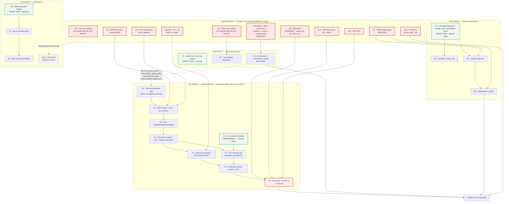

<!-- doc-status: historical -->
> **HISTORICAL RECORD — bu belge GÜNCEL GERÇEK DEĞİLDİR.** Yazıldığı andaki durumu
> kaydeder; SHA'lar, sayılar, alembic head'i ve "next" maddeleri bayat olabilir.
> Güncel otorite: `CLAUDE.md` §Current position + `docs/generated/repository_facts.md`
> (üretilmiş, CI'da `--check` ile kapılı).
>
> **`historical` işareti bu belgenin planını geçersiz kılmaz** — `docs/implementation/*.md`
> globundaki her dosya `historical`'dır, çünkü `current` yalnız canlı kickoff'a aittir ve
> `check_classification` bunu CI'da zorlar.

# P-D — Dependency-ordered implementation plan for the remaining V18 closure work

**NO PRODUCTION CODE WAS WRITTEN.** No file under `backend/src`, `frontend/src`,
`backend/migrations` or any test tree was created or modified. No `ENGINE_VERSION` value was
changed, no flag introduced, **no issue opened, closed or relabelled**. This document orders
work; it does not start it.

---

## §0 — Base, preconditions, and what was re-measured

### 0.1 Base

| | |
|---|---|
| **BASE_SHA** | `c49f5e714e41b4b44232a3cc410435647461659f` (`Merge pull request #727 …claude-permission-allowlist`) |
| **Expected base (prompt pack §3)** | `31ed27dfc1f3bf7448b0e03c7c732d22d8b758c4` |
| **Difference** | The expected base **is an ancestor** of this one, 60 commits behind. The delta contains `#720` (all three financial fixes), `#712` (P-E2 partial), `#722` (P-B), `#724` (**P-C1**) and `#725` (**P-C2**). Every number in §0.3 was re-measured on `c49f5e7`; nothing is inherited from either design document. |
| **Branch** | `docs/final-closure-ordered-plan` |
| **alembic head** | `0043_i08_registry_strategy_fks` — single head (`repository_facts.md:18`) |
| **`ENGINE_VERSION`** | `backtest-engine-v18-percent-sizing-per-fill-commission` |
| **`SHARED_ALLOCATION_STATUS`** | `future_dev` (`domain/allocation/capability.py:105`) |
| **Nothing was executed** | No `pytest`, no `npm test`, no coverage figure is asserted anywhere below. Every claim is a source measurement at `c49f5e7`. **CI is the authority for anything that runs.** |

### 0.2 Hard precondition — both design documents on `main`: **YES**

| Document | On `origin/main` | Landed as |
|---|---|---|
| `docs/implementation/closure_design_financial_research_2026-08-13.md` | ✅ | `138d4be` (**#724**) |
| `docs/implementation/closure_design_portfolio_performance_2026-08-13.md` | ✅ | `7e32352` (**#725**) |

The gate is satisfied. This plan proceeds.

### 0.3 What was re-measured, and the four numbers that moved

Both design documents were written against `0650369`/`138d4be`. Four of their load-bearing
figures do not reproduce at `c49f5e7`, and one of them is an **acceptance gate number**, so it
is corrected here rather than copied forward.

| # | Claim in P-C1/P-C2 | Measured at `c49f5e7` | Consequence |
|---|---|---|---|
| **M-1** | P-C2: *"46 golden digests unmoved"* — E4a's entire acceptance | **50 digest entries** (`backend/tests/unit/engine_golden_digests.json`, key `digests`) | **E4a's gate is 50, not 46.** #720 added four `costs.commission_*` scenarios. A PR that asserts "46 unmoved" is asserting against a file that no longer has 46 rows. |
| **M-2** | P-C2: ADR §14 A13 — *"37 non-portfolio digests unchanged, only the 9 `portfolio.*` move"* | **41 non-portfolio + 9 `portfolio.*` = 50** | A13's split is **41/9**. The 9 is right; the 37 is stale by exactly the four new scenarios. |
| **M-3** | P-C2: *"25 portfolio oracles unmoved"* (E4b's gate) | `test_oracle_portfolio_capital.py` **11** + `test_oracle_portfolio_clock.py` **10** = **21** participant-driven, plus **5** in `test_oracle_portfolio_containment_gate.py` | The number does not reproduce either way (21 or 26, not 25). **Do not write a count into the gate.** E4b's acceptance is *these two files unmoved, by name* — a count is a worse assertion than a file list, and this is why. |
| **M-4** | P-C1 §0.1 records `ENGINE_VERSION` at `manifest.py:145`; P-C2 cites `engine.py:756` for `_ItemStepper`, `:2498` for `_phase_entry` | `_ItemStepper` at **`:757`**, `_phase_entry` at **`:2498`** ✅ | Line numbers drift by ±1 between bases. **Every slice below cites symbol names.** Where a line number appears it is an aid, never an anchor (`CLAUDE.md`: *"satır numarası yazma, sembol adı kullan"*). |

Everything else in both designs reproduced. In particular these five, each re-measured:

| Claim | Re-measured at `c49f5e7` | Verdict |
|---|---|---|
| `run_portfolio` / `project_portfolio_run` have zero production callers | `test_oracle_portfolio_containment_gate.py:185`, `:223` — both still `assert callers == []` | ✅ holds |
| The lift pins are untouched | `:235` `SHARED_ALLOCATION_STATUS == "future_dev"` · `:241` `ENGINE_VERSION == "…percent-sizing-per-fill-commission"` | ✅ holds |
| `ItemParticipant` has no `settle` / `finalize` | Protocol members measured: `identity`, `stream`, `instrument_id`, `carry`, `mandatory_exit` — **five, no P7, no finalize** | ✅ P-C2's new seam #6 confirmed |
| The three Ready Check legs are still per-item | `_resolve_tick_data_issues` loop `:463` → `find_approved_tick_revision_for_instrument` `:472` · `_build_item_inputs` loop → `_resolve_strategy_payload` `:339` → `get_strategy_revision` `:371` · `_resolve_external` `:341`/`:788` | ✅ all three live |
| `query_budgets.json` covers 8 surfaces, 3 of them Ready Check legs | 8 rows, all at `per_item: 0`; completeness gate `test_query_budgets.py:543-553` is a **hand-written literal set** | ✅ P-C2 §D.2 confirmed |

---

## §1 — The proposed graph, verified rather than accepted

The prompt supplies a candidate graph (E1 → E2 → E3 → E4 → E5 → E6) and instructs that it be
checked against the tree. **Three of its six nodes change shape under measurement.** Each
correction is proved below.

### 1.1 E2 is **not** already landed. It is 2/5 done.

The prompt guesses *"MUHTEMELEN ZATEN LANDED, doğrula"*. Measured, that is half right and the
half that is wrong is the half that matters.

`#712` (P-E2, ADIM 62) closed **two** legs — `signal_market_data_leg` and
`research_funding_leg`, both now recorded at `per_item: 0`. Five per-item read sites exist in
`run_readiness_check`. Three are still live:

| Leg | Site at `c49f5e7` | State |
|---|---|---|
| market data | `_resolve_market_data_issues` → `market_repo.get_dataset_roots` (`:411`, batched) | ✅ closed before P-E2 |
| Trading Signal OHLCV fallback | `_resolve_signal_market_data_issues` → `get_dataset_roots` (`:555`) | ✅ closed by `#712` |
| research funding | `_resolve_research_sources` → `research_repo.get_dataset_roots` (`:744`) | ✅ closed by `#712` |
| **tick data** | `for item in items:` (`:463`) → `find_approved_tick_revision_for_instrument` (`:472`) | ❌ **live N+1, unmeasured** |
| **Strategy mirror deref** | `_build_item_inputs` → `_resolve_strategy_payload` (`:339`) → `get_strategy_revision` (`:371`) | ❌ **live N+1, unmeasured** |
| **external import state** | `_resolve_external` (`:341` → `:788`) → `resolve_trade_log_batch` / `resolve_signal_revision` | ❌ **live N+1, blocked on a product decision** |

**Correction to the graph: E2 is not a node to tick off — it is a package of three slices
(P1/P2/P3 below), one of which is permanently blocked on a product decision.** Treating E2 as
"landed" would leave two repairable N+1s in the readiness path and, worse, would leave the
*completeness gate* believing it covers an operation it has never measured end to end.

### 1.2 E1 does **not** have to precede E4 — and the real coupling is not `engine.py`

This is the question the prompt singles out. The answer is measured, not argued.

**Measurement.** `engine.py` is 3452 lines and has **only three** top-level symbols in the
relevant span: `class _ItemStepper` (`:757`), `def _build_stepper` (`:794`) and `def run_engine`
(`:3335`). `_build_stepper` is therefore a **single ~2541-line function** (`:794`–`:3334`)
whose body contains *every* touch point of both E1 and E4. Naïvely, "both touch `engine.py`" is
true and useless. So the enclosing **nested** function of each touch point was resolved:

| Work item | Touch point | Nested function that owns it |
|---|---|---|
| **A-2** (#551 residual, E1) | `led.portfolio_block_reason = "size_resolved_to_zero"` (`:1499`) | `_open()` (`:1416`) |
| A-2 context | `if size <= _ZERO:` (`:1469`) | `_open()` (`:1416`) |
| **A-3** (#552, E1) | entry-fill commission charge (`:1592`) | `_do_open()` (`:1552`) |
| **A-3** | stacking commission charge (`:3007`) + stale comment (`:2993`) | **`_phase_tail()` (`:2759`)** |
| **A-3** | scale-layer commission charge (`:3189`) + stale comments (`:3058`, `:3186`) | **`_phase_tail()` (`:2759`)** |
| **E4a** | `_phase_carry` split | `_phase_carry()` (`:1963`–`:2040`) |
| **E4a** | `_phase_held` split | `_phase_held()` (`:2314`–`:2497`) |
| **E4a** | `_phase_entry` split | `_phase_entry()` (`:2498`–`:2515`) + `_phase_entry_body()` (`:2516`–`:2758`) |
| **E4a** | `_phase_tail` scaling separability (P-C2 precondition #2) | **`_phase_tail()` (`:2759`–`:3232`, 474 lines)** |

**Three conclusions follow, and they are different from the prompt's assumption.**

1. **A-2 and E4a are genuinely independent.** A-2 lives in `_open()`; E4a rewrites
   `_phase_carry` / `_phase_held` / `_phase_entry`. **Zero nested-function overlap**, ~460 lines
   apart at the nearest edge. There is no semantic dependency either: A-2 changes a literal's
   *definition site* and emits a byte-identical string. **A-2 may land before, after, or
   concurrently with E4a.** The prompt's ordering is not required here.
2. **A-3 and E4a genuinely collide.** Both rewrite `_phase_tail()` — A-3 for two commission
   charge sites and three stale comments, E4a for the scaling separability P-C2 names as
   precondition #2. That is a 474-line function being restructured by two authors. **A-3 must
   not be in flight while E4a is open**, and vice versa.
3. **The binding constraint is neither file nor semantics — it is a shared acceptance
   artifact.** `backend/tests/unit/engine_golden_digests.json` is:
   - E4a's **entire** gate, in the form *"byte-unchanged, 50 digests unmoved"* (ADR §15 R-4);
   - A-3's **required output** if the commission base changes, in the form *"regenerate, and
     justify every moved digest"* (P-C1 §3.1).

   **Two PRs cannot both own that file.** One asserts it does not change; the other changes it.
   Whichever merges second is rebasing onto a file its own acceptance already spoke about.

> **Ruling.** E1 is **not** a prerequisite of E4. The prerequisite is narrower and stricter:
> **no slice whose acceptance is `engine_golden_digests.json` byte-unchanged may be open at the
> same time as a slice that regenerates it.** That is a *mutual-exclusion* edge (a lane rule),
> not a *precedence* edge. It is drawn as a dashed red constraint in §4's graph, and it is why
> §5 caps concurrency at 3 rather than at "however many file sets are disjoint".

### 1.3 E3 is not one slice, and half of it needs no signature

P-C1 §6 measures that B-1's **extraction half** and B-2 are unblocked, while B-1's *projection*
half and B-3 wait on Karar 2 (#558). The prompt's *"E3 (PO kararı landed ise)"* would idle the
unblocked 60% behind an unsigned decision. **Split at the measured seam** (R1/R3 free, R2/R4
gated). P-C1's own verdict is stronger than a scheduling preference:

> *"The single highest-value unblocked action is B-1's byte-identity proof … it converts the
> most dangerous risk in this entire design — silently repartitioning every stored Result's
> reproducibility namespace during a refactor — into a gate that fails loudly. It should land
> **before** any bundle field work, not with it."*

Corroborated here: `_seal_bundle` (`application/jobs/research_data.py:553`) computes
`bundle_hash = manifest_hash(body)` at `:563` and only then adds `resolved_at` at `:564` — so
`resolved_at` is **outside** the hash today. That ordering is exactly what a refactor can
silently invert, and exactly what the byte-identity proof pins.

### 1.4 E6 is not a slice. It is five, and it carries 22 preconditions

P-C2 §C.7 enumerates 22 preconditions for `SHARED_ALLOCATION_STATUS = "active_v1"`, six of them
human. A single "E6" PR would be a diff no reviewer can hold, mixing admission blockers, manifest
namespace surgery, a new oracle class and a flag flip whose merge changes shipped numbers.
**Split into C5–C9**, with the flag flip alone in the last one so the act of lifting is a
reviewable diff of its own.

### 1.5 What survives unchanged from the proposed graph

E4 → E5 → E6 ordering is **correct and strict**, and A-08 is **correctly modelled as fully
parallel and human-only**. E5's dependency on E4 is not stylistic: `_use_unified_clock`'s shared
branch constructs `_EngineParticipant`, which does not exist until E4c, and the containment-gate
narrowing at E5 asserts on a call site E4c makes legal.

---

## §2 — Hard gates: who opens each, looking at what, evidence written where

The prompt names six. Measurement finds **thirteen**, of which two are already discharged and
one has no owner at all.

| # | Gate | Status at `c49f5e7` | **Who opens it** | **Looking at what** | **Evidence written where** | Blocks |
|---|---|---|---|---|---|---|
| **G1** | **#552 commission — incidence** (per-fill vs round trip) | **UNSIGNED.** `decisions:276` all four boxes `[ ]`, `karar veren:` blank. GH #552 is **closed** (by #720) — *issue CLOSED ≠ çözüldü* | PO / maintainer | `decisions §Karar 1`; Master Ref §8 `:7513`, §6.2 `:7425`, §7 item 7 `:7738` | signature block `decisions:276-283` | **F3** |
| **G2** | **#552 commission — base** (flat amount vs bps on notional) | **UNSIGNED, and untouched by #720.** Shipped schema says flat (`config.py`, *"Per-trade fee"*); Master Ref §2.3 `:3110` gives the only concrete example as *bps on notional* | PO / maintainer | same block, Option C | same signature block | **F3**, and the only Package A item that can bump `ENGINE_VERSION` |
| **G3** | **`execution_content.commission_model` manifest field** — required by Master Ref §8 *regardless of which model wins*; absent today | **UNSIGNED** (mandatory addendum, `decisions:280`) | PO / maintainer | `decisions:460-465` | same signature block, `[ ] evet / [ ] hayır` | **F3** |
| **G4** | **#550 cap-overflow disposition** — Master Ref §10.2 says *"clamp değil"*; the engine clamps silently and **no validator compares base against the cap** | **NOT BRIEFED — no owner.** First recorded in P-C1 §2.1 / STOP-GATE 4 | **NOBODY YET.** Requires a fourth entry in `docs/decisions/closure_product_decisions_2026-08-13.md` | Master Ref §10.2 `:7562` vs doc 02 `:1015`/`:1920`; sleeve precedent `:8168` | **does not exist yet — creating it is this plan's first deliverable to a human** | **F2** |
| **G5** | **#550 canonical option** (percent vs unit-count) | ✅ **DISCHARGED.** GH #550 body: *"Decision recorded in the comments: adopt canon (option A)"*; closed `completed` by #720 | — | GH #550 body + comments; `sizing.py::_percent_of_capital` | GH #550, PR #720 | nothing |
| **G6** | **#558 research bundle shape** (A1 / A2 / A1+A2 / B / C) + 2 sub-decisions | **UNSIGNED.** `decisions:467-477` all boxes `[ ]`. GH #558 **OPEN**, `product-decision` | PO / maintainer | `decisions §Karar 2`; doc 12 §9.1/§9.2 | signature block `decisions:467-477` | **R2, R4** |
| **G7** | **§9.2's two class-D fields** (`alignment_policy_versions[]`, `missing_and_stale_policies[]`) | **UNSIGNED**, and **out of scope regardless** — measured 0 hits in `backend/src`, `frontend/src`; no column exists | PO / maintainer | `decisions:472` sub-decision | same signature block | nothing (excluded) |
| **G8** | **#559 DST fold/gap — is it required for shared mixed-zone?** | **UNSIGNED.** GH #559 **OPEN**, labelled `blocks-mixed-zone-axis`. **P-DEC answered the scoping question and it awaits ratification:** the decision doc's *hüküm (a)* is that #559 blocks the **mixed-zone scope only, not the axis arithmetic** — with its own `[ ] evet / [ ] hayır` box at `decisions:706-717` | PO / maintainer | `decisions §Karar 3`, ADR §12 | signature block `decisions:706-717` | **C9 only** (E6 precondition #21). **Not E4, not E5** — under fail-closed admission no shared run can reach a mixed-zone axis |
| **G9** | **ADR §16 Gate 1** — amend ADR §6/§8 to add `settle`, `finalize`, P10, `iter_portfolio` | **NOT REQUESTED.** ADR is `Accepted`; amending an accepted contract needs the signature that accepted it | PO / maintainer | `docs/adr/0002…md` §6, §8, §16 | an ADR amendment entry, same shape as the §13.1 table | **C2** |
| **G10** | **ADR §16 Gate 2** — flag flip + `ENGINE_VERSION` bump | **NOT REQUESTED.** §16: *"should hold for ADIM 20, which is the first slice that changes a shipped number"* | PO / maintainer | ADR §14 acceptance matrix, §16 | ADR §16 approval record | **C9** |
| **G11** | **P2 — deferred fills / resting limits on shared runs** (block at admission, or model P2) | **UNDECIDED, unbriefed.** P-C2 §C.3.7 recommends (a) block | PO / maintainer | P-C2 §C.3.7; doc 14 §9.1 taxonomy | needs a new admission blocker code + a decision entry | **C6** |
| **G12** | **P8 — scaling on shared runs** (block at admission, or model P8) | **UNDECIDED, unbriefed.** `run_portfolio` currently raises `UnsupportedIntentKindError` | PO / maintainer | P-C2 §C.3.8 | as G11 | **C6**, and the size of **C1** |
| **G13** | **P10 end-of-data equity point** — append a new point at the last `t_ms`, or fold into it | **UNDECIDED.** P-C2 §C.3.10 recommends fold; appending would put two points on one instant and break A5 | PO / maintainer | P-C2 §C.3.10; ADR §14 A5 | ADR amendment alongside G9 | **C2** |
| **G14** | **#544 NET cross-item conflict semantics** | GH #544 **OPEN**, `product-decision` + `blocks-adim-19` | PO / product | ADR §9.4 | GH #544 | **C9** (E6 precondition #20) |
| **G15** | **Ready Check leg 3 — which row wins** (`work_object_revision_id` is **not UNIQUE**, so today's per-item winner is undefined) | **UNDECIDED, unbriefed.** Batching changes readiness answers | PO / product | `CLAUDE.md` §ADIM 62 measurement; P-C2 §D.1 leg 3 | needs a decision entry | **nothing in this plan** — leg 3 has no slice by design |
| **G16** | **A-08 human screen-reader audit** (#514) | **OPEN, in progress.** 2/184 Section A cells, 0/10 flows, SR-1 never started, exit criteria **0/4** | **human auditor only** (`human-only` label) | `docs/audit/a11y_screen_reader_audit_results.md` §5 exit criteria | that ledger | **the final RC verdict** |

> **G4 and G15 are the two gates nobody owns.** Both are recorded here for the first time as
> *actionable* rather than as an observation. Neither can be discharged by an agent, and neither
> has a signature block to sign — creating those blocks is a human action this plan requests.

**Count, stated three ways because the three numbers differ and each is used somewhere below:**

| | Count | Which |
|---|---|---|
| **Registered human gates** | **16** | G1–G16. **Not one is dischargeable by an agent.** |
| **Still open** | **15** | all but **G5** (#550 canonical option, discharged in the issue body and shipped by #720) |
| **Actually blocking a slice or the RC verdict** | **14** | the 15 open, minus **G7** (unsigned but excluded from scope — the two class-D fields have no backing column and no slice) |

Two of the sixteen — **G4** and **G15** — have **no signature block to sign**. Creating those
blocks is the first human action this plan asks for, and neither can be substituted by an
agent's judgement.

---

## §3 — The slices

**19 implementation slices** in four packages. Each carries the nineteen mandatory fields. Two
command macros are defined once here and referenced by name, so that every slice states its full
verification without 19 copies of the same block.

```text
[V-BACKEND]  — the full local gate. Any slice touching backend/src or backend/tests runs it.
  cd backend
  uv sync --all-extras
  uv run ruff check . && uv run ruff format --check .
  uv run mypy src
  uv run python -m entropia.apps.api.openapi_export --check
  uv run alembic heads                      # expect exactly: 0043_i08_registry_strategy_fks
  uv run pytest -q                          # FULL suite — this is also the --cov-fail-under=90 gate
  cd .. && python scripts/generate_repository_facts.py --check

  Expected exit codes: 0 from every line.
  Traps that have bitten this repo, all three still apply:
    · a focused subset run needs --no-cov, or the coverage gate reports a FALSE RED (~4%)
    · never pipe pytest into `tail` — the exit code becomes tail's; write to a file, read $? separately
    · run the full suite in ONE pytest invocation; do not run `uv sync` while it runs

[V-GOLDEN]   — the engine acceptance. Any slice touching engine.py or execution/ runs it.
  cd backend
  uv run pytest tests/unit/oracles -q --no-cov          > /tmp/oracles.txt; echo "exit=$?"
  git diff --exit-code -- tests/unit/engine_golden_digests.json   # exit 0 REQUIRED unless the
                                                                  # slice's own field says BUMP
  Expected: exit 0 from both. A non-zero `git diff --exit-code` in a slice whose
  "ENGINE_VERSION change?" field says NO is a STOP, not a regeneration prompt.
```

---

### PACKAGE F — financial semantics (the prompt's "E1")

#### `F1` — publish the zero-size refusal reason

| Field | Value |
|---|---|
| **Goal** | Promote the bare literal `"size_resolved_to_zero"` to a module constant beside its sibling `SLEEVE_ZERO_CAPACITY`, and pin its **value** with a test. One technical purpose: a wire token that a user can read in a restriction trace must be defined somewhere. |
| **Prerequisites** | **NONE.** The only Package A item needing no signature (P-C1 §2.2). |
| **Canonical source** | Master Ref §10.1 `:7551` (*"Pozitif olmalı"*); doc 02 `:1014`. The F-10 **restriction-trace** vocabulary — **not** the HTTP error envelope. |
| **Production files** | `domain/backtest/execution/portfolio_ledger.py` (new constant, beside `SLEEVE_ZERO_CAPACITY`) · `domain/backtest/engine.py` — **one line inside `_open()`**, the assignment currently at `:1499` |
| **Test files** | `backend/tests/unit/oracles/test_oracle_sizing.py` (or the ledger's own unit file): assert the constant's **value**, plus a negative control asserting the allocation path still reports `sleeve_zero_capacity` |
| **No-touch files** | `engine_golden_digests.json` · `manifest.py` · `shared/errors.py` (**this is not an HTTP error and must not acquire an `ErrorCategory`** — O-02 governs `ErrorBody`, and no `ErrorBody` is emitted on this path) · anything under `_phase_*` |
| **Migration?** | No |
| **OpenAPI change?** | No — unless the whole trace vocabulary is published as an enum, which is a **separate, larger, separately valuable** change and must not ride along |
| **ENGINE_VERSION change?** | **NO.** The emitted string is byte-identical; only its definition site moves. A bump here would invalidate 50 digests to rename a constant. |
| **Manifest-schema version?** | No |
| **Historical compatibility** | Untouched. Pre-#551 Results containing phantom 0-size trades **stay wrong and stay immutable** — they are namespaced away by `execution_key`. **No backfill is proposed; correcting a stored Result would break immutability.** |
| **Acceptance IDs** | P-C1 §2.2 Definition of Done: `grep -c '"size_resolved_to_zero"' backend/src` returns **1**, and that hit is the constant definition |
| **Commands** | `[V-BACKEND]` + `[V-GOLDEN]` |
| **Expected exit codes** | 0 everywhere; `git diff --exit-code` on the golden file **must** be 0 |
| **Rollback** | Single-commit revert. No data, no hash, no version touched. |
| **Stop condition** | If the frontend turns out to render `portfolio_block_reason` (**unmeasured — P-C1 explicitly did not measure it**) and a label is needed, that is still in scope; but if publishing the label requires a schema change, **stop and split** |
| **Next PR** | none — F1 is a leaf |
| **Parallel?** | **YES** — with every slice except one that regenerates the golden file. Disjoint from R*, P*, and from C1 (measured: `_open()` vs `_phase_*`, §1.2) |

#### `F2` — Max Single Position overflow disposition

| Field | Value |
|---|---|
| **Goal** | Make the cap overflow non-silent, in whichever of the three dispositions is signed. |
| **Prerequisites** | **G4 — and G4 has no signature block yet.** A brief must be written first. **Do not start.** |
| **Canonical source** | Master Ref §10.2 `:7562` — *"Base veya formula sonucu bu limiti aşarsa `clamp değil` blocker veya explicit cap policy uygulanır"*; doc 02 `:1015`, `:1920`; sleeve precedent `:8168` (which allows capping **for the sleeve** and therefore is *not* an argument here) |
| **Production files** | *blocker* → `domain/readiness/validators.py` only (engine untouched) · *cap policy* → `config.py::PositionSizeLimits` + `execution/sizing.py::_clamp_to_limits` + `manifest.py` `execution_content` · *sign the clamp* → **zero files** |
| **Test files** | Ready Check unit test **with a negative control** (base *under* the cap must stay READY — otherwise the test proves only that the validator always fires) |
| **No-touch files** | `engine_golden_digests.json` under all three dispositions |
| **Migration?** | **NO under all three.** `StrategyConfig` is stored as a JSON payload (`readiness_check.py:700` `StrategyConfig(**item.payload)`) so a new optional field needs no DDL. |
| **OpenAPI change?** | *cap policy* only — `PositionSizeLimits` is a published component, so `docs/openapi.json` must be regenerated **in the same PR** or the export drift guard fails |
| **ENGINE_VERSION change?** | **NO, under all three dispositions.** A refusal is not a re-pricing. *This is the strongest reason to land F2 separately from anything that does.* |
| **Manifest-schema version?** | *cap policy* only: `overflow_policy` belongs **inside** `execution_content`, which shifts **every** `execution_key` → no stored Result is idempotently reused for a re-RUN. Precedented (INF-04/INF-05) but must be **stated in the PR, not discovered**. |
| **Historical compatibility** | Stored Results are never recomputed; a shifted `execution_key` simply never matches again. **The hazard is not Results — it is saved revisions:** the *blocker* disposition makes strategies that run clamped today start failing Ready Check. **Blast radius unmeasured; count it before signing.** |
| **Acceptance IDs** | P-C1 §2.1 Definition of Done |
| **Commands** | `[V-BACKEND]` + `[V-GOLDEN]` |
| **Expected exit codes** | 0; golden diff 0 |
| **Rollback** | *blocker*: revert the validator, no data touched. *cap policy*: revert the field — stored payloads carrying `overflow_policy` stay valid JSON, **but verify the config models actually ignore unknown keys before relying on it**; `execution_key` returns to its old namespace, so post-revert runs stop matching interim Results. **Cheapest rollback is not shipping the field until signed.** |
| **Stop condition** | Unsigned G4 = do not open the PR |
| **Next PR** | none |
| **Parallel?** | YES with R*, P*, C1 — **but it is blocked, so the question is moot until G4 is signed** |

#### `F3` — commission model + `execution_content.commission_model`

| Field | Value |
|---|---|
| **Goal** | Implement the signed commission decision, and add the manifest descriptor Master Ref §8 requires **regardless of which model wins**. |
| **Prerequisites** | **G1 + G2 + G3, all unsigned.** GH #552 is *closed* and the decision is *unsigned* — the closed issue is not the evidence. **Do not start.** |
| **Canonical source** | Master Ref §8 `:7513` · §6.2 `:7425` · §2.3 `:3110` (the only concrete example: *bps on notional*) · §7 item 7 `:7738`. **K3 contradicts the shipped schema** (`config.py`, flat `Decimal`, *"Per-trade fee"*) — that contradiction is G2's subject. |
| **Production files** | `execution/booking.py::close_position` · `engine.py` **inside `_do_open()` and `_phase_tail()`** (charge sites at `:1592`, `:3007`, `:3189`) · `domain/backtest/manifest.py` (`execution_content`) · `config.py` if the base changes |
| **Test files** | `tests/unit/oracles/test_oracle_costs.py`, `test_oracle_position_lifecycle.py`; **`engine_golden_digests.json` regenerated only if the base changes** |
| **No-touch files** | none pre-declared — but see the mutual-exclusion rule in §1.2 |
| **Migration?** | No |
| **OpenAPI change?** | Only if `config.py`'s commission field changes type/meaning |
| **ENGINE_VERSION change?** | **Conditional and this is the whole scheduling problem.** Incidence ratified as-is → **NO BUMP**. Base changed to bps → **BUMP** on every commissioned run. `commission_model` manifest field alone → **NO BUMP**, but `execution_key` **shifts**. |
| **Manifest-schema version?** | **YES — mandatory under every option.** `execution_content` carries no commission descriptor today; §8 requires one, *"aksi halde iki farklı ücret modeliyle üretilmiş iki run aynı reprodüksiyon kimliğini paylaşır"* |
| **Historical compatibility** | A bump namespaces old Results away; none is rewritten. Cross-version comparison surfaces correctly treat them as non-comparable — user-visible, contracted, and the reason the bump exists. |
| **Acceptance IDs** | Whatever the signature specifies. **Plus one unconditional item:** the **three stale comments** inside `_phase_tail()` (`:2993`, `:3058`, `:3186-3188`) still say *"the close still books one round trip"*, which has been false since #720. **Fix all three in this PR under every option.** |
| **Commands** | `[V-BACKEND]` + `[V-GOLDEN]`. If the base changes: refresh digests **only after verifying each moved digest moved for the signed reason**, and regenerate `repository_facts.md` in the same commit (`ENGINE_VERSION` is published there and `--check` is blocking). |
| **Expected exit codes** | 0. `git diff --exit-code` on the golden file: **0 if no bump, non-zero and justified if bump** |
| **Rollback** | If a bump shipped, reverting re-partitions `execution_key` a second time. Interim Results become unreachable for reuse. **Not a cheap revert — this is why it is gated.** |
| **Stop condition** | Any unsigned box in G1/G2/G3 |
| **Next PR** | none |
| **Parallel?** | **NO with C1** (both rewrite `_phase_tail()`, and if the base changes both claim `engine_golden_digests.json`). YES with R*, P*. |

---

### PACKAGE R — research provenance (the prompt's "E3")

#### `R1` — `TimingProvenance` value object + bundle-hash byte-identity proof

| Field | Value |
|---|---|
| **Goal** | Extract the timing vocabulary that is spelled four different ways across four surfaces into **one** value object, and **prove by test that the extraction changes no `bundle_hash` byte**. |
| **Prerequisites** | **NONE.** P-C1 §6: *"the single highest-value unblocked action"*. |
| **Canonical source** | doc 12 §9.1/§9.2; P-C1 §4.1's measured inventory (manifest carries **10** timing fields, Ready Check **4**, both bundle compilers **0**, the Agent gateway **0**) |
| **Production files** | one new value object module under `domain/research/` (or beside the existing provenance types) · `application/jobs/backtest_run_context.py::_research_entries` and `application/commands/readiness_check.py::_resolve_research_sources` consume it. **The bundle compilers are NOT changed in R1** — that is R2. |
| **Test files** | **The byte-identity proof is the deliverable**: a test that compiles a bundle before and after and asserts `bundle_hash` is **byte-identical**. Plus typed-response coverage. |
| **No-touch files** | `manifest.py` · `engine_golden_digests.json` · anything under `domain/backtest/` |
| **Migration?** | No |
| **OpenAPI change?** | **Likely yes** — P-C1 §4.1 wants the bundle/context responses to become typed models. `dict[str, Any]` returns hide the contract from the schema (O-30's lesson). Regenerate `docs/openapi.json` in the same PR. |
| **ENGINE_VERSION change?** | **NO. Package B never bumps** — bundles are not engine inputs (P-C1 §3.1). |
| **Manifest-schema version?** | **NO — and this is the point of the slice.** `execution_key` **must stay unchanged**; the byte-identity proof is what makes that a gate rather than a hope. |
| **Historical compatibility** | Existing sealed bundles keep their `bundle_hash`. **Note the measured ordering:** `_seal_bundle` (`application/jobs/research_data.py:553`) computes `bundle_hash = manifest_hash(body)` at `:563` and adds `resolved_at` at `:564` — so `resolved_at` is **outside** the hash. A refactor that inverts that ordering silently re-hashes every bundle. **That inversion is exactly what this proof catches.** |
| **Acceptance IDs** | P-C1 §4.1; the byte-identity assertion |
| **Commands** | `[V-BACKEND]` |
| **Expected exit codes** | 0 |
| **Rollback** | Revert; no data, no hash, no version touched |
| **Stop condition** | If the extraction moves a single `bundle_hash` byte, **stop** — the refactor changed meaning, not shape |
| **Next PR** | `R3`, then `R2`/`R4` when G6 is signed |
| **Parallel?** | **YES** — with F1, all P*, and C1. Disjoint file set (research/readiness vs backtest/engine). |

#### `R2` — bundle field projection (shape per Karar 2)

| Field | Value |
|---|---|
| **Goal** | Project the R1 value object into the two bundle compilers, in the shape the signature names. |
| **Prerequisites** | **R1 merged** + **G6 signed** (A1 / A2 / A1+A2 / B / C, plus the timezone sub-decision) |
| **Canonical source** | doc 12 §9.1/§9.2; `decisions §Karar 2` |
| **Production files** | `application/jobs/research_data.py::compile_agent_data_bundle` (`:487`), `::compile_backtest_evidence_bundle` (`:519`), `::_seal_bundle` (`:553`) · `agent_tools.py::_handle_data_bundle_resolve` |
| **Test files** | bundle-shape tests per the signed option; **`bundle_hash` is EXPECTED to move here** — that is the difference from R1 |
| **No-touch files** | `manifest.py`, `execution_key` — a bundle hash is not a run identity |
| **Migration?** | No |
| **OpenAPI change?** | Yes if the bundle response is typed |
| **ENGINE_VERSION change?** | **NO** |
| **Manifest-schema version?** | **`bundle_hash` shifts; `execution_key` must NOT.** State both explicitly in the PR body. |
| **Historical compatibility** | Sealed bundles keep their old hash; new bundles get a new one. `compiler_version` must move with the shape (R3's rule). |
| **Acceptance IDs** | P-C1 §4.2 |
| **Commands** | `[V-BACKEND]` |
| **Expected exit codes** | 0 |
| **Rollback** | Revert; already-sealed bundles are unaffected either way |
| **Stop condition** | **Option B (pin-and-deviate) needs no code at all** — if B is signed, this slice does not exist and the deliverable is a signed deviation paragraph |
| **Next PR** | `R4` |
| **Parallel?** | YES with F*, P*, C* — blocked on G6 |

#### `R3` — compiler-version rule + `resolved_at` pin

| Field | Value |
|---|---|
| **Goal** | Make the rule *"a shape change bumps `compiler_version`"* enforceable, and pin `resolved_at`'s position relative to the hash. |
| **Prerequisites** | **R1 merged.** No signature needed. |
| **Canonical source** | P-C1 §4.2 |
| **Production files** | `application/jobs/research_data.py::_seal_bundle` |
| **Test files** | a rule test: the same inputs at the same `compiler_version` seal to the same `bundle_hash`; `resolved_at` does **not** enter the hash |
| **No-touch files** | `manifest.py`, `engine.py` |
| **Migration?** | No · **OpenAPI change?** No · **ENGINE_VERSION change?** No · **Manifest-schema version?** No |
| **Historical compatibility** | Unchanged — this pins existing behaviour rather than altering it |
| **Acceptance IDs** | P-C1 §4.2 |
| **Commands** | `[V-BACKEND]` · **Expected exit codes** 0 |
| **Rollback** | Revert |
| **Stop condition** | If pinning reveals that `resolved_at` *is* inside the hash on some path, **stop** — that is a defect, not a pin |
| **Next PR** | `R4` |
| **Parallel?** | YES with everything except R1 (which it follows) and R2 (same file) |

#### `R4` — close the strict xfail + three-artifact parity test

| Field | Value |
|---|---|
| **Goal** | Retire the one deliberate `xfail(strict)` and prove manifest / Ready Check / bundle agree on timing. |
| **Prerequisites** | **R1 + R2 merged** (the xfail asserts on a field R2 introduces) + **G6 signed** |
| **Canonical source** | P-C1 §4.3; doc 12 §9.1/§9.2 |
| **Production files** | **none expected** — R4 is a test slice |
| **Test files** | `backend/tests/integration/test_research_point_in_time_parity.py` (the `xfail(strict)` at `:583`) + a new three-artifact parity test |
| **No-touch files** | all production trees |
| **Migration?** | No · **OpenAPI change?** No · **ENGINE_VERSION change?** No · **Manifest-schema version?** No |
| **Historical compatibility** | n/a |
| **Acceptance IDs** | P-C1 §4.3. Acceptance-debt ratchet: if this closes criteria, `docs/audit/acceptance_coverage_baseline.json` **only goes down**; `total_criteria = 383` is a floor; **moving a criterion between debt classes raises that class's ceiling and is an adjudication, not a test slice's call** |
| **Commands** | `[V-BACKEND]` · **Expected exit codes** 0 |
| **Rollback** | Revert; the xfail returns |
| **Stop condition** | **If option B was signed at G6, the xfail stays** and the deliverable is a documented permanent deviation with the strict-xfail count unchanged. Do not "close" it by weakening it. |
| **Next PR** | none |
| **Parallel?** | YES with F*, P*, C* |

---

### PACKAGE P — performance (the prompt's "E2", which is 2/5 done)

#### `P3` — the whole-operation budget backstop **(recommended first in this package)**

| Field | Value |
|---|---|
| **Goal** | Add one `readiness_check.run_readiness_check` budget row measuring the **whole operation** on the *items in the composition* axis, and replace the completeness gate's hand-written literal set with a derived one. |
| **Prerequisites** | **NONE** |
| **Canonical source** | doc 14 §9.2/§11; P-C2 §D.2 (design **(b)** as the backbone, **(a)** for existing legs, **(c)** named but not built) |
| **Production files** | **none** — this is a gate, not a feature |
| **Test files** | `backend/tests/integration/test_query_budgets.py` (new measured surface + derived completeness gate) · `docs/performance/query_budgets.json` (new row) |
| **No-touch files** | `application/commands/readiness_check.py` — **P3 measures, it does not repair** |
| **Migration?** | No · **OpenAPI change?** No · **ENGINE_VERSION change?** No · **Manifest-schema version?** No |
| **Historical compatibility** | n/a |
| **Acceptance IDs** | P-C2 §D.2. **The row's `per_item` will NOT be 0 on first measurement** — legs 2 and 3 are live N+1s. Record the **measured** slope with a `note` naming leg 3 as the reason. **Recording 0 to look clean fails the build; omitting the row to avoid the ugly number is the silence this gate exists to break.** |
| **Commands** | `[V-BACKEND]` (needs Postgres on `:5432`, `entropia`/`entropia`; in a parallel worktree use `TEST_DATABASE_URL` with a `postgresql+asyncpg://` driver) |
| **Expected exit codes** | 0 |
| **Rollback** | Revert the row and the gate |
| **Stop condition** | If the derived completeness gate cannot enumerate `_measure` call sites without parsing gymnastics, **ship (a)+(b) and leave the literal**, recording why — do not half-build (c) |
| **Next PR** | `P1`, then `P2` — **each lowers this row** |
| **Parallel?** | **YES** with F1, R1, C1. **NO** with P1/P2 (they re-measure the same row) |

#### `P1` — batch the tick-data availability leg

| Field | Value |
|---|---|
| **Goal** | Replace the per-item `find_approved_tick_revision_for_instrument` with one batched read. `per_item` → **0**. |
| **Prerequisites** | none (but see merge order: **after P3**, so the backstop ratchets down rather than being born already-repaired) |
| **Canonical source** | doc 14 §9.2; P-C2 §D.1 leg 1 |
| **Production files** | `infrastructure/postgres/repositories/market_data.py` (new batched reader) · `application/commands/readiness_check.py::_resolve_tick_data_issues` (loop at `:463`, read at `:472`) |
| **Test files** | `test_query_budgets.py` (new/updated row at `per_item: 0`) + a filter-parity test |
| **No-touch files** | `_resolve_external` (leg 3) · `research_data.py` |
| **Migration?** | No · **OpenAPI change?** No · **ENGINE_VERSION change?** No · **Manifest-schema version?** No |
| **Historical compatibility** | Readiness answers must be **identical**. The per-item query is `ORDER BY created_at DESC, revision_id DESC LIMIT 1` — a **total** order — so `DISTINCT ON (instrument_id) … ORDER BY instrument_id, created_at DESC, revision_id DESC` over an `IN()` returns *exactly* the same row per instrument. **No ordering ambiguity to adjudicate** (unlike leg 3). |
| **Acceptance IDs** | P-C2 §D.1 leg 1. **Ratchet, never raise a ceiling.** Mirror `market_data.get_dataset_roots` (`:406-424`) **field for field** — empty input short-circuits, duplicates collapse, entity-type/root-state guards stay **in SQL**, an absent id is absent from the map so the caller's fail-closed branch stays byte-identical. **Do not invent a third idiom.** |
| **Commands** | `[V-BACKEND]` |
| **Expected exit codes** | 0 |
| **Rollback** | Revert both files; the budget row returns to its prior slope (**which is a ratchet raise — record it**) |
| **Stop condition** | **Run the negative control against a pristine file.** ADIM 62 recorded that the first attempt at exactly this gave a **false green**; and the counter has a measured blind spot — a `session.get` for a PK a batch already warmed issues **no SQL at all** |
| **Next PR** | `P2` |
| **Parallel?** | **NO** with P2/P3 (same JSON row, same test file). YES with F*, R*, C1 |

#### `P2` — batch the Strategy mirror deref

| Field | Value |
|---|---|
| **Goal** | Replace the per-item `get_strategy_revision` mirror deref with a plain PK batch. |
| **Prerequisites** | **P1 merged** (same test file and JSON row) |
| **Canonical source** | P-C2 §D.1 leg 2 |
| **Production files** | `infrastructure/postgres/repositories/strategy.py` (batch reader) · `application/commands/readiness_check.py::_build_item_inputs` / `::_resolve_strategy_payload` (`:339`, `:371`) |
| **Test files** | `test_query_budgets.py` — lower the backstop row **and** add the leg row |
| **No-touch files** | `_resolve_external` |
| **Migration?** | No · **OpenAPI change?** No · **ENGINE_VERSION change?** No · **Manifest-schema version?** No |
| **Historical compatibility** | Identical readiness answers — a PK batch has no ordering question |
| **Acceptance IDs** | P-C2 §D.1 leg 2 |
| **Commands** | `[V-BACKEND]` · **Expected exit codes** 0 |
| **Rollback** | Revert; record the ratchet raise |
| **Stop condition** | If the mirror pin turns out **not** to be a PK, stop — it becomes leg 3's problem (see G15) |
| **Next PR** | none. **Leg 3 has no slice, by design.** |
| **Parallel?** | NO with P1/P3. YES with F*, R*, C1 |

> **Leg 3 (`_resolve_external`) is deliberately unscheduled.** The `work_object_revision_id`
> these readers key on is **not UNIQUE**, so today's per-item "winner" is undefined and a batch
> would pick a possibly-different row. **Batching it is a product decision about which row wins
> (G15), not a performance change.** Silently making it fast would silently change readiness
> answers. It stays named in `query_budgets.json`'s `note` and in G15 until a human decides.

---

### PACKAGE C — shared portfolio (the prompt's E4 / E5 / E6)

**Containment stays `future_dev` through C1–C8. Only `C9` lifts it.**

#### `C1` — E4a: the describe/book split (pure refactor)

| Field | Value |
|---|---|
| **Goal** | Split three `_ItemStepper` phases into a pure half and a booking half, and **size** whether `_phase_tail`'s scaling section is separable. Nothing else. |
| **Prerequisites** | **NONE** — and notably **not** ADR §16 Gate 1: E4a changes no contract, and its whole proof is that nothing moves |
| **Canonical source** | ADR `0002` §15 R-4; P-C2 §C.2 Gap 1 |
| **Production files** | `domain/backtest/engine.py` **only** — inside `_build_stepper`: `_phase_carry` → `_compute_carry` + `_book_carry`; `_phase_held` → `_evaluate_held` + `_apply_held`; `_phase_entry` → `_evaluate_entry` + `_apply_entry`. `_ItemStepper` gains six fields and keeps its three, so `_step` (`:3233`) stays **character-identical** and every existing `.carry`/`.held`/`.entry` caller keeps working. |
| **Test files** | `tests/unit/oracles/*` (unchanged expectations); `tests/unit/test_backtest_engine_stepper.py` (10 tests, one bar per call, digest-identical) |
| **No-touch files** | `portfolio_engine.py` · `manifest.py` · `application/jobs/backtest_engine.py` · `test_oracle_portfolio_containment_gate.py` · **`engine_golden_digests.json` — byte-unchanged is the gate** |
| **Migration?** | No · **OpenAPI change?** No |
| **ENGINE_VERSION change?** | **NO. This is the definition of the slice.** |
| **Manifest-schema version?** | No |
| **Historical compatibility** | Total — a pure refactor re-prices nothing |
| **Acceptance IDs** | ADR §15 **R-4**. **The gate is 50 digests unmoved and `engine_golden_digests.json` byte-unchanged** — *not* 46 (measurement M-1: the file has **50** entries, 41 non-portfolio + 9 `portfolio.*`, since #720 added four `costs.commission_*` scenarios). |
| **Commands** | `[V-BACKEND]` + `[V-GOLDEN]` |
| **Expected exit codes** | 0 everywhere. **`git diff --exit-code -- backend/tests/unit/engine_golden_digests.json` must be 0.** |
| **Rollback** | Revert; a pure refactor reverts cleanly by construction |
| **Stop condition** | **A moved digest means E4a is wrong — it has become a re-price. Stop; do not regenerate the file.** ADR §15 R-4 says only this assertion is trusted. Second stop: if `_phase_tail`'s scaling section proves **inseparable**, stop and report — P-C2 §C.3.8 option (a) then becomes *mandatory* rather than recommended, which creates a new admission blocker (G12) rather than more refactoring. P-C2 concedes this separability was asserted from the call graph, **not** from reading the 474-line body. |
| **Next PR** | `C2` |
| **Parallel?** | **YES** with F1, R*, P*. **NO** with F3 (same `_phase_tail`, and F3 may claim the golden file). |

#### `C2` — E4b: `ItemParticipant.settle` + `.finalize`, P10, `iter_portfolio`

| Field | Value |
|---|---|
| **Goal** | Close the write-only-Protocol hole and make the loop drivable tick by tick. |
| **Prerequisites** | **C1 merged** + **G9 (ADR §16 Gate 1) signed** + **G13 (P10 equity-point rule) decided** |
| **Canonical source** | ADR §6, §8 (both **being amended** — that is what G9 is); P-C2 §C.2 Gap 2, §C.3.9, §C.3.10 |
| **Production files** | `domain/backtest/portfolio_engine.py` — two new **required** Protocol members, `_phase_10_finalize`, `PHASE_ORDER` gains P10, `iter_portfolio` generator with `run_portfolio` as its two-line wrapper |
| **Test files** | `tests/unit/oracles/portfolio_harness.py::_ScriptedParticipant` gains a **no-op pair** (books nothing, returns `None`) · the phase-order test updated **deliberately** |
| **No-touch files** | `engine.py` · `manifest.py` · the worker · the containment gate |
| **Migration?** | No · **OpenAPI change?** No · **ENGINE_VERSION change?** **NO** · **Manifest-schema version?** No |
| **Historical compatibility** | Nothing reachable changes; `run_portfolio` keeps its signature and semantics |
| **Acceptance IDs** | **The portfolio oracles unmoved — by file, not by count.** Measurement M-3: `test_oracle_portfolio_capital.py` has **11** test functions and `test_oracle_portfolio_clock.py` has **10** (21), plus **5** in the containment gate; P-C2's *"25"* reproduces neither way. **Write the file names into the gate, never a number.** |
| **Commands** | `[V-BACKEND]` + `[V-GOLDEN]` |
| **Expected exit codes** | 0; golden diff 0 |
| **Rollback** | Revert. **But note: the ADR amendment does not revert with it** — if C2 is reverted, say so in the ADR |
| **Stop condition** | `settle`/`finalize` must be **required** Protocol members, not `hasattr`-probed: probing is fail-open and a participant that forgets `settle` runs silently flat. If mypy cannot enforce them structurally, **stop and reconsider the seam.** Also: if the end-of-data close is implemented as an **appended** equity point at the last `t_ms`, two points land on one instant and A5's by-construction claim breaks — that is G13, not an implementation detail. |
| **Next PR** | `C3` |
| **Parallel?** | YES with F1/F2, R*, P*. **NO** with C1 (predecessor) or C3 (successor). |

#### `C3` — E4c: the `_EngineParticipant` adapter

| Field | Value |
|---|---|
| **Goal** | One new module: an engine-backed participant, plus the two invariants that make dual booking safe rather than lucky. |
| **Prerequisites** | **C2 merged** |
| **Canonical source** | ADR §5, §8.2; P-C2 §C.1, §C.3.1–§C.3.6 |
| **Production files** | **`domain/backtest/participant.py` — ONE new module.** Deliberately **outside** `execution/`: placing it at `domain/backtest/execution/participant.py` would dodge the containment gate's importer check *by construction*, making the guard blind rather than satisfied. Outside, the guard turns red and the allowlist must be widened **explicitly and reviewed**. |
| **Test files** | new oracle file: the **reconciliation invariant** (portfolio-ledger attribution deltas == item `_Ledger` realized deltas, on a two-item fixture) and the **sleeve-parity invariant** (`sleeve_capital(stepper.ctx, snapshot.equity) == snapshot.sleeve_capacity[item_id]` at every tick for every item) |
| **No-touch files** | `manifest.py` · `application/jobs/backtest_engine.py` (that is C4) · `run_engine` |
| **Migration?** | No · **OpenAPI change?** No · **ENGINE_VERSION change?** **NO** · **Manifest-schema version?** No |
| **Historical compatibility** | Nothing reachable from production; the adapter has no caller until C4 |
| **Acceptance IDs** | P-C2 §C.3.3 (reconciliation) + §C.3.5 (sleeve parity). **Seam #7 is the weakest link in the whole design:** `Ci(t)` is derived **twice** — by the engine from the injected `E(t)` (`sizing.py:406-410`) and by the ledger as `snapshot.sleeve_capacity`. They *should* agree; the assertion is what makes "should" into "does". |
| **Commands** | `[V-BACKEND]` + `[V-GOLDEN]` |
| **Expected exit codes** | 0; golden diff 0 |
| **Rollback** | Revert the module; nothing imports it yet |
| **Stop condition** | Three traps, each of which silently produces a wrong run if missed: (1) `entry()` must return `None` when the item is not flat — the flat check lives in `_step`'s driver, **not** in `_phase_entry_body`, whose guard list has `pending`/`working_limit`/`working_stop` but **not** `position`; (2) the adapter must **not** duplicate `_validated_intent`'s five boundary checks — letting the loop refuse is the point of having them there; (3) **no bar translation layer** — `clock.py` and `engine.py` already import the same `_Bar`/`_normalize` from `execution/state.py`, and a second normalization is a second coercion policy. |
| **Next PR** | `C4` |
| **Parallel?** | YES with F*, R*, P*. NO with C2/C4. |

#### `C4` — E5: the worker branch, the cancel checkpoint, and the narrowed tripwire

| Field | Value |
|---|---|
| **Goal** | Wire a branch **nobody can enter**, and replace the tripwire's "nothing calls it" with "only this caller, and it is flag-guarded". |
| **Prerequisites** | **C3 merged** |
| **Canonical source** | ADR §11, §14 **A21**; P-C2 §C.5, §C.6 |
| **Production files** | `application/jobs/backtest_engine.py` — `_use_unified_clock(capital_execution)` at **one** place, returning `shared_allocation_is_executable() and shared_allocation_requested(capital_execution)`; the shared branch as a **sibling above** the item loop; the tick-strided cancellation checkpoint |
| **Test files** | `tests/unit/oracles/test_oracle_portfolio_containment_gate.py` (narrowed) + two behavioural tests: *an independent multi-item run never reaches the unified loop* (flag as shipped, Result carries the sequential fold's marker) and *a shared run is still refused at admission* (already exists — must stay green **unweakened**) |
| **No-touch files** | **`manifest.py` — E5 must not touch it.** The four policy fields are E6/A15 because the moment they enter `execution_content` the `execution_key` namespace shifts. Also no-touch: `engine.py`, `portfolio_engine.py`, `capability.py`. |
| **Migration?** | No · **OpenAPI change?** No · **ENGINE_VERSION change?** **NO** — E5 wires; only C9 lifts · **Manifest-schema version?** No |
| **Historical compatibility** | **Both conjuncts of `_use_unified_clock` are load-bearing.** `shared_allocation_requested` alone would route an independent multi-item run through the loop the moment someone misreads the snapshot; `shared_allocation_is_executable` alone would route **every** multi-item run through it. Either mistake **silently re-prices every independent composite Result** with no flag, no bump and no user-visible change. |
| **Acceptance IDs** | ADR §14 **A21**, **A13**, **A14**; P-C2 §C.6 |
| **Commands** | `[V-BACKEND]` + `[V-GOLDEN]` |
| **Expected exit codes** | 0; golden diff 0 |
| **Rollback** | Revert the branch **and** restore the tripwire's original assertions in the same revert — a narrowed gate with no wiring behind it is a weakened gate |
| **Stop condition** | **The gate turning red here is expected, not a bug** — it is a deliberate tripwire and must be **narrowed to an authorised-caller allowlist**, never deleted or weakened. Two of its five assertions (`combine_item_runs(` and `for prepared in prepared_items:`) **stay untouched and must stay green** — deleting either is the silent re-price above. **If this PR finds itself editing the lift pins (`SHARED_ALLOCATION_STATUS == "future_dev"`, the `ENGINE_VERSION` literal, or the `5000.00`/`3000.00` fixture), it has silently become ADIM 20 and needs G10 first — stop.** Never resolve a conflict in that file with `-X theirs` (ADIM 56 recorded that shape dropping a pinned sentence silently). |
| **Next PR** | `C5`…`C8` |
| **Parallel?** | YES with F*, R*, P*. NO with any other C. |

#### `C5` — R-1: pin the allocation plan revision (narrow, and it can go early)

| Field | Value |
|---|---|
| **Goal** | `_resolve_allocation` records `plan_revision_id` as a bare pointer while building `config` from **live draft rows**; `AllocationProvenance` demands the **frozen** record. |
| **Prerequisites** | **NONE — this slice does not depend on C1–C4.** ADR §10.2 says it is its own narrow PR; only its *deadline* (before C9) ties it to Package C. |
| **Canonical source** | ADR §10.2 (R-1) |
| **Production files** | `application/commands/readiness_check.py::_resolve_allocation` (`:824`) and the allocation provenance path |
| **Test files** | a test that the pinned config **byte-matches** the named revision row; `sleeve_amount_divergences` cross-check |
| **No-touch files** | `engine.py`, `portfolio_engine.py`, `manifest.py` |
| **Migration?** | No (verify) · **OpenAPI change?** No · **ENGINE_VERSION change?** No · **Manifest-schema version?** No |
| **Historical compatibility** | Existing provenance records unchanged; new ones become truthful |
| **Acceptance IDs** | ADR §10.2 R-1; E6 precondition **#19** |
| **Commands** | `[V-BACKEND]` · **Expected exit codes** 0 |
| **Rollback** | Revert |
| **Stop condition** | If pinning changes a *readiness answer* rather than only its provenance, stop — that is a behaviour change needing its own record |
| **Next PR** | `C7` |
| **Parallel?** | **YES with everything, including C1–C4** — disjoint file set (readiness/allocation vs engine/worker). **This makes C5 the best "second lane" filler during the serial C1→C4 chain.** |

#### `C6` — admission blockers: OD-1, OD-6, P2, P8

| Field | Value |
|---|---|
| **Goal** | Fail closed on the shapes the shared loop cannot model. |
| **Prerequisites** | **C4 merged** + **G11 (P2)** + **G12 (P8)** decided. OD-1/OD-6 are resolved in ADR §13.1 and need no new signature. |
| **Canonical source** | ADR §13.1 (OD-1(a), OD-6(a)); P-C2 §C.3.7, §C.3.8 |
| **Production files** | `application/commands/backtest_run.py` admission path; doc 14 §9.1 blocker taxonomy (**each new blocker needs a code, a message and a `field_path`**) |
| **Test files** | one refusal test per blocker, **each with a negative control** (a legal config must stay READY) |
| **No-touch files** | `engine.py`, `portfolio_engine.py` |
| **Migration?** | No · **OpenAPI change?** Likely (`ErrorResponse` blocker codes are published) · **ENGINE_VERSION change?** No · **Manifest-schema version?** No |
| **Historical compatibility** | Only shared runs are affected, and no shared run is admissible until C9 |
| **Acceptance IDs** | E6 preconditions **#13, #14, #15, #16** |
| **Commands** | `[V-BACKEND]` · **Expected exit codes** 0 |
| **Rollback** | Revert |
| **Stop condition** | Silently letting deferred fills bypass arbitration would commit capital with **no `PortfolioSnapshot` behind it** — the exact silent-degradation shape the working standard forbids. If G11/G12 are unsigned, do not pick a default. |
| **Next PR** | `C7` |
| **Parallel?** | YES with C5, C7 (disjoint). NO with C4. |

#### `C7` — A16: the manifest split (static → admission, timeline → Result)

| Field | Value |
|---|---|
| **Goal** | Put the four static policy versions into the **admission** manifest and the timeline block into **Result-side** provenance. |
| **Prerequisites** | **C4 merged**; **C5 merged** (R-1 first, per ADR §10.2) |
| **Canonical source** | ADR §14 **A16**; P-C2 §C.3.12 |
| **Production files** | `domain/backtest/manifest.py` (`execution_content` gains `engine_allocation_policy_version`, `clock_policy_version`, `arbitration_policy_version`, `mark_staleness_policy`) · the Result provenance path for `timeline_identity`, `tick_count`, `first_t_ms`, `last_t_ms`, `ledger_artifact` |
| **Test files** | the containment gate's `test_the_manifest_carries_none_of_the_policy_fields_the_lift_requires` — **this test is designed to go red here; that redness is the act of lifting** and must be converted, not deleted |
| **No-touch files** | `engine.py` |
| **Migration?** | Verify — the Result-side timeline block may need a column · **OpenAPI change?** Likely · **ENGINE_VERSION change?** Not by itself, **but `execution_key` shifts** |
| **Manifest-schema version?** | **YES — this is the slice that shifts the namespace** |
| **Historical compatibility** | **Non-negotiable rule:** the timeline block must **not** enter the admission manifest. `execution_key` would then depend on the run's own output — unknowable at admission and a direct O-13 violation (*never fingerprint state the command itself changes*), which would break Idempotency-Key replay. |
| **Acceptance IDs** | ADR §14 A16; E6 precondition **#22** (partial) |
| **Commands** | `[V-BACKEND]` + `[V-GOLDEN]`; regenerate `docs/generated/repository_facts.md` |
| **Expected exit codes** | 0 |
| **Rollback** | Revert — but the `execution_key` namespace shifts back, so interim Results stop matching for reuse |
| **Stop condition** | If a timeline field is found inside `execution_content`, stop |
| **Next PR** | `C8` |
| **Parallel?** | NO with C8/C9. YES with C6. |

#### `C8` — production-worker oracles + historical compatibility proof

| Field | Value |
|---|---|
| **Goal** | Prove the loop over the **real** adapter and the **real** worker, and prove a pre-containment Result still reads byte-identically. |
| **Prerequisites** | **C4 + C6 + C7 merged** |
| **Canonical source** | ADR §14 acceptance matrix (A3, A4, A5, A6/A7, A9/A10, A13/A14, A18, A19, A21); P-C2 §C.7 |
| **Production files** | **none expected** — C8 is an oracle slice |
| **Test files** | a new oracle class driven by `_EngineParticipant` over the worker; the A19 historical-compat test (`capability.py:138-149`, `LEGACY_SEQUENTIAL_RESULT_NOTE`) retained **unweakened**; the flag must be forced by a **test-owned fixture that is never importable from `backend/src`** |
| **No-touch files** | all production trees; `capability.py` (that is C9) |
| **Migration?** | No · **OpenAPI change?** No · **ENGINE_VERSION change?** No · **Manifest-schema version?** No |
| **Historical compatibility** | **This slice IS the proof.** `COMPOSITION_CURVE_WARNING` absent from new Results **and** present on old ones — the same assertion from both sides. Measurement M-2 applies: **A13 is 41 non-portfolio digests unchanged with only the 9 `portfolio.*` moving**, not 37. |
| **Acceptance IDs** | A3, A4, A5, A6, A7, A9, A10, A13, A14, A18, A19, A21 + the reconciliation and sleeve-parity invariants |
| **Commands** | `[V-BACKEND]` + `[V-GOLDEN]` · **Expected exit codes** 0 |
| **Rollback** | Revert |
| **Stop condition** | **P-C2 records A4 as NOT EVALUABLE today** (permuting `mainboard_items` must yield an identical `EngineOutput` digest **on a real Result**). If it is still not evaluable, say so — **do not mark it covered**. Marking-without-covering is the shape ADIM 48 recorded. |
| **Next PR** | `C9` |
| **Parallel?** | NO with C9. |

#### `C9` — the lift: A15 bump + `SHARED_ALLOCATION_STATUS = "active_v1"`

| Field | Value |
|---|---|
| **Goal** | Flip the flag. **This is ADIM 20.** |
| **Prerequisites** | **All 22 of P-C2 §C.7's preconditions**, plus **G8 (#559)**, **G10 (ADR §16 Gate 2)**, **G14 (#544)** |
| **Canonical source** | ADR §14 **A15**, §16; ADR §10.3 proposes `backtest-engine-v18-unified-clock-portfolio` |
| **Production files** | `domain/allocation/capability.py:105` (the flag) · `domain/backtest/manifest.py` (`ENGINE_VERSION`) · the `MARK_STALENESS_POLICY` and `CONTENTION_SELECTION_STATUS` label flips |
| **Test files** | `test_oracle_portfolio_containment_gate.py:235`, `:241` — the lift pins, updated **deliberately, as the act of lifting** · a `_PRIOR_ENGINE_VERSION` namespace-shift test |
| **No-touch files** | none — but every edit here is intentional and reviewed |
| **Migration?** | No · **OpenAPI change?** Possible (capability surface) |
| **ENGINE_VERSION change?** | **YES — BUMP.** Regenerate `engine_golden_digests.json` **and** `docs/generated/repository_facts.md` in the same commit; the golden file carries `engine_version` **inside itself**, so a bump without a refresh fails loudly *by design*. |
| **Manifest-schema version?** | `execution_key` shifts with the bump. `METRIC_SET_VERSION` **unchanged** (OD-7(a), resolved). |
| **Historical compatibility** | Sequential-era Results are namespaced away and can never be idempotently reused for a unified-clock re-run. They stay readable, keep their `portfolio_curve_sequential_not_unified_clock` diagnostic, and are labelled at read time. |
| **Acceptance IDs** | ADR §14 **A15**, **A16**, **A19**, **A22** (full suite green at `--cov-fail-under=90`) |
| **Commands** | `[V-BACKEND]` + `[V-GOLDEN]` (**bump branch**), plus frontend if the capability surface changes: `cd frontend && npm ci && npm run typecheck && npm test -- --run` |
| **Expected exit codes** | 0 |
| **Rollback** | **Effectively one-way in practice.** Flipping back re-partitions `execution_key` a second time and orphans every Result produced while active. Treat as irreversible and gate accordingly. |
| **Stop condition** | **Any of the 22 preconditions unmet, or G10 unsigned → do not open this PR.** Refresh digests **only after verifying each moved digest moved for the signed reason** — #720 is the model: it measured that its commission change moved **0 of the then-46** scenarios because the matrix never configured a commission, and added four new ones **with a proven negative control**. |
| **Next PR** | Final RC re-verification — **which cannot conclude while G16 (A-08) is open** |
| **Parallel?** | **NO. With nothing.** |

---

### Not a slice: `A-08` (#514)

Human-only (`human-only` label on the issue **and** in its body). **An agent can neither open nor
close it.** Fully parallel with every slice above; on the critical path for the **final RC
verdict only**. State at `c49f5e7`: **2/184** Section A cells, **0/10** flows, **0/23** routes
complete, SR-1 (NVDA/Firefox) never started → exit criteria **0/4**. No document may show A-08 as
`Complete`/`PASS`/`Done`, and the issue's own state is **not** evidence — the gate is the §5 exit
criteria in `docs/audit/a11y_screen_reader_audit_results.md`.

---

## §4 — Dependency graph and parallelism lanes

### 4.1 The graph



**Two edges in this graph are not precedence edges and must not be read as such:**

- `F3 ⇢ C1` is a **mutual-exclusion** edge (dotted). Neither precedes the other. They may not be
  *open at the same time*, because both rewrite `_phase_tail()` and either may claim
  `engine_golden_digests.json` — one asserting it is byte-unchanged, the other regenerating it.
- `G15 ⇢ leg 3` blocks *closure* of leg 3, not the budget row that measures it. The row lands in
  P3 carrying leg 3's cost, honestly labelled.

### 4.2 Parallelism lanes — which slices share a wave

| Wave | Slices | Why they share a wave | Concurrency |
|---|---|---|---|
| **W4-a** | **`R1`** · **`P3`** · **`F1`** | Three fully disjoint file sets — research/jobs, tests+`query_budgets.json`, engine `_open()`+`portfolio_ledger.py`. **Zero shared files. All three are ready today.** | **3** |
| **W4-b** | **`C1`** · `R3` · `P1` | `C1` opens the serial Package C chain. `R3` follows R1, `P1` follows P3. `C1` touches only `engine.py`'s `_phase_*`; `F1` (if still open) is ~460 lines away in `_open()` — measured disjoint, but see §5's ceiling | **3** |
| **W4-c** | `C2` · `P2` · **`C5`** | `C5` is the ideal second-lane filler: it is a Package C precondition with **no dependency on C1–C4** and a completely disjoint file set (readiness/allocation) | **3** |
| **W4-d** | `C3` · `R2` · `R4` | `R2`/`R4` unlock the moment G6 is signed and never touch `domain/backtest/` | **3** |
| **W5** | `C4` | **Alone.** It narrows the containment tripwire; a second concurrent PR touching the worker or the gate would make the diff unreviewable at exactly the point where review matters most | **1** |
| **W6** | `C6` · `C7` | Disjoint (admission taxonomy vs manifest), both follow C4 | **2** |
| **W7** | `C8` | Alone — it is the acceptance evidence for everything before it | **1** |
| **W8** | **`C9`** | **Alone. Nothing else may be open.** This is ADIM 20 | **1** |
| **∥ always** | `F2` · `F3` · **`A-08`** | `F2`/`F3` are gate-blocked, not order-blocked — they slot into any wave once signed, **except that F3 may never share a wave with C1**. **A-08 is human-only and runs parallel to everything, forever** | — |

---

## §5 — P11-1 merge economics: how many PRs, and in what order

### 5.1 The arithmetic, stated before the recommendation

Ruleset `20765617` is active on `main`: **16 required checks**, all pinned to
`integration_id: 15368`, plus `strict_required_status_checks_policy: true` (a branch must be
**up to date with `main`** to merge) and `pull_request` with 0 approvals. **`Backend — lint,
type, test` runs 48–85 minutes.**

`strict: true` is what makes parallelism expensive, and the cost is not intuition — it is
arithmetic:

> With **N** open PRs, the first merge invalidates the currency of the other **N−1**. Each must
> then absorb `main` and re-run the full 16 checks. The queue therefore costs roughly
> **1 parallel round + (N−1) serial rounds ≈ N × T**, where `T ≈ 50–85 min`.

**CI wall-clock is therefore ~the same whether you open 3 PRs or merge 3 serially.** Parallelism
buys **authoring** concurrency, not CI concurrency. That single fact should govern the ceiling:
open exactly as many PRs as you can usefully *write* at once, and no more — every extra open PR
adds a rebase-and-re-run without shortening the queue.

Two costs grow **super**-linearly and are the real reason for a hard cap:

1. **Rebase risk.** Every absorbed `main` is a chance to lose a pinned line. ADIM 56 recorded
   `-X theirs` silently dropping a sentence a contract test pinned. That risk is per-absorption,
   so N PRs × (N−1) absorptions.
2. **Attribution loss.** Two concurrent PRs that both shift a digest, a hash or an
   `execution_key` make it impossible for a reviewer to tell which change moved which number.
   This is why P-C1 already forbids Package A and Package B landing mid-flight together.

### 5.2 Recommended ceiling: **3 concurrent PRs, of which at most 2 touch `backend/src`**

| Rule | Value | Why |
|---|---|---|
| **Absolute ceiling** | **3 open PRs** | Beyond 3, the (N−1) serial re-runs dominate and every additional PR is pure rebase tax with no wall-clock gain |
| **Of those, touching `backend/src`** | **≤ 2** | Both pay the 48–85 min `Backend` job; a third only lengthens the queue |
| **Docs-only / test-only PRs** | do **not** count against the ceiling | They still run the full 16 checks, but they carry near-zero conflict and rebase-loss risk |
| **Touching `engine.py` or `engine_golden_digests.json`** | **exactly 1, ever** | The mutual-exclusion rule of §1.2. This is not a preference. |
| **During `C4`, `C8`, `C9`** | **1** | Tripwire narrowing, acceptance evidence and the lift each need an unambiguous diff |

**Three is also what the shape of the work supports.** §4.2's waves are all width 3 or less, and
they are that width because the file sets genuinely separate — not because 3 was chosen first.

### 5.3 Merge order: **most-conflicting first.** Here is the proof

The prompt asks whether the heaviest or the lightest PR should merge first. Measured against
`strict: true`, the answer is **heaviest first**, and the reasoning is asymmetric in a way that
is easy to get backwards:

- Under `strict: true` **every trailing PR absorbs `main` regardless of order.** The question is
  only *what* it absorbs and *what it costs that PR to absorb it*.
- A docs-only or test-only PR absorbing a large `engine.py` change is **free** — no conflict, no
  semantic re-check, one re-run.
- An `engine.py` PR absorbing a docs change is also cheap **in conflict terms**, but it pays a
  full 48–85 min `Backend` re-run **and** a re-verification of its own acceptance (are the 50
  digests still unmoved *after* absorbing?). Do that once per small merge and the heavy PR pays
  the tax **k times** for k small merges.
- Landing the heavy PR **first** makes that tax exactly **once, for everyone else**, and every
  light PR absorbs it for free.

> **Rule: within a wave, merge in descending order of (conflict surface × job cost). The slice
> that owns `engine.py` or a generated artifact goes first; docs-only goes last.**

Applied to §4.2's waves:

| Wave | Merge order | Reason |
|---|---|---|
| W4-a | `R1` → `P3` → `F1` | R1 is the largest surface (new module + two consumers + typed responses); F1 is a two-line change that absorbs anything for free |
| W4-b | `C1` → `P1` → `R3` | C1 owns `engine.py` and a generated-artifact assertion. It must not re-verify "50 digests unmoved" after every small merge |
| W4-c | `C2` → `C5` → `P2` | C2 owns the Protocol and `PHASE_ORDER` |
| W4-d | `C3` → `R2` → `R4` | C3 owns the new adapter module |
| W6 | `C7` → `C6` | C7 shifts `execution_key`; C6 absorbs that for free, not the reverse |

**One exception, and it overrides the rule:** a slice that **regenerates a shared artifact**
(`engine_golden_digests.json`, `docs/openapi.json`, `docs/generated/repository_facts.md`,
`docs/performance/query_budgets.json`) must be the **only** open PR touching that artifact —
order does not rescue two writers. See §1.2 and P1/P2/P3's `Parallel?` fields.

### 5.4 Two process rules this programme already paid for

1. **Bring `main` in by REBASE, not merge, on docs branches.** A merge commit makes a heading
   rename look to `docs-history-guard` like a record deletion. Recorded in `CLAUDE.md` §ADIM 61.
2. **Do not use the server-side "Update branch" button on a docs PR.** In ADIM 61 a server-side
   merge silently dropped a record and **no gate saw it** — the guard wants a local commit, and
   CI does not read `docs/` deletions.

---

## §6 — Slice inventory

| ID | Slice | Ready today? | Blocked by | Bumps `ENGINE_VERSION`? | Shifts `execution_key`? |
|---|---|---|---|---|---|
| `F1` | zero-size refusal reason | ✅ | — | no | no |
| `F2` | cap-overflow disposition | ❌ | **G4 (no signature block)** | no | only the cap-policy option |
| `F3` | commission + `commission_model` | ❌ | **G1 + G2 + G3** | **maybe** | **yes** |
| `R1` | `TimingProvenance` + hash proof | ✅ | — | no | **must not** |
| `R2` | bundle projection | ❌ | R1 + **G6** | no | no (`bundle_hash` only) |
| `R3` | compiler-version rule | ⏳ | R1 | no | no |
| `R4` | xfail closure + parity | ❌ | R1 + R2 + **G6** | no | no |
| `P1` | leg 1 tick-data batch | ✅ | (order: after P3) | no | no |
| `P2` | leg 2 mirror deref batch | ⏳ | P1 | no | no |
| `P3` | whole-operation budget backstop | ✅ | — | no | no |
| `C1` | E4a describe/book split | ✅ | — | **no — that is the slice** | no |
| `C2` | E4b Protocol + P10 + generator | ❌ | C1 + **G9 + G13** | no | no |
| `C3` | E4c adapter | ⏳ | C2 | no | no |
| `C4` | E5 worker branch + tripwire | ⏳ | C3 | no | no |
| `C5` | R-1 allocation pinning | ✅ | — | no | no |
| `C6` | admission blockers | ❌ | C4 + **G11 + G12** | no | no |
| `C7` | A16 manifest split | ⏳ | C4 + C5 | no | **yes** |
| `C8` | production-worker oracles + A19 | ⏳ | C4 + C6 + C7 | no | no |
| `C9` | **the lift** | ❌ | all 22 + **G8 + G10 + G14** | **YES** | **yes** |

**19 slices.** **Four are runnable today: `R1`, `P3`, `F1`, `C1`** (plus `C5`, which is runnable
today and is the best filler for the second lane during Package C's serial chain — **five
runnable, of which the wave ceiling admits three at a time**).

---

## §7 — What this document does NOT claim

1. **It ran nothing.** No `pytest`, no `npm test`, no coverage figure, no test count is asserted.
   Every claim is a source measurement at `c49f5e7`, cited by symbol. **CI is the authority for
   anything that runs.**
2. **It decides no product question.** Sixteen gates are registered; **fifteen are open** and not
   one is answered here. Two of them (**G4**, **G15**) have no signature block to sign, and
   creating those blocks is a human action this plan requests rather than performs.
3. **It changed no issue state**, opened no issue, and closed none — including the three whose
   *closed* status is measured above as **not** equal to *resolved* (#550, #551, #552).
4. **The 22 E6 preconditions are P-C2's design output, not a verified checklist.** They are
   carried forward, not re-derived; the count will move as human gates land.
5. **The estimate that `Backend` runs 48–85 minutes is inherited** from
   `required_status_checks_setup.md` (measured `16:01:24 → 16:49:18` on 2026-08-12), not
   re-measured here. §5's arithmetic is a ratio and does not depend on the exact figure.
6. **`_phase_tail`'s separability is still unsized.** P-C2 asserted it from the call graph
   without reading the 474-line body; this plan repeats that boundary rather than resolving it,
   and makes sizing it an explicit deliverable of `C1` with a written stop condition.
7. **Ready Check leg 3 is left open on purpose.** Batching it changes which row wins, and neither
   this plan nor P-C2 will make that call.
