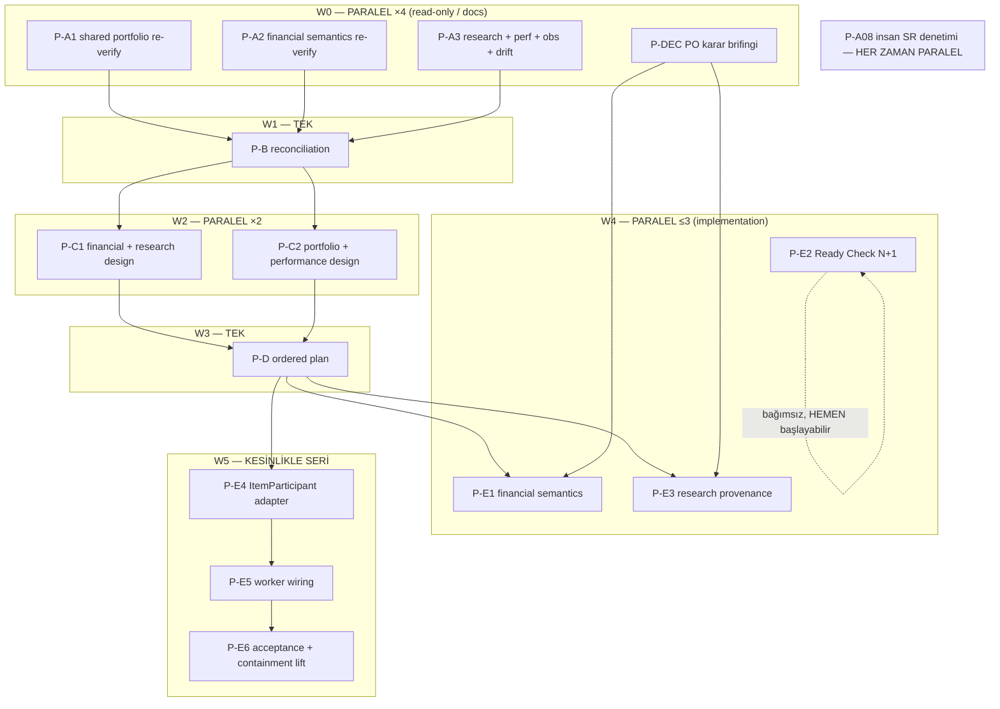

<!-- doc-status: historical -->
> **HISTORICAL RECORD — bu belge GÜNCEL GERÇEK DEĞİLDİR.** Yazıldığı andaki durumu
> kaydeder; SHA'lar, sayılar, alembic head'i ve "next" maddeleri bayat olabilir.
> Güncel otorite: `CLAUDE.md` §Current position + `docs/generated/repository_facts.md`
> (üretilmiş, CI'da `--check` ile kapılı).

# Entropia V18 — Final Closure Prompt Pack (paralel dalgalar)

**Üretildi:** 2026-08-13 · **Ölçülen main:** `31ed27dfc1f3bf7448b0e03c7c732d22d8b758c4`

> **Bu paket bir ÖLÇÜM ANIDIR.** `§0` tablosu `31ed27d` üzerinde doğrulandı. Main
> ilerlediyse prompt'lar yine kullanılabilir — her biri `§3 ORTAK SÖZLEŞME` içinde
> "taban farklıysa `§0` satırlarını yeniden ölç" talimatını zaten taşıyor. Satır
> numaralarına değil, **sembol adlarına** güven.

Bu belge **prompt paketidir** — burada hiçbir ürün kodu değişmez. Her blok, temiz bir
Claude Code oturumuna **olduğu gibi yapıştırılmak** üzere yazıldı. Aynı dalgadaki bloklar
**eşzamanlı** çalıştırılabilir.

---

## 0. Ölçülen gerçek (bu paketin dayanağı)

Yüklenen deep-research raporu `e2fa521`'i ölçüyordu. **Main o noktadan sonra 4 commit ilerledi:**

```
31ed27d docs(adim-56): kapanış — A-08 denetimi BAŞLADI (SR-2 oturum 1, PR #684) (#697)
c4cd932 feat(adim-54): bring the agentmemory server up locally, nothing hosted (#699)
efae094 docs(adim-53): superseded banner çelişkisini gider (#695)
4d9a373 test(acceptance): prove an approved Research revision is frozen (#701)
e2fa521 test(acceptance): prove external-object run provenance survives (#692)   <-- raporun ölçtüğü nokta
```

Dördü de **docs/test** commit'i; ürün kodu yolları değişmedi. Raporun yük taşıyan
iddiaları `31ed27d` üzerinde **tek tek doğrulandı**:

| İddia | `31ed27d`'de doğrulama | Hüküm |
|---|---|---|
| `run_portfolio` var, production caller **yok** | `portfolio_engine.py:518` tanım; tek çağıran `tests/unit/oracles/portfolio_harness.py:238` | ✅ IMPLEMENTED-BUT-UNWIRED |
| `ItemParticipant` yalnız Protocol | `portfolio_engine.py:238` Protocol; production implementor yok | ✅ CONFIRMED-MISSING |
| `_ItemStepper` production-active | `engine.py:756` tanım, `engine.py:3263` çağrı | ✅ IMPLEMENTED-ACTIVE (rapor haklı, eski yorumlar bayat) |
| `project_portfolio_run` unwired | `portfolio_projection.py:513`; caller yalnız test | ✅ IMPLEMENTED-BUT-UNWIRED |
| `build_portfolio_manifest` unwired | `provenance.py:473` | ✅ IMPLEMENTED-BUT-UNWIRED |
| Worker dış döngüsü **item** | `application/jobs/backtest_engine.py:323` `_replay_strategy` → `:364` `combine_item_runs` | ✅ İlk divergence noktası |
| `SHARED_ALLOCATION_STATUS` | `domain/allocation/capability.py:105` = `"future_dev"` | ✅ contained |
| `base_position_size` ham unit | `execution/sizing.py:216` → `return Decimal(sizing.base_position_size)` — yüzde dönüşümü **yok** | ✅ PARTIAL (#550) |
| partial-close commission | `execution/booking.py:93` `commission * 2 if is_full else commission * 2 * fraction`; docstring `:83` başka model anlatıyor | ✅ PRODUCT-DECISION-REQUIRED (#552) |
| Ready Check N+1 kalıntısı | `readiness_check.py:554` `get_dataset_root` **`:550` döngüsünün içinde**; `readiness_check.py:749` aynı kusur `:735` döngüsünde | ✅ PARTIAL — üstelik **batch API zaten var** (`:411` `get_dataset_roots`) |
| Tek strict xfail | `test_research_point_in_time_parity.py:583` | ✅ (#558) |
| `ENGINE_VERSION` | `manifest.py:126` = `backtest-engine-v18-gap-adjusted-stop-fill` | ✅ değişmedi |
| Alembic head | `0043_i08_registry_strategy_fks` | ✅ değişmedi |
| **Issue-state drift** | **RAPOR BAYAT — aşağı bak** | ❌ **artık YOK** |

**Sonuç: AŞAMA A'yı baştan koşmaya gerek yok.** Main docs/test yönünde ilerledi, forensic
tablo geçerli. Gereken şey, raporun tek dev A promptu değil, **dar kapsamlı ve paralel**
doğrulama dalgası — aşağıdaki W0.

### 0.1 Raporun BAYATLADIĞI tek eksen: issue-state drift

Rapor `ISSUE-STATE-DRIFT`'i **P0 başlık** yapıyor: "#550/#551/#552 kapalı ama kusur canlı",
"#617/#618 açık ama fix landed". **2026-08-13 tarihinde GitHub'dan ölçüldü — ikisi de
artık geçerli değil.** İnsan bugün defteri elle uzlaştırmış:

| Issue | Rapor ne diyordu | **Bugün ölçülen** | Sonuç |
|---|---|---|---|
| #550 sizing | closed, kusur canlı → drift | **open** (`reopened`, bugün 10:30Z) | drift **kapandı** |
| #551 zero-size | closed, kusur canlı → drift | **open** (`reopened`, bugün 10:30Z) | drift **kapandı** |
| #552 commission | closed, kusur canlı → drift | **open** (`reopened`, bugün 12:42Z) | drift **kapandı** |
| #558 bundle shape | open, PO kararı | **open** (`reopened`), label `product-decision` | doğru |
| #559 DST | — | **open**, label `product-decision` + **`blocks-mixed-zone-axis`**, milestone *ADIM 16-20 unified clock* | **E4/E5'i bloklayabilir** |
| #617 ready-check N+1 | open ama fix landed → drift | **closed** `completed` (bugün 11:07Z) | drift **kapandı** |
| #618 ESP resolver | open ama fix landed → drift | **closed** `completed` (bugün 11:07Z) | drift **kapandı** |
| #514 A-08 | open | **open**, `human-only`, 0 linked PR | doğru, blocker |

**Üç sonuç, prompt'lara işlendi:**

1. **`ISSUE-STATE-DRIFT` artık bir P0 konusu DEĞİL.** P-A3 ve P-B onu hâlâ *ölçer*
   (yeni drift doğabilir), ama "üç kapalı issue'nun altında canlı kusur var" anlatısını
   **kurmaz**. Kusurlar hâlâ canlı — ama defter artık onlarla **aynı fikirde**.
2. **#559 sandığımızdan daha yakın.** `blocks-mixed-zone-axis` etiketi + unified-clock
   milestone'u, DST kararının **E4/E5'in ön koşulu** olabileceğini söylüyor. `P-DEC`
   Karar 3 bu yüzden opsiyonel değil — cevaplanması gereken bir kapı.
3. **#617'nin "closing PR"ı yanıltıcı.** GitHub `#619`'u gösteriyor, ama #619
   *ölçüm/kapı* PR'ı — asıl `per_item: 0` onarımı ADIM 46 dalgasında landed.
   #618'in linkli PR'ı hiç yok. **PR linkage'ı hangi değişikliğin neyi düzelttiğinin
   kanıtı değildir** — prompt'lar bunu söylüyor.

> **Not:** #550/#551/#552'nin `reopened` olması, **kusurun çözülmediğinin** insan
> tarafından teyididir — yani raporun finansal bulguları bağımsız olarak doğrulanmış
> sayılır. `P-A2` yine de kanıtı **koddan** üretir; issue durumu hâlâ kanıt değildir.

### 1.4 `doc-status` kapısı — bu paketin CI'da yiyerek öğrendiği tuzak

Bu paketin ilk push'u `Backend` job'ını **50 saniyede** kırmızıya çevirdi. Sebep test
değil, `scripts/generate_repository_facts.py::check_classification`:

```
ALWAYS_HISTORICAL_GLOBS = (..., "docs/audit/*.md", "docs/implementation/*.md")
```

Bu iki dizindeki **her** dosya `<!-- doc-status: historical -->` işaretlenmek zorunda,
ve aynı anda **yalnız bir** belge `current` olabilir. Paket `current` yazmıştı → iki
bulgu, tek sebep.

**Bu paketin sekiz prompt'u tam da o iki dizine yazıyor** (`P-A1` `P-A2` `P-A3`
`P-B` `P-C1` `P-C2` `P-D` ve `P-DEC`'in çıktısı `docs/decisions/` hariç). Kural
`§3 ORTAK SÖZLEŞME` içine banner metniyle birlikte yazıldı — her prompt onu taşıyor,
böylece sekiz oturumun her biri aynı 50 saniyelik kırmızıyı yeniden keşfetmez.

**Kapı erken adımdır:** düşerse testler hiç koşmaz, yani "docs PR'ı, CI'ı önemsemem"
diye geçiştirilemez. Push'tan önce yerelde `--check` koş.

---

## 1. Raporun kaçırdığı üç şey (paralelliği doğrudan etkiler)

### 1.1 Containment gate bir TRIPWIRE'dır — E4/E5 onu KIRACAK

`backend/tests/unit/oracles/test_oracle_portfolio_containment_gate.py` şunu **assert eder**:

```python
# :178-180
callers = [... if path != loop and ("run_portfolio(" in text or "import run_portfolio" in text)]
assert callers == [], f"run_portfolio gained a production caller: {callers}"
# :216 — aynısı project_portfolio_run için
```

Yani worker wiring'i yapan PR bu testi **kırmızıya çevirecek**. Bu bir bug değil,
**bilinçli tripwire**. Prompt'un bunu söylemesi şart, yoksa ajan testi "bozuk" sanıp
sessizce zayıflatır. Doğru davranış: gate'i **silmek değil**, beklenen caller'ı adıyla
**pinleyen** hâle getirmek.

### 1.2 P11-1 ruleset paralel merge'i pahalılaştırır

Main'de ruleset `20765617` aktif: **16 zorunlu check** + `strict: true` (dal main ile
güncel olmalı). `Backend` job'ı **48–85 dk**. Sonuç:

> **N paralel PR → her merge diğerlerinin güncelliğini düşürür → kuyruğun sonunda
> N × ~85 dk seri yeniden koşu.**

Bu yüzden aşağıdaki plan **read-only/docs dalgalarını agresif paralelleştirir**
(çakışma riski düşük), **implementation dalgasını en fazla 2–3 eşzamanlı PR ile sınırlar**.
4+ implementation PR'ını aynı anda açmak net **yavaşlatır**.

### 1.3 ÜÇ PO kararı gerçek blocker — ve şimdi paralel çözülebilir

`#552` (commission modeli), `#558` (bundle shape) ve `#559` (DST) kod yazımını
durduruyor. Rapor ilk ikisini AŞAMA C'nin içine gömüyor, üçüncüsünü ise yalnız
"gerekliyse" diye geçiyor — oysa `#559`'un `blocks-mixed-zone-axis` etiketi ve
unified-clock milestone'u onu **E4/E5'in muhtemel ön koşulu** yapıyor.

Üçü de **spec okuma + seçenek sunma** işidir ve **W0 ile aynı anda** koşabilir.
`P-DEC` promptu bunun için — W0'da başlatırsan E1/E3/E4'ün önündeki kapılar,
sıra oraya geldiğinde çoktan açık olur.

---

## 2. Dalga planı



### Kısa tablo

| Dalga | Prompt | Paralel? | Ön koşul | Dokunduğu dosyalar | Süre tahmini |
|---|---|---|---|---|---|
| W0 | `P-A1` | ✅ ×4 | yok | `docs/audit/` (kendi dosyası) | ~1 oturum |
| W0 | `P-A2` | ✅ | yok | `docs/audit/` (kendi dosyası) | ~1 oturum |
| W0 | `P-A3` | ✅ | yok | `docs/audit/` (kendi dosyası) | ~1 oturum |
| W0 | `P-DEC` | ✅ | yok | `docs/decisions/` (kendi dosyası) | ~1 oturum |
| — | **`P-E2`** | ✅ **W0 ile birlikte** | yok | `readiness_check.py`, `query_budgets.json` | ~1 oturum |
| W1 | `P-B` | ❌ tek | A1+A2+A3 merged | `CLAUDE.md`, `CODEMAPS/`, `README.md` | ~1 oturum |
| W2 | `P-C1` | ✅ ×2 | B merged, DEC imzalı | `docs/implementation/` (kendi dosyası) | ~1 oturum |
| W2 | `P-C2` | ✅ | B merged | `docs/implementation/` (kendi dosyası) | ~1 oturum |
| W3 | `P-D` | ❌ tek | C1+C2 merged | `docs/implementation/` | ~1 oturum |
| W4 | `P-E1` | ⚠️ ≤2 eşzamanlı | D merged, #552 imzalı | `sizing.py`, `booking.py`, `engine.py`, `manifest.py` | 1–2 oturum |
| W4 | `P-E3` | ⚠️ | D merged, #558 imzalı | `research_data.py`, bundle compiler | 1–2 oturum |
| W5 | `P-E4` | ❌ seri | E1 merged | `portfolio_engine.py`, yeni adapter | 1–2 oturum |
| W5 | `P-E5` | ❌ seri | E4 merged | `application/jobs/backtest_engine.py` | 2 oturum |
| W5 | `P-E6` | ❌ seri | E5 merged | oracles, `capability.py` | 2 oturum |
| ∥ | `P-A08` | ✅ her zaman | yok | `docs/audit/a11y_*` | insan işi |

> **En hızlı başlangıç:** şu an **5 sekme** aç → `P-A1`, `P-A2`, `P-A3`, `P-DEC`, `P-E2`.
> `P-E2` tek gerçek kod PR'ı ve hiçbir şeyi beklemiyor.

---

## 3. Her prompt'a gömülü ortak sözleşme

Aşağıdaki blok **her** prompt'un içinde tekrar eder (temiz oturum bunları bilmez):

```text
==================================================
ENTROPIA ORTAK SÖZLEŞME (bu bloğu atlamadan uygula)
==================================================

SESSION START
  git fetch --all --prune
  git status --short        -> kirliyse DUR. stash/clean/reset YAPMA.
  git switch main
  git reset --hard origin/main
  git rev-parse HEAD        -> BASE_SHA olarak kaydet ve raporla.

  Beklenen taban: 31ed27dfc1f3bf7448b0e03c7c732d22d8b758c4
  FARKLIYSA: durma, ama farkı raporla ve bu paketin §0 doğrulama tablosundaki
  ilgili satırları yeniden ölç. Körlemesine kabul etme.

OTORİTE SIRASI
  1. docs/spec/Entropia_V18_Master_Technical_Reference_v1_0.md + ilgili page docs
  2. docs/adr/0002-unified-clock-portfolio-simulation.md
  3. current production code (backend/src)
  4. tests
  5. docs/generated/repository_facts.md   <-- SAYISAL OTORİTE BUDUR
  6. CLAUDE.md / docs/PROJECT_HISTORY.md
  7. GitHub issue/PR

  Issue CLOSED  != çözüldü.
  Test adı      != davranış kanıtı.
  Kodun varlığı != production'dan erişilebilir.
  CLAUDE.md'deki elle yazılmış sayı != gerçek (üretilmiş bloğa güven).

KOD ARAMA (dosya okumadan ÖNCE)
  Bu repo 488 dosya / ~114k satır. Kör grep + tam dosya okuma pahalı.
  - Önce docs/CODEMAPS/ içindeki ilgili haritayı oku
    (BACKEND_ROUTES / BACKEND_LAYERS / DATA_MODEL / FRONTEND_MAP / JOBS_AND_EVENTS)
  - Sonra codebase-memory-mcp: search_graph / trace_path / get_code_snippet
    TAZE CONTAINER'DA INDEX BOŞTUR -> önce index_repository çağır,
    yoksa boş sonucu "sembol yok" sanarsın.
  - Geçmiş slice ayrıntısı gerekirse docs/PROJECT_HISTORY.md'den HEDEFLİ oku.

TEST TUZAKLARI (üçü de bu repoda gerçekten ısırdı)
  - Alt küme koşarken --no-cov EKLE. Tek dosyalık koşu paketin tamamını ~%4 ölçer
    ve --cov-fail-under=90 kapısı SAHTE KIRMIZI verir.
  - `pytest ... | tail` KULLANMA. Exit code tail'in olur. Çıktıyı dosyaya yaz,
    $? değerini AYRI oku.
  - Paralel worktree varsa TEST_DATABASE_URL ile izole DB kullan.
    Sürücü postgresql+asyncpg:// olmalı.
  - Tam suite'i TEK pytest çağrısında koş, ortada öldürme.
    Suite koşarken uv sync / uv run çalıştırma.

YEREL DOĞRULAMA (backend)
  cd backend
  uv sync --all-extras
  uv run ruff check . && uv run ruff format --check .
  uv run mypy src
  uv run python -m entropia.apps.api.openapi_export --check
  uv run alembic heads          # tek head: 0043_i08_registry_strategy_fks
  uv run pytest -q              # tam suite = coverage kapısını da doğrular
  cd .. && python scripts/generate_repository_facts.py --check

  Frontend değiştiyse:
  cd frontend && npm ci && npm run typecheck && npm test -- --run

  GERÇEK exit code'ları raporla. "geçti" yazma, sayıyı yaz.

DOCS YAZARKEN — doc-status KAPISI (bu paket bunu CI'da yiyerek öğrendi)
  scripts/generate_repository_facts.py::check_classification bir KAPIDIR ve
  `Backend` job'ının ERKEN adımıdır — düşerse job ~50 saniyede kırmızı olur,
  testlerin hiç koşmaz.

  Kural: şu glob'lardaki HER dosya `historical` işaretlenmek ZORUNDA
    docs/PROJECT_HISTORY.md · docs/POST_V1_SPEC_GAP_BACKLOG_*.md ·
    docs/V18_R2_ROADMAP.md · docs/audit/*.md · docs/implementation/*.md

  Yani bu paketteki AUDIT ve DESIGN prompt'larının ürettiği her dosya
  (docs/audit/closure_w0_*.md, docs/implementation/closure_design_*.md,
   docs/implementation/final_closure_ordered_plan_*.md,
   docs/audit/final_closure_reconciliation_*.md) bu kapsamdadır.

  Yeni dosyanın İLK SATIRLARI tam olarak şu olmalı (ilk 3 satır taranır):

    <!-- doc-status: historical -->
    > **HISTORICAL RECORD — bu belge GÜNCEL GERÇEK DEĞİLDİR.** Yazıldığı andaki durumu
    > kaydeder; SHA'lar, sayılar, alembic head'i ve "next" maddeleri bayat olabilir.
    > Güncel otorite: `CLAUDE.md` §Current position + `docs/generated/repository_facts.md`
    > (üretilmiş, CI'da `--check` ile kapılı).

  AYRICA: aynı anda YALNIZ BİR belge `doc-status: current` olabilir.
  Yeni bir KICKOFF yazıyorsan (kapanış ritüeli md. 2) o an `current` olanı
  `historical`a DEMOTE ET, yoksa kapı düşer.

  HANGİSİ OLDUĞUNU BURADAN OKUMA, BULDUR — her slice'ta değişir:

    for f in $(git ls-tree -r --name-only HEAD -- docs | grep -E 'KICKOFF.*\.md$'); do
      head -3 "$f" | grep -q 'doc-status: current' && echo "$f"
    done

  `head -3` ZORUNLU: kapı (`_doc_status`) yalnız İLK 3 SATIRI okur, ama bu paket
  dahil birçok belge gövdesinde `doc-status: current` dizgesini ANLATIR.
  Düz `grep -l` gövde metnini de yakalar ve sana yanlış dosyayı gösterir —
  bu paketin ilk denemesi tam olarak buna düştü.

  Push etmeden ÖNCE yerelde doğrula:
    cd backend && uv run python ../scripts/generate_repository_facts.py --root .. --check
    -> "documentation-truth gate OK" ve exit=0 görmeden push etme.

GATEGUARD
  YENİ dosyayı Bash heredoc ile yaz (cat > f << 'PYEOF') -> gate-free.
  MEVCUT dosyaya EDIT/WRITE fact-force tetikler: 4 gerçeği sun
  (importers / etkilenen public API / veri şeması / kullanıcı isteği verbatim) -> retry.

GIT / PR DİSİPLİNİ
  Dal adı bu prompt'ta ne yazıyorsa AYNEN kullan.
  Commit mesajı: <type>(closure-<slice>): <subject>
  AI ATTRIBUTION YOK (global olarak kapalı) — Co-Authored-By / Generated with YAZMA.
  PR aç, MERGE ETME. Self-merge zaten bloklu.

  P11-1 RULESET (20765617) — BUNU BİL:
    main'e doğrudan push YOK. Her PR 16 yeşil check + main ile GÜNCEL olmak ister.
    `Backend` job'ı 48-85 dk sürer.
    Dal main'in gerisine düşerse merge REDDEDİLİR (22/22 yeşil olsa bile).
    Çözüm: main'i dala MERGE ET, bypass DEĞİL.
    `-X theirs` KULLANMA — sözleşme testinin pinlediği satırı sessizce düşürür;
    strateji-çözümünden sonra ilgili testi MUTLAKA koştur.

KABUL BORCU RATCHET'İ
  Yeni test bir kabul kriterini kapatıyorsa docs/audit/acceptance_coverage_baseline.json
  ratchet'i günceller. RATCHET YALNIZ AŞAĞI İNER.
  total_criteria = 383 TABANDIR; rahatsız edici bir `partial`ı silerek tavan düşürme.
  Sınıflar (A/B/C/D) AYRI ratchet'lenir: bir kriteri B'den D'ye taşımak D TAVANINI
  YÜKSELTİR -> bu bir adjudication'dır, test slice'ının kararı değil.

DURDURMA KOŞULLARI ("Complete" YAZMA)
  - çözülmemiş canonical/PO kararı
  - kırmızı focused test / typecheck / OpenAPI drift / çoklu alembic head
  - açıklanamayan golden farkı
  - historical Result davranışı değişiyor
  - shared production path hâlâ fake/test participant kullanıyor
  PR'ı aç, durumu dürüstçe yaz, DUR.
```

---

# W0 — PARALEL DALGA (4 sekme + P-E2 = 5)

## P-A1 · Shared portfolio subsystem — dar kapsamlı re-verify

> **Paralel:** P-A2, P-A3, P-DEC, P-E2 ile. **Ön koşul:** yok. **Çıktı dosyası çakışmaz.**

```text
ENTROPIA V18 — P-A1
SHARED PORTFOLIO SUBSYSTEM — FORENSIC RE-VERIFY
READ-ONLY / PRODUCTION KODU DEĞİŞMEZ

ROL
Sen Entropia V18 Backtest Engine Architect'sin. Bu oturum KOD YAZMAZ.
Amaç: shared portfolio katmanının current main'deki gerçek erişilebilirliğini kanıtlamak.

[ORTAK SÖZLEŞME bloğunu buraya yapıştır]

==================================================
BAĞLAM — ÖNCEDEN ÖLÇÜLMÜŞ (doğrula, kopyalama)
==================================================

31ed27d üzerinde ölçülen:
  portfolio_engine.py:518        def run_portfolio
  portfolio_engine.py:238        class ItemParticipant(Protocol)
  engine.py:756 / :3263          _ItemStepper tanım / production çağrı
  portfolio_projection.py:513    def project_portfolio_run
  provenance.py:473              def build_portfolio_manifest
  application/jobs/backtest_engine.py:323  _replay_strategy  (item outer loop)
  application/jobs/backtest_engine.py:364  combine_item_runs
  domain/allocation/capability.py:105      SHARED_ALLOCATION_STATUS = "future_dev"

BUNLARI DOĞRULA. Değişmişse yeni satır numaralarını kaydet.

==================================================
CEVAPLANACAK SORULAR
==================================================

İSİM ARAMA — DAVRANIŞ VE CALL CHAIN İZLE.
Beklediğin ad yoksa şu adlar altında yeniden ara:
adapter / participant / stepper / coordinator / runner / executor / facade /
application service / worker.

1.  run_portfolio production'dan çağrılıyor mu? trace_path ile KANITLA.
2.  ItemParticipant'ın Protocol dışında gerçek implementasyonu var mı?
    Test-owned olanları (_ScriptedParticipant vb.) AYRI listele.
3.  Başka isimle gizli/eşdeğer bir adapter var mı?
4.  Worker dış döngüsü item mı, timestamp mi? file:line ver.
5.  Her item aynı E(t)'yi görüyor mu, yoksa her biri kendi capital basis'inde mi?
6.  Tek shared ledger mı, item-local ledger mı?
7.  Simultaneous intent arbitration production'da mı, yalnız oracle'da mı?
8.  project_portfolio_run gerçek Result yolunda mı?
9.  build_portfolio_manifest gerçek manifest yolunda mı?
10. shared mode neden contained? Fail-closed noktası tam olarak nerede (file:line)?
11. containment lift için current code hangi koşulları KARŞILIYOR, hangilerini KARŞILAMIYOR?

==================================================
TRIPWIRE — ÖZEL DİKKAT
==================================================

tests/unit/oracles/test_oracle_portfolio_containment_gate.py
  :178-180  assert callers == []  (run_portfolio)
  :216      aynısı project_portfolio_run için

Bu test "production caller YOK" iddiasını KİLİTLER.
Şunu belgele:
  - test tam olarak neyi tarıyor (hangi dosya kümesi, hangi string)?
  - E5 wiring'i bu testi nasıl kıracak?
  - Gate'i SİLMEDEN, beklenen caller'ı adıyla pinleyecek minimum değişiklik nedir?
Bu, E5'in en riskli seam'i. Şimdiden tasarla.

==================================================
TEST FORENSICS
==================================================

Testleri koşmadan ÖNCE kaynaklarını oku. Şunları ayır:
  PRODUCTION CODE / TEST-OWNED HARNESS / FAKE PARTICIPANT /
  REAL WORKER / REAL DB / REAL RESULT PERSISTENCE

Sonra koş (--no-cov ekle, alt küme):
  cd backend
  uv run pytest -q --no-cov \
    tests/unit/oracles/test_oracle_portfolio_containment_gate.py \
    tests/unit/test_backtest_portfolio_projection.py \
    tests/unit/test_backtest_portfolio_provenance.py \
    > /tmp/p_a1.txt 2>&1
  rc=$?; echo "exit=$rc"; tail -30 /tmp/p_a1.txt

UYARI: containment-gate testinin GEÇMESİ shared engine'in aktif olduğunu değil,
tam TERSİNE production'ın run_portfolio'ya ULAŞMADIĞINI kanıtlar. Bunu açıkça yaz.

==================================================
ÇIKTI
==================================================

Oluştur:  docs/audit/closure_w0_shared_portfolio_2026-08-13.md

Zorunlu bölümler:
  Base SHA
  Doğrulanan / değişen ölçümler tablosu (§0 satırlarına karşı)
  Current production flow (mermaid)
  Target canonical flow (mermaid)
  First divergence — exact file:line
  Implemented-but-unwired envanteri (sembol + tanım satırı + tek çağıranları)
  Test-only implementasyonlar
  Confirmed missing
  Containment lift ön koşulları: KARŞILANAN / KARŞILANMAYAN
  Containment gate tripwire analizi + minimum güvenli değişiklik önerisi
  E4/E5 için en riskli 5 seam

Zorunlu matris:
| Requirement | Canonical Source | Production Symbol | Production Caller | Tests | Docs | GitHub | Classification | Confidence |

Classification YALNIZ şunlardan: IMPLEMENTED-ACTIVE / IMPLEMENTED-BUT-CONTAINED /
IMPLEMENTED-BUT-UNWIRED / TEST-ONLY / DEAD-UNREACHABLE / PARTIAL / CONFIRMED-MISSING /
DOCUMENTATION-DRIFT / ISSUE-STATE-DRIFT / PRODUCT-DECISION-REQUIRED /
DELIBERATE-FUTURE-DEV / NOT-A-GAP
Confidence: HIGH / MEDIUM / LOW

==================================================
YASAK
==================================================
backend/src · frontend/src · migration · test expectation · ENGINE_VERSION ·
feature flag · issue state  -> HİÇBİRİNİ DEĞİŞTİRME.

==================================================
DAL / PR
==================================================
git switch -c docs/closure-w0-shared-portfolio
commit: docs(closure-w0): verify shared portfolio reachability on current main
Draft PR aç. MERGE ETME.

FINAL RESPONSE
Base SHA: / Audit file: / Production code changed: NO
Implemented active: / unwired: / contained: / test-only: / confirmed missing:
First production divergence:
Containment gate tripwire: <tek cümle>
Top 5 riskli seam:
DUR.
```

---

## P-A2 · Financial semantics — #550 / #551 / #552 re-verify

> **Paralel:** P-A1, P-A3, P-DEC, P-E2 ile. **Ön koşul:** yok.

```text
ENTROPIA V18 — P-A2
FINANCIAL SEMANTICS — FORENSIC RE-VERIFY
READ-ONLY / PRODUCTION KODU DEĞİŞMEZ

ROL
Sen Entropia V18 Backtest Engine Architect ve finansal doğruluk denetçisisin.
Bu oturum KOD YAZMAZ. Amaç: üç finansal kusuru current main'de yeniden ÜRETİLEBİLİR
biçimde kanıtlamak veya çürütmek.

[ORTAK SÖZLEŞME bloğunu buraya yapıştır]

==================================================
KURAL
==================================================

GÜNCEL DURUM (2026-08-13'te GitHub'dan ölçüldü):
  #550 / #551 / #552 üçü de ŞU AN **OPEN** — üçü de bugün `reopened` oldu.
  Yani defter artık "bu kusurlar açık" diyor.

BUNA DA GÜVENME. Issue OPEN olması da kusurun canlı olduğunun kanıtı DEĞİLDİR —
tıpkı CLOSED olmasının çözüldüğünün kanıtı olmaması gibi.
Kanıt: current main'de koşan bir testin ürettiği SAYIDIR.

Görevin issue'yu teyit etmek değil, kusuru KODDAN yeniden üretmek.
Bir kusuru üretemezsen bunu AÇIKÇA yaz — "issue açık olduğuna göre vardır" DEME.

Bir oracle testinin GEÇMESİ "bug çözüldü" DEMEK DEĞİLDİR — bu repoda bazı oracle'lar
MEVCUT (hatalı) davranışı bilinçli olarak pinliyor. Her oracle için sor:
"bu test canonical'ı mı yoksa shipped davranışı mı pinliyor?"

==================================================
BAĞLAM — ÖNCEDEN ÖLÇÜLMÜŞ (doğrula)
==================================================

sizing.py:216   return Decimal(sizing.base_position_size)   <- ham unit, yüzde dönüşümü YOK
sizing.py:186-187  limits.min_position_size / max_position_size
booking.py:83   docstring: "whole position pay exactly one round-trip"
booking.py:93   commission_lot = costs.commission * 2 if is_full
                                 else costs.commission * 2 * fraction
booking.py:221-222  costs.commission tek taraflı düşülüyor (extra fill yolu)
engine.py:813   alloc_on = allocation is not None

==================================================
A. SIZING (#550)
==================================================

Şu üç alanı UÇTAN UCA izle:
  base_position_size / min_position_size / max_position_size

Her katmanda ne anlama geldiğini ayrı ayrı yaz:
  canonical spec (Master §10.1 + page 02) -> ne diyor?
  frontend UI (frontend/src) -> kullanıcıya ne olarak sunuluyor? (% mi, adet mi?)
  API schema -> hangi tip/birim?
  engine (sizing.py) -> hangi birim olarak tüketiliyor?

Uyuşmazlığı SAYIYLA göster: örnek bir config al, elle hesapla,
"UI 5 girdiğinde engine ne yapıyor / canonical ne isterdi" karşılaştırmasını yaz.

Leverage'ın uygulanma SIRASINI canonical'dan çıkar:
  resolved capital -> percent -> notional -> price -> units/contracts
Bu zincirin hangi adımı kodda YOK?

==================================================
B. ZERO-SIZE PHANTOM (#551)
==================================================

size <= 0 koruması nerede ve hangi KOŞULLA çalışıyor?
engine.py:813 alloc_on koşulunun guard'ı allocation moduna bağlayıp bağlamadığını
kanıtla (kodu oku, tahmin etme).

Şu senaryoların HER BİRİNİ ayrı ayrı ölç:
  - independent mode + base size 0
  - allocation mode + base size 0
  - Kelly zero edge
  - min > max (çelişkili limitler)
  - zero-notional interval üretiliyor mu?
  - trade count kirleniyor mu?
  - win-rate kirleniyor mu?
  - cross-item conflict zero-notional tarafından tetikleniyor mu?

Her biri için: KUSUR CANLI MI, EVETSE HANGİ DOSYA:SATIR.

==================================================
C. COMMISSION (#552)
==================================================

Dört kaynağı YAN YANA koy ve farkı yaz:
  1. canonical spec (Master §8)
  2. booking.py DOCSTRING (:83)
  3. booking.py KOD (:93, :221)
  4. API/DB schema
  5. mevcut oracle testi

Sor: partial close per-fill mı ücretlendiriliyor, round-trip payı mı?
Full remainder close'da toplam ücret nedir? Bir pozisyonu 3 parçada kapatmak,
1 parçada kapatmaktan farklı toplam ücret mi doğuruyor? SAYIYLA göster.

BU BİR PO KARARIDIR. Model UYDURMA. Yalnız seçenekleri ve her birinin
finansal sonucunu belgele. P-DEC promptu kararı toplayacak.

==================================================
TESTLER
==================================================

cd backend
uv run pytest -q --no-cov \
  tests/unit/oracles/test_oracle_sizing.py \
  tests/unit/oracles/test_oracle_position_lifecycle.py \
  > /tmp/p_a2.txt 2>&1
rc=$?; echo "exit=$rc"; tail -40 /tmp/p_a2.txt

Her PASS eden test için: canonical'ı mı shipped'i mi pinliyor? Kaynağını OKU.

==================================================
VERSIONING ETKİSİ
==================================================

Bu üç düzeltmenin her biri golden/oracle sonucunu değiştirir mi?
  ENGINE_VERSION (manifest.py:126 = backtest-engine-v18-gap-adjusted-stop-fill)
  tek boundary mi olmalı, ayrı boundary'ler mi?
Historical Result'lar IMMUTABLE — yeniden yorumlanmamalı. Hangi mekanizma bunu koruyor?
execution-key namespace var mı?

==================================================
ÇIKTI
==================================================

Oluştur:  docs/audit/closure_w0_financial_semantics_2026-08-13.md

Bölümler:
  Base SHA
  #550 — canonical vs UI vs schema vs engine tablosu + sayısal örnek + hüküm
  #551 — 8 senaryonun tek tek hükmü + guard'ın gerçek koşulu
  #552 — 5 kaynağın karşılaştırması + seçenek A/B/C + her birinin finansal sonucu
  Oracle forensics: hangi test canonical'ı, hangisi shipped'i pinliyor
  ENGINE_VERSION boundary önerisi + gerekçe
  Historical compatibility riski
  PO kararı gereken kalemler (açık soru olarak, cevapsız)

Matris (§ORTAK sınıflandırma sözlüğüyle).

==================================================
YASAK
==================================================
backend/src · frontend/src · test expectation · ENGINE_VERSION · issue state -> DEĞİŞTİRME.

DAL: docs/closure-w0-financial-semantics
commit: docs(closure-w0): re-verify the three financial defects on current main
Draft PR. MERGE ETME.

FINAL RESPONSE
Base SHA: / Audit file: / Production code changed: NO
#550 hüküm: / #551 hüküm: / #552 hüküm:
Canlı kusur sayısı: / PO kararı bekleyen: / ENGINE_VERSION önerisi:
DUR.
```

---

## P-A3 · Research + performance + observability + drift

> **Paralel:** P-A1, P-A2, P-DEC, P-E2 ile. **Ön koşul:** yok.

```text
ENTROPIA V18 — P-A3
RESEARCH PROVENANCE + PERFORMANCE + OBSERVABILITY + DRIFT
READ-ONLY / PRODUCTION KODU DEĞİŞMEZ

ROL
Sen Entropia V18 Release Closure Auditor'sun. Bu oturum KOD YAZMAZ.

[ORTAK SÖZLEŞME bloğunu buraya yapıştır]

==================================================
A. RESEARCH PROVENANCE (#558)
==================================================

Üç artefaktı yan yana koy:
  Agent Data Bundle / Backtest Evidence Bundle / Run Context Manifest

Her biri için şu alanların VAR/YOK ve HASH'E DAHİL/HARİÇ durumunu tablola:
  research_revision_id / research_content_hash / usage_scope /
  available_time_policy / available_delay_seconds / event_time semantics /
  frequency_policy / timezone / instrument mapping / feature definitions /
  alignment policy version / missing-stale policy

Ana soru: bundle_hash bunları KAPSIYOR mu?
Kapsamıyorsa: aynı hash iki farklı timing politikasıyla üretilebilir mi? KANITLA.

Strict xfail:
  tests/integration/test_research_point_in_time_parity.py:583
  Node ID'sini TAM kaydet. Ne pinliyor? Bug mu, ürün kararı mı?

  cd backend
  uv run pytest -q --no-cov -rxX \
    tests/integration/test_research_point_in_time_parity.py \
    > /tmp/p_a3_res.txt 2>&1
  rc=$?; echo "exit=$rc"; tail -30 /tmp/p_a3_res.txt

Hash SHAPE değişikliği gerekiyorsa: mevcut kayıtlı bundle'lar ne olur?
Bu bir PO kararıdır — seçenekleri yaz, seçme.

==================================================
B. PERFORMANCE — READY CHECK N+1 KALINTILARI
==================================================

ÖNCEDEN ÖLÇÜLDÜ (doğrula):
  readiness_check.py:411  roots = await market_repo.get_dataset_roots(...)  <- BATCH, DOĞRU
  readiness_check.py:550  for item, config, ref in signals:
  readiness_check.py:554      await market_repo.get_dataset_root(...)       <- DÖNGÜ İÇİ N+1
  readiness_check.py:735  for item, config, revision_id in funded:
  readiness_check.py:749      root = await research_repo.get_dataset_root(...)  <- DÖNGÜ İÇİ N+1

Yani BATCH API ZATEN VAR (get_dataset_roots). Bu bir "yeni repository method"
işi DEĞİL, bir reuse işi. Doğrula.

Şunları belgele:
  - iki leg'in her biri kaç ekstra round-trip üretiyor (n item için)?
  - docs/performance/query_budgets.json bu iki yüzeyi ÖLÇÜYOR MU?
    Ölçmüyorsa: budget kapsamı neden bu legleri kaçırıyor?
  - get_dataset_roots imzası signal/research leg'inde aynen kullanılabilir mi?
    Kullanılamıyorsa TAM olarak neden (tip? repo sınıfı? entity ekseni?)
  - readiness_check içinde BAŞKA döngü-içi single-row read var mı? Hepsini tara.

  cd backend
  uv run pytest -q --no-cov tests/integration/test_query_budgets.py \
    > /tmp/p_a3_qb.txt 2>&1
  rc=$?; echo "exit=$rc"; tail -20 /tmp/p_a3_qb.txt

NOT: P-E2 promptu bu düzeltmeyi PARALEL olarak uyguluyor olabilir.
Sen yalnız ÖLÇ ve BELGELE — kod yazma, çakışma yaratma.

==================================================
C. OBSERVABILITY
==================================================

Dört katmanı KESİN olarak ayır:
  DETECTION / VALIDATION / ROUTING / DELIVERY

Prometheus'un fire etmesi gerçek notification delivery DEĞİLDİR.
Her katman için: var mı? CI kapısı mı? kanıtı nerede?

Üç bilinen artık (doğrula, güncelle):
  - kurallar gerçek production serilerine karşı hiç değerlendirilmedi
  - delivery proof CI kapısı değil
  - monitörü izleyen yok

==================================================
D. ACCESSIBILITY (A-08) — YALNIZ KAYIT
==================================================

Şunları KESİN ayır: automated axe / keyboard / human audit prep /
real NVDA / real VoiceOver / findings / retests / signed deviations

Kanonik blok: docs/audit/a11y_screen_reader_audit_results.md §STATUS

Say ve raporla: kaç Section A hücresi dolu / kaç akış / kaç rota /
dört çıkış kriterinin kaçı ☑.

İNSAN KANITI YOKSA "PASS" YAZMA.
#514'e DOKUNMA (human-only etiketi).
K-1..K-7 bulgularının her birinin AÇIK/KAPALI durumunu tazele.

==================================================
E. DOCUMENTATION + ISSUE-STATE DRIFT
==================================================

Ara ve listele:
  git grep -n -e "never written" -e "hiç yazılmadı" -- backend/src backend/tests docs CLAUDE.md
  git grep -n -e "2712 passed" -e "3987 passed" -e "92.06" -e "93.53" -- CLAUDE.md README.md docs

Her isabet için: iddia / gerçek / kaynak.

Kategoriler:
  code ahead of docs / docs ahead of code / production source'ta bayat yorum /
  closed issue + canlı kusur / open issue + landed fix / bayat next-step /
  bayat test sayısı / yanlış Future-Dev durumu

SAYISAL OTORİTE: docs/generated/repository_facts.md — elle yazılmış sayı değil.

GitHub durumunu KAYDET (değiştirme):
  #514 #550 #551 #552 #558 #559 #617 #618
  state / state_reason / labels / closing PR / son yorum tarihi

ÖNEMLİ — 2026-08-13'te ÖLÇÜLDÜ, DOĞRULA:
  #550 #551 #552 #558 #559 -> OPEN (hepsi `reopened`)
  #617 #618 -> CLOSED `completed` (bugün 11:07Z, insan eliyle)
  #514 -> OPEN, `human-only`, 0 linked PR

  Yani daha önceki raporların anlattığı issue-state drift'in BÜYÜK KISMI
  BUGÜN KAPANDI. "Üç kapalı issue'nun altında canlı kusur var" anlatısını
  KURMA — defter artık kodla aynı fikirde.

  Senin işin: YENİ drift var mı diye bakmak. Yoksa "drift yok" yaz —
  olmayan drift'i raporlamak için eski anlatıyı yeniden üretme.

TUZAK: #617'nin GitHub'daki "closing PR"ı #619 görünüyor, ama #619 ölçüm/kapı
PR'ı — asıl onarım ADIM 46 dalgasında landed. #618'in linkli PR'ı hiç yok.
PR LINKAGE'I HANGİ DEĞİŞİKLİĞİN NEYİ DÜZELTTİĞİNİN KANITI DEĞİLDİR.
Hangi commit'in neyi düzelttiğini git'ten doğrula.

#559'a DİKKAT: label `blocks-mixed-zone-axis` + `product-decision`,
milestone "ADIM 16-20 — unified clock programme". Bu, DST kararının
shared portfolio wiring'in (E4/E5) ÖN KOŞULU olabileceğini söylüyor.
Gerçekten blokluyor mu? Koddan ölç ve hükmünü yaz.

==================================================
ÇIKTI
==================================================

Oluştur:  docs/audit/closure_w0_research_perf_obs_drift_2026-08-13.md

Bölümler: Base SHA / Research provenance matrisi / strict-xfail node ID /
Performance residual (iki leg, file:line, round-trip sayısı) /
Observability dört katman / A-08 sayım tablosu /
Documentation drift listesi / Issue-state drift tablosu /
PO kararı bekleyenler / Release blockers

==================================================
YASAK
==================================================
backend/src · frontend/src · test · issue state -> DEĞİŞTİRME.
readiness_check.py'ye DOKUNMA (P-E2 orayı yazıyor).

DAL: docs/closure-w0-research-perf-obs
commit: docs(closure-w0): measure research provenance, perf residuals, delivery and drift
Draft PR. MERGE ETME.

FINAL RESPONSE
Base SHA: / Audit file: / Production code changed: NO
Research provenance hüküm: / N+1 leg sayısı: / Delivery CI kapısı: (EVET/HAYIR)
A-08 hücre / akış / rota: / Docs drift kalem sayısı: / Issue-state drift:
DUR.
```

---

## P-DEC · PO karar brifingi (E1 ve E3'ün kapısı)

> **Paralel:** W0'ın tamamıyla. **Ön koşul:** yok. **Çıktısı: senin imzalayacağın karar dokümanı.**

```text
ENTROPIA V18 — P-DEC
PRODUCT DECISION BRIEF
READ-ONLY / KARAR VERME — SEÇENEK SUN

ROL
Sen Entropia V18 Principal Architect'sin. Bu oturumda KARAR VERMEZSİN.
Ürün sahibinin imzalayacağı KARAR DOKÜMANI hazırlarsın.

İki karar E1 ve E3'ü bloklar. Bu prompt onları paralel olarak açar,
böylece implementation sırası geldiğinde kapı çoktan açık olur.

[ORTAK SÖZLEŞME bloğunu buraya yapıştır]

==================================================
KARAR 1 — COMMISSION MODELİ (#552)
==================================================

Oku: Master Technical Reference §8, execution/booking.py (özellikle :83 docstring
ve :93 kod), API/DB schema, mevcut commission oracle'ları.

Sun (KARAR VERME):

  Seçenek A — per-fill commission
    tanım / kod etkisi / hangi test kırılır / historical Result etkisi /
    ENGINE_VERSION etkisi / 3-parçalı kapanış vs 1-parçalı kapanış toplam ücreti

  Seçenek B — one complete round-trip allocation
    aynı başlıklar

  Seçenek C — başka explicit canonical model (varsa spec'ten türet)
    aynı başlıklar

Her seçenek için SAYISAL ÖRNEK ZORUNLU:
  100 birim pozisyon, commission=0.5, 3 partial close (40/30/30) senaryosunda
  her seçenek toplam kaç ücret alır? Tabloyla göster.

Ayrıca yaz: "hiçbir şey yapma" seçeneğinin bedeli nedir?

==================================================
KARAR 2 — RESEARCH BUNDLE SHAPE (#558)
==================================================

Oku: page doc 12 §9, Agent Data Bundle / Backtest Evidence Bundle /
Run Context Manifest üreticileri, strict xfail
(tests/integration/test_research_point_in_time_parity.py:583).

Soru: available-time timing provenance bundle_hash'e PİNLENECEK Mİ?

  Seçenek A — pinle
    hash shape değişir -> mevcut kayıtlı bundle'lar ne olur?
    versioned hash mi, migration mı, dual-read mi?
    hangi alanlar dahil (tam liste öner)

  Seçenek B — pinleme, imzalı sapma yaz
    neyi kaybederiz? Aynı hash iki farklı timing politikasıyla üretilebilir kalır mı?
    bu bir provenance yalanı mı?

  Seçenek C — kısmi pinleme (yalnız policy tokenları, delay değerleri hariç)
    hangi soruyu cevaplar, hangisini cevaplamaz?

==================================================
KARAR 3 — #559 DST  (OPSİYONEL DEĞİL — KAPI OLABİLİR)
==================================================

2026-08-13'te ölçüldü: #559 OPEN, labels `product-decision` +
**`blocks-mixed-zone-axis`**, milestone **"ADIM 16-20 — unified clock programme"**.
Sekiz issue içinde milestone taşıyan TEK issue bu.

Yani proje kaydı, DST kararının unified-clock programına ait olduğunu
ve mixed-zone eksenini BLOKLADIĞINI söylüyor. Bunu KODDAN doğrula:

  - shared portfolio merged-clock ekseni (execution/clock.py) farklı
    timezone'lardaki item'ları AYNI eksende birleştiriyor mu?
  - birleştiriyorsa DST fold (aynı yerel saat iki kez) ve DST gap
    (yerel saat hiç olmaz) şu an NASIL çözülüyor? Sessizce mi?
  - E4/E5 bu davranışa DOKUNUYOR mu, yoksa onu miras mı alıyor?

Hükmünü net yaz:
  (a) #559 E4/E5'i BLOKLUYOR   -> seçenekleri sun, imza satırı ekle
  (b) #559 E4/E5'i BLOKLAMIYOR -> GEREKÇESİNİ KANITLA (hangi kod yolu
      mixed-zone'a hiç girmiyor?) ve ordered plan'ın ön koşulundan ÇIKAR

"Muhtemelen sorun olmaz" YAZMA. Ya kanıtla ya kapı olarak bırak.

==================================================
ÇIKTI
==================================================

Oluştur:  docs/decisions/closure_product_decisions_2026-08-13.md

Her karar için ZORUNLU şablon:
  ## Karar N — <başlık>
  ### Canonical ne diyor
  ### Kod şu an ne yapıyor (file:line)
  ### Çelişki tam olarak nerede
  ### Seçenekler (A / B / C) — her biri için:
      tanım / sayısal sonuç / kod etkisi / test etkisi /
      historical compatibility / ENGINE_VERSION veya hash etkisi / rollback
  ### Önerilen seçenek + GEREKÇE (bu bir öneri, karar değil)
  ### İMZA SATIRI:  [ ] A   [ ] B   [ ] C   — karar veren: ____  tarih: ____

Belgenin başına şunu yaz:
  > Bu belge KARAR BEKLİYOR. İmzalanmadan P-E1 ve P-E3 BAŞLATILAMAZ.

==================================================
YASAK
==================================================
Kod yazma. Karar verme. Seçenek eleme. "Zaten böyle yapılmış" diye
mevcut davranışı canonical ilan etme.

DAL: docs/closure-product-decisions
commit: docs(closure): brief the two decisions blocking financial and research slices
Draft PR. MERGE ETME.

FINAL RESPONSE
Karar sayısı: / Her biri için seçenek sayısı:
E1'i bloklayan: / E3'ü bloklayan:
Önerilen seçenekler (öneri olarak):
İmza bekleyen satır sayısı:
DUR.
```

---

## P-E2 · Ready Check N+1 — HEMEN başlayabilir (tek gerçek kod PR'ı)

> **Paralel:** W0'ın tamamıyla. **Ön koşul: YOK.** Hiçbir tasarım kararına bağlı değil,
> batch API zaten var, çakışan dosya yok. **İlk açacağın sekme bu olsun.**

```text
ENTROPIA V18 — P-E2
READY CHECK RESIDUAL N+1 — IMPLEMENTATION
TEK SLICE / KOD DEĞİŞİR

ROL
Sen Entropia V18 Principal Engineer'sin. Yalnız bu slice'ı uygula.
Bu slice hiçbir PO kararına, hiçbir başka PR'a bağlı DEĞİLDİR.

[ORTAK SÖZLEŞME bloğunu buraya yapıştır]

==================================================
KUSUR — ÖNCEDEN ÖLÇÜLDÜ (önce DOĞRULA)
==================================================

backend/src/entropia/application/commands/readiness_check.py

  DOĞRU DESEN (market data leg — bunu örnek al):
    :405  revisions = await market_repo.get_revisions(session, [...])
    :411  roots     = await market_repo.get_dataset_roots(session, [...])
    :414  for item in items:        <- döngü, ama içinde read YOK

  KUSUR 1 (trading signal leg):
    :549  revisions = await market_repo.get_revisions(session, [...])   <- batch, doğru
    :550  for item, config, ref in signals:
    :554      await market_repo.get_dataset_root(session, revision.entity_id)  <- DÖNGÜ İÇİ

  KUSUR 2 (research/funding leg):
    :732  revisions = await research_repo.get_revisions(session, [...])  <- batch, doğru
    :735  for item, config, revision_id in funded:
    :749      root = await research_repo.get_dataset_root(session, revision.entity_id)  <- DÖNGÜ İÇİ

Yani her iki leg de revision'ları ZATEN batch okuyor, sonra dataset root'u
TEK TEK okuyor. Batch karşılığı (get_dataset_roots) market tarafında MEVCUT.

ÖNCE DOĞRULA:
  - satır numaraları hâlâ geçerli mi?
  - research_repo'da get_dataset_roots (çoğul) VAR MI?
    Yoksa: market_repo'daki imzayı aynen aynala, YENİ desen icat etme.
  - get_dataset_roots dönüş tipi Mapping mi? Eksik anahtar davranışı nedir?
    (:409 yorumu "market dataset olmayan bu map'te absent" diyor — aynı semantiği koru)

==================================================
YAPILACAK
==================================================

1. İki leg'i de batch'e çevir: döngüden ÖNCE tek çağrı, döngü içinde map lookup.
2. Eksik/absent anahtar davranışını AYNEN koru — bir revision'ın root'u yoksa
   şu an ne oluyorsa o olmalı. Davranış değişikliği YOK, yalnız round-trip azalması.
3. Hata/blocker taksonomisi DEĞİŞMEZ. Aynı issue kodları, aynı sırayla üretilmeli.
4. readiness_check içindeki BAŞKA döngü-içi single-row read'leri de tara;
   bulursan bu PR'a AL (aynı teknik amaç), ama başka bir konuya SAPMA.

==================================================
QUERY BUDGET RATCHET
==================================================

docs/performance/query_budgets.json bir RATCHET'tir:
  - budget'ın ALTINA inmek -> `pytest -s` ile tighten-me satırı basar,
    yeni sayıları dosyaya YAZ (ratchet aşağı iner)
  - budget'ı YÜKSELTMEK -> yasak, gerekçesiz yapma
  - bu iki yüzey budget'ta HİÇ YOKSA: yeni surface kaydı EKLE
    (n_small / n_large / queries_small / queries_large / per_item / note)
    per_item HEDEFİ 0'dır. 0 değilse neden 0 olmadığını `note`'a yaz.

Slope (per_item) N+1 kapısıdır. Düzeltme sonrası per_item 0 OLMALI.
0 çıkmıyorsa düzeltme eksiktir — budget'ı gevşetme, kodu bitir.

==================================================
TEST
==================================================

ÖNCE (baseline, değişiklikten önce):
  cd backend
  uv run pytest -q --no-cov tests/integration/test_query_budgets.py \
    > /tmp/e2_before.txt 2>&1
  rc=$?; echo "before_exit=$rc"; tail -20 /tmp/e2_before.txt
  # readiness ile ilgili tüm testleri de baseline'la
  uv run pytest -q --no-cov -k readiness > /tmp/e2_ready_before.txt 2>&1
  rc=$?; echo "ready_before_exit=$rc"; tail -20 /tmp/e2_ready_before.txt

SONRA aynı ikisini tekrar koş, exit code'ları KARŞILAŞTIR.

NEGATİF KONTROL (zorunlu): batch çağrıyı geçici olarak boz (örn. boş liste ver),
budget testinin GERÇEKTEN kırmızıya döndüğünü gör, sonra geri al.
Kapı kendi negatifini geçmiyorsa kapı değildir.

SONRA tam suite (coverage kapısı dahil):
  uv run ruff check . && uv run ruff format --check .
  uv run mypy src
  uv run pytest -q > /tmp/e2_full.txt 2>&1
  rc=$?; echo "full_exit=$rc"; tail -20 /tmp/e2_full.txt
  cd .. && python scripts/generate_repository_facts.py --check; echo "facts_exit=$?"

==================================================
DOKUNMA
==================================================

- ready check'in HATA TAKSONOMİSİ (issue kodları, severity, sıralama)
- readiness blocker'ın ErrorBody yükseltme mantığı
- shared allocation admission / SHARED_ALLOCATION_STATUS
- herhangi bir route, OCC token, Idempotency-Key
- frontend

==================================================
ADVERSARIAL REVIEW (commit'ten ÖNCE)
==================================================

read-only bir reviewer subagent çalıştır. Sordur:
  - absent/eksik anahtar davranışı gerçekten AYNI mı, yoksa sessizce KeyError mi?
  - issue üretim SIRASI değişti mi? (deterministik olmalı)
  - batch çağrı boş liste ile çağrılırsa ne olur?
  - aynı revision iki item tarafından paylaşılıyorsa map lookup doğru mu?
  - budget testi gerçekten yeni yolu ölçüyor mu, yoksa eski yolu mu?
Bulguları GERÇEK KODDAN doğrula — reviewer'lar bu repoda sık yanılıyor.

==================================================
COMMIT / PR
==================================================

DAL: fix/closure-e2-ready-check-batching
commit: perf(closure-e2): batch the signal and research dataset-root lookups

PR body:
  Base SHA / Kusur (file:line ×2) / Düzeltme / Batch API reuse edildi mi yoksa eklendi mi
  Budget öncesi-sonrası per_item / Negatif kontrol sonucu
  Test exit code'ları (before/after/full) / Davranış değişikliği: YOK
  ENGINE_VERSION: değişmedi / Migration: yok / OpenAPI: değişmedi

MERGE ETME. 16 check yeşile dönünce kullanıcıya haber ver.

==================================================
KAPANIŞ RİTÜELİ
==================================================
Bu bir kod slice'ı — CLAUDE.md §Session CLOSING ritüelinin 6 maddesini uygula
(handoff, kickoff+resume prompt, PROJECT_HISTORY kaydı, memory --sync --only,
codemap tazeleme, commit->PR->await merge).

FINAL RESPONSE
Base SHA: / Branch: / Commit: / PR:
Kusur satırları: / per_item önce -> sonra: / Negatif kontrol: (GEÇTİ/GEÇMEDİ)
Test exit codes: / Davranış değişikliği: NO
DUR.
```

---

# W1 — TEK OTURUM

## P-B · Reconciliation

> **Ön koşul:** P-A1 + P-A2 + P-A3 PR'ları **merge edilmiş** olmalı.
> **Paralel DEĞİL** — `CLAUDE.md`, `CODEMAPS/`, `README.md` gibi paylaşılan dosyalara yazar.

```text
ENTROPIA V18 — P-B
CANONICAL + DOCUMENTATION + ISSUE-TRUTH RECONCILIATION
DOCS-ONLY

ROL
Sen Entropia V18 Release Closure Architect ve Documentation Truth Owner'sın.
Bu oturum YENİ PRODUCTION DAVRANIŞI YAZMAZ.

[ORTAK SÖZLEŞME bloğunu buraya yapıştır]

==================================================
ÖN KOŞUL — SERT
==================================================

Şu üç PR main'e MERGE EDİLMİŞ olmalı:
  docs/closure-w0-shared-portfolio
  docs/closure-w0-financial-semantics
  docs/closure-w0-research-perf-obs

Doğrula:
  git log --oneline origin/main -15
  ls docs/audit/closure_w0_*.md

Üçü de yoksa DUR. Eksik olanı söyle.

==================================================
GİRDİLER
==================================================

docs/audit/closure_w0_shared_portfolio_2026-08-13.md
docs/audit/closure_w0_financial_semantics_2026-08-13.md
docs/audit/closure_w0_research_perf_obs_drift_2026-08-13.md
docs/decisions/closure_product_decisions_2026-08-13.md   (varsa)

docs/spec/Entropia_V18_Master_Technical_Reference_v1_0.md
page docs 02 / 12 / 13 / 14 / 15 / 18
docs/adr/0002-unified-clock-portfolio-simulation.md
CLAUDE.md · README.md · docs/generated/repository_facts.md
docs/PROJECT_HISTORY.md · docs/STAGE2_HANDOFF.md · docs/CODEMAPS/ · docs/implementation/

==================================================
AMAÇ
==================================================

Her bulguyu DÖRT eksende uzlaştır ve bu dördünü BİRBİRİNDEN AYIR:
  IMPLEMENTATION TRUTH / DOCUMENTATION TRUTH / GITHUB BOOKKEEPING / PRODUCT DECISION

Üç W0 raporu ÇELİŞİYORSA çelişkiyi ÖRTME — adıyla yaz ve hangisinin
hangi kanıta dayandığını göster.

==================================================
ÖZELLİKLE DÜZELT
==================================================

1. `_ItemStepper` için "never written / hiç yazılmadı" gibi bayat present-tense ifadeler.
   (engine.py:756 tanım, :3263 çağrı — production-active.)
2. run_portfolio: KOD OLARAK MEVCUT, PRODUCTION'DA UNWIRED. İkisini birlikte yaz.
3. ItemParticipant Protocol ile gerçek production adapter'ı AYIR.
4. project_portfolio_run: mevcut + unwired.
5. build_portfolio_manifest: mevcut + unwired.
6. SHARED_ALLOCATION_STATUS=future_dev: "eksik" değil,
   DELIBERATE FAIL-CLOSED CONTAINMENT olarak yaz.
7. #550/#551/#552: BUNLAR ARTIK OPEN (2026-08-13'te reopened).
   Eski belgelerde "kapalı ama kusur canlı" diyen ISSUE-STATE-DRIFT
   anlatısı varsa onu TARİHSEL işaretle — drift KAPANDI, defter kodla
   aynı fikirde. Kusurlar hâlâ canlı; değişen şey kayıt.
8. #617/#618: BUNLAR ARTIK CLOSED `completed` (2026-08-13 11:07Z, insan eliyle).
   ADIM 46 kaydındaki "izleme kaydı insan kararı, #617/#618 açık kaldı"
   satırı BAYAT — düzelt. Ayrıca #617'nin GitHub'daki closing PR'ı (#619)
   ölçüm PR'ı, onarım PR'ı DEĞİL; bunu not düş.
   P-E2 landed ise kalan N+1'in de kapandığını kaydet.
9. #558: gerçek open product-decision durumu + strict-xfail node ID.
9b. #559: open, `blocks-mixed-zone-axis` + `product-decision`,
   milestone "ADIM 16-20 — unified clock programme".
   E4/E5'in ön koşulu MU? Hükmünü yaz — bu bir plan bağımlılığı.
10. A-08: automated prep ile human acceptance'ı AYIR. Hiçbir yerde
    Complete/PASS/Done gösterme.
11. Çelişen test sayıları: TEK OTORİTE docs/generated/repository_facts.md
    veya gerçek CI run. Elle yazılmış bayat sayıyı current truth gibi bırakma.
12. docs/CODEMAPS/ — portfolio subsystem için navigasyon boşluğu varsa doldur.

==================================================
CLAUDE.md — İNCE KAL
==================================================

CLAUDE.md §Current position'a SLICE ANLATISI YAZMA.
Yalnız 5-6 satır: HEAD sha, alembic head, test sayıları, son dalga, Next.
Tam kayıt docs/PROJECT_HISTORY.md'ye gider.
CLAUDE.md her oturumda tamamen context'e yüklenir — şişirme.

==================================================
YENİ TRUTH DOCUMENT
==================================================

Oluştur:  docs/audit/final_closure_reconciliation_2026-08-13.md

Bölümler: Base SHA / kaynak üç audit / canonical decisions /
implementation truth / documentation corrections / issue-state drift /
product decisions waiting / deliberately contained capabilities /
release blockers / non-blocking debt / exact next design questions

Her finding için:
| Finding | Canonical | Current Code | Previous Doc Claim | Corrected Claim | GitHub State | Action |

==================================================
DOCS DEĞİŞİKLİĞİ KURALLARI
==================================================

Historical documentların TARİHSEL GÖVDESİNİ REWRITE ETME.
Tarihsel kayıt current instruction gibi okunuyorsa ilk satıra
  <!-- doc-status: historical -->
veya açık superseded uyarısı ekle.

Production source'taki bayat YORUM düzeltilebilir — ama
EXECUTABLE BEHAVIOR DEĞİŞMEZ.

==================================================
GITHUB DİSİPLİNİ
==================================================
Bu PR: issue KAPATMAZ, AÇMAZ, label DEĞİŞTİRMEZ.
Yalnız issue-state drift TABLOSUNU yazar.
İnsan kararı gerekenleri HUMAN-ACTION-REQUIRED olarak işaretle.
#514'e dokunma (human-only).

==================================================
DOĞRULAMA
==================================================
python scripts/generate_repository_facts.py --check; echo "exit=$?"
git diff --check
git diff origin/main...HEAD -- backend/src frontend/src backend/alembic/versions
  -> BU DIFF BOŞ OLMALI (yorum düzeltmesi dışında executable değişiklik yok)

DAL: docs/final-closure-reconciliation
commit: docs(closure): reconcile forensic implementation truth before final design
Draft PR. MERGE ETME.

FINAL RESPONSE
Base SHA: / Branch: / Commit: / PR: / Production behavior changed: NO
Canonical corrections: / Documentation drift repaired: / Issue-state drift recorded:
Product decisions still required: / Release blockers: / Validation exit codes:
Next: P-C1 + P-C2 (paralel)
DUR.
```

---

# W2 — PARALEL ×2

## P-C1 · Design: financial semantics + research provenance

> **Paralel:** P-C2 ile. **Ön koşul:** P-B merged; `P-DEC` kararları **imzalı**.

```text
ENTROPIA V18 — P-C1
SOLUTION DESIGN: FINANCIAL SEMANTICS + RESEARCH PROVENANCE
NO PRODUCTION IMPLEMENTATION

ROL
Sen Entropia V18 Principal Architect'sin. KOD YAZMA.

[ORTAK SÖZLEŞME bloğunu buraya yapıştır]

ÖN KOŞUL — SERT
  P-B PR'ı main'e merge edilmiş olmalı (docs/audit/final_closure_reconciliation_*.md var mı?)
  docs/decisions/closure_product_decisions_*.md İMZALI mı?
    Karar 1 (#552 commission) imzasızsa: tasarımı YAZ ama
    "STOP-GATE: karar bekliyor" damgasıyla, seçenek uydurma.
    Karar 2 (#558) imzasızsa: aynısı.

==================================================
HER ÇÖZÜM İÇİN ZORUNLU ŞABLON
==================================================
Problem / Canonical requirement / Current implementation (file:line) /
Reuse candidates / Minimal code seam / Compatibility impact /
ENGINE_VERSION impact / manifest-hash impact / migration impact /
OpenAPI impact / historical Result impact / Test strategy /
Risks / Human decision gates / Definition of Done / Rollback story

==================================================
PAKET A — FINANCIAL SEMANTICS
==================================================

#550 — sizing
  Canonical yüzde semantiğinin TAM formülünü belirle:
    resolved capital -> percent -> notional -> price/instrument rule -> units/contracts
  Leverage'ın uygulanma SIRASINI canonical'dan ÇIKAR (tahmin etme, alıntıla).
  base/min/max semantiği TEK ve AÇIK olmalı.

  Stored historical revisions için cevapla:
    - görünür transition gate gerekir mi?
    - eski semantik replay edilecek mi?
    - yeni engine version namespace mi?
    - eski Result'lar IMMUTABLE kalır (bu pazarlıksız) — mekanizması ne?

#551 — zero-size
  size <= 0 BÜTÜN modlarda fail-closed olmalı (alloc_on koşulundan bağımsız).
  Ayrıca tasarla:
    - zero-notional interval üretilmemeli
    - trade count kirlenmemeli
    - win-rate kirlenmemeli
    - cross-item conflict zero-notional tarafından tetiklenmemeli
    - reason taxonomy: hangi hata kodu? shared/errors.py'de var mı, yeni mi?
      Yeniyse ErrorCategory'sini bildir (CLAUDE.md O-02).

#552 — commission
  İmzalı karar VARSA: o modeli uygula edecek seam'i tasarla.
  İmzalı karar YOKSA: büyük harfle STOP-GATE yaz ve implementation planlama.

ENGINE_VERSION SORUSU (açıkça cevapla):
  Bu üç düzeltme TEK boundary mi, AYRI boundary'ler mi? Gerekçelendir.
  manifest.py:126'daki değer nasıl değişir? Eski Result'ları okuyan kod ne yapar?

==================================================
PAKET B — RESEARCH PROVENANCE
==================================================

Agent Data Bundle / Backtest Evidence Bundle / Run Context Manifest
aynı immutable timing provenance sözlüğünü NASIL paylaşmalı?

Alanlar: available_time_policy / available_delay_seconds / event_time_semantics /
frequency_policy / timezone / instrument mapping / feature definitions /
alignment policy versions / missing-stale policy

Tasarla:
  - tek paylaşılan value object mü, üç ayrı projeksiyon mu?
  - hash shape nasıl değişir? versioned hash mi?
  - mevcut kayıtlı bundle'lar ne olur (dual-read / backfill / migration)?
  - strict xfail (test_research_point_in_time_parity.py:583) nasıl kapanır?
    xfail'in kendisi kırmızıya döner — bu BEKLENEN, planla.
  - üç artefakt arasında PARITY testi nasıl yazılır?

Product decision gereken her yerde STOP-GATE yaz.

==================================================
ÇIKTI
==================================================
Oluştur: docs/implementation/closure_design_financial_research_2026-08-13.md
Zorunlu: mermaid dependency graph (A ve B paketlerinin iç bağımlılıkları)

YASAK: backend/src · frontend/src · migration · tests · ENGINE_VERSION · flag · issue

DAL: docs/closure-design-financial-research
commit: docs(closure): design the financial and research closure fixes
Draft PR. MERGE ETME.

FINAL RESPONSE
Base SHA: / Branch: / Commit: / PR: / Production code changed: NO
Solutions designed: / STOP-GATE sayısı: / ENGINE_VERSION boundary kararı:
Hash shape değişikliği: / High-risk seams:
Next: P-D
DUR.
```

---

## P-C2 · Design: shared portfolio + performance

> **Paralel:** P-C1 ile. **Ön koşul:** P-B merged.

```text
ENTROPIA V18 — P-C2
SOLUTION DESIGN: SHARED PORTFOLIO WIRING + PERFORMANCE
NO PRODUCTION IMPLEMENTATION

ROL
Sen Entropia V18 Principal Architect'sin. KOD YAZMA.

[ORTAK SÖZLEŞME bloğunu buraya yapıştır]

ÖN KOŞUL: P-B merged.

==================================================
PAZARLIKSIZ TASARIM KURALI
==================================================

YENİ ENGINE İCAT ETME. İKİNCİ PARALEL ENGINE YAZMA.

Şunlar MEVCUT ve REUSE EDİLMELİ:
  _ItemStepper            engine.py:756
  run_portfolio           portfolio_engine.py:518
  ItemParticipant         portfolio_engine.py:238   (Protocol)
  execution/clock.py / intents.py / portfolio_ledger.py /
  arbitration.py / attribution.py
  project_portfolio_run   portfolio_projection.py:513
  build_portfolio_manifest provenance.py:473

Mevcut bir şeyi "daha temiz" diye yeniden yazmak bu slice'ın işi DEĞİLDİR.

==================================================
PAKET C — SHARED PORTFOLIO (E4 + E5 + E6'nın tasarımı)
==================================================

E4 için EXACT SEAM tasarla:
  real ItemParticipant  <->  _ItemStepper  <->  run_portfolio

Şu 12 başlığın HER BİRİNİ ayrı ayrı tasarla:
  1.  Participant lifecycle (oluşturma, sıralama, sonlandırma)
  2.  Bar/timestamp advancement — stepper hangi çağrıyla ilerler?
  3.  Mandatory exits (P3)
  4.  Read-only intent proposal (P4) — participant state MUTATE ETMEMELİ
  5.  Shared E(t) injection — tek PortfolioSnapshot nasıl geçirilir?
  6.  Admitted action apply (P7)
  7.  Pending fill treatment — tick sınırında ne olur?
  8.  Scaling treatment
  9.  Cancellation checkpoint — iptal kaybolmamalı
  10. Finalization
  11. EngineOutput projection (project_portfolio_run)
  12. Manifest provenance (build_portfolio_manifest)

PAZARLIKSIZ: single-item run_engine davranışı DEĞİŞMEMELİ.
Golden/oracle ile nasıl korunacağını tasarla.

E5 için worker branch tasarımı:
  application/jobs/backtest_engine.py:323/:364 — mevcut item outer loop
  independent path ve shared path EXPLICIT BRANCH olmalı.
  Hangi koşul dallandırır? Fail-closed admission'la ilişkisi ne?

TRIPWIRE TASARIMI (bunu atlarsan E5 patlar):
  tests/unit/oracles/test_oracle_portfolio_containment_gate.py:178-180 ve :216
  "production caller YOK" assert'i wiring'le KIRILACAK.
  Tasarla: gate SİLİNMEDEN, beklenen caller'ı ADIYLA pinleyen minimum değişiklik.
  Gate'in koruduğu invariant nedir, wiring sonrası o invariant nasıl ifade edilir?

CONTAINMENT bu aşamada KALDIRILMAZ. E6'nın kabul şartlarını tanımla:
  - production-worker oracle'ları neyi kanıtlamalı?
  - historical compatibility nasıl kanıtlanır?
  - manifest/version namespace kararı ne?
  - SHARED_ALLOCATION_STATUS = "active_v1" için TAM ön koşul listesi
  - ADR §16 insan kapısı tam olarak nerede devreye girer?

==================================================
PAKET D — PERFORMANCE
==================================================

P-E2 landed ise: kalan bir N+1 var mı? Yoksa bunu yaz ve geç.
P-E2 landed değilse: readiness_check.py:554 ve :749 için batch tasarımını yaz
(ama P-E2 ile ÇAKIŞMA — o slice uyguluyor).

Asıl tasarım işi: query-budget test KAPSAMINI tüm Ready Check execution'a
genişletme. Şu an hangi yüzeyler ölçülüyor, hangileri ölçülmüyor?
Ölçülmeyen bir leg'in N+1'e dönmesini ne durdurur?

Ayrıca: shared portfolio wiring'in kendi query budget'ı olmalı mı?
run_portfolio DB'ye dokunuyor mu, yoksa saf domain mi? Kanıtla.

==================================================
ÇIKTI
==================================================
Oluştur: docs/implementation/closure_design_portfolio_performance_2026-08-13.md
Zorunlu: mermaid — (a) E4 seam diyagramı, (b) E5 worker branch, (c) dependency graph

YASAK: backend/src · frontend/src · migration · tests · ENGINE_VERSION · flag · issue

DAL: docs/closure-design-portfolio-performance
commit: docs(closure): design the shared portfolio wiring seam and perf coverage
Draft PR. MERGE ETME.

FINAL RESPONSE
Base SHA: / Branch: / Commit: / PR: / Production code changed: NO
E4 seam tasarlandı: / E5 branch tasarlandı: / Tripwire çözümü:
Containment lift ön koşul sayısı: / High-risk seams:
Next: P-D
DUR.
```

---

# W3 — TEK OTURUM

## P-D · Dependency-ordered implementation plan

> **Ön koşul:** P-C1 + P-C2 merged. **Paralel değil.**

```text
ENTROPIA V18 — P-D
DEPENDENCY-ORDERED IMPLEMENTATION PLAN
NO PRODUCTION CODE

ROL
Sen Entropia V18 Release Train Owner'sın.
AŞAMA C tasarımlarını küçük, bağımlılıkları doğru, TEK SORUMLULUKLU PR'lara böl.

[ORTAK SÖZLEŞME bloğunu buraya yapıştır]

ÖN KOŞUL — SERT
  docs/implementation/closure_design_financial_research_*.md   main'de mi?
  docs/implementation/closure_design_portfolio_performance_*.md main'de mi?
  İkisi de yoksa DUR.

==================================================
PLAN KURALLARI
==================================================
Her PR: tek teknik amaç / tek writer / review edilebilir diff /
kendi acceptance kanıtı / rollback boundary / ilgisiz refactor YOK / feature creep YOK.

Aynı ENGINE_VERSION boundary'sine ait değişiklikleri rastgele ayrı PR'lara BÖLME.
Ama şu beşi BİRBİRİNE KARIŞTIRILMAZ:
  financial semantics / research provenance / shared portfolio wiring /
  performance / accessibility

==================================================
P11-1 RULESET GERÇEĞİ — PLANI BUNA GÖRE YAP
==================================================

main'de ruleset 20765617 aktif: 16 zorunlu check + strict:true (güncellik).
`Backend` job'ı 48-85 dk.

Sonuç: N paralel PR -> her merge diğerlerinin güncelliğini düşürür ->
kuyruğun sonunda N × ~85 dk seri yeniden koşu.

Planında AÇIKÇA belirt:
  - hangi PR'lar GERÇEKTEN paralel açılabilir (disjoint dosya kümesi)
  - eşzamanlı açık PR sayısı ÜST SINIRI ne olmalı (öner ve gerekçelendir)
  - merge SIRASI ne olmalı (en çok çakışan en önce mi, en az mı?)

==================================================
SERT KAPILAR
==================================================
Aşağıdakiler çözülmeden ilgili implementation PR'ı OLUŞTURMA:
  - #552 commission canonical modeli (imzalı mı?)
  - #550 canonical option teyidi
  - #558 bundle shape kararı
  - #559 DST kararı — shared mixed-zone için GEREKLİ Mİ? (P-DEC cevapladı mı?)
  - ADR §16 human gate (E5 için)
  - containment lift için PO kararları (E6 için)

Her kapı için: KİM açar, NEYE bakarak, kanıtı NEREDE yazılı?

==================================================
ÖNERİLEN GRAFİĞİ DOĞRULA — KÖRÜ KÖRÜNE KABUL ETME
==================================================

  E1  Financial semantics + engine version boundary
  E2  Ready Check residual batching        <- MUHTEMELEN ZATEN LANDED, doğrula
  E3  Research timing provenance           (PO kararı landed ise)
  E4  Engine-backed ItemParticipant adapter — CONTAINMENT future_dev KALIR
  E5  Worker shared-path wiring + unified projection + immutable Result
                                            — CONTAINMENT future_dev KALIR
  E6  Production-worker oracle acceptance + historical compatibility +
      manifest/version namespace + containment-lift gate
  A-08 human-only, tamamen paralel
  Final RC: yalnız tüm blocker'lar çözülünce

Current tree BAŞKA bir bağımlılık gösteriyorsa PLANI DEĞİŞTİR ve NEDENİNİ KANITLA.
Özellikle sor: E1 gerçekten E4'ün önünde olmak ZORUNDA mı, yoksa dosya
çakışması dışında bağımsız mı? (ikisi de engine.py'ye dokunuyor — ölç.)

==================================================
HER PR İÇİN ZORUNLU ALANLAR
==================================================
PR ID / Goal / Prerequisites / Canonical source / Production files /
Test files / No-touch files / Migration? / OpenAPI change? /
ENGINE_VERSION change? / Manifest-schema version? / Historical compatibility /
Acceptance IDs / Commands / Expected exit codes / Rollback / Stop condition /
Next PR / PARALEL AÇILABİLİR Mİ (evet/hayır + hangi PR'larla)

==================================================
ÇIKTI
==================================================
Oluştur: docs/implementation/final_closure_ordered_plan_2026-08-13.md
Zorunlu: mermaid dependency graph + PARALELLİK ŞERİDİ (hangi PR'lar aynı dalgada)

YASAK: production code · tests · issue state · implementation başlatma

DAL: docs/final-closure-ordered-plan
commit: docs(closure): order the remaining V18 implementation slices
Draft PR. MERGE ETME.

FINAL RESPONSE
Base SHA: / Branch: / Commit: / PR:
Implementation slice sayısı: / Human gate sayısı:
Maksimum eşzamanlı PR önerisi: / İlk çalıştırılabilir slice:
Son containment-lift gate: / Final human blocker:
Next: W4 (paralel implementation)
DUR.
```

---

# W4 — PARALEL ≤2–3 (implementation)

## P-E1 · Financial semantics

> **Ön koşul:** P-D merged + `#552`/`#550` kararları **imzalı**.
> **Paralel:** P-E3 ile (disjoint dosyalar). **P-E4 ile DEĞİL** — ikisi de `engine.py`'ye dokunur.

```text
ENTROPIA V18 — P-E1
FINANCIAL SEMANTICS — IMPLEMENTATION
TEK SLICE

ROL
Sen Entropia V18 Principal Engineer'sin. Yalnız bu slice.

[ORTAK SÖZLEŞME bloğunu buraya yapıştır]

==================================================
ÖN KOŞUL — SERT, ATLANMAZ
==================================================
1. docs/implementation/final_closure_ordered_plan_*.md main'de mi?
2. docs/decisions/closure_product_decisions_*.md İMZALI mı?
   Karar 1 (#552 commission) imzasızsa -> DUR. Model UYDURMA.
   Karar 1 imzalıysa: seçilen seçeneği AYNEN uygula, "daha iyisini" önerme.
3. Ordered plan'daki bu slice'ın prerequisite'ları merge edilmiş mi?

Herhangi biri hayırsa: PR AÇMA, durumu yaz, DUR.

==================================================
SIZING KURALI (#550)
==================================================
Yüzde semantiği uygulanacaksa zinciri SPEC'TEN KANITLA:
  resolved capital -> canonical percentage -> canonical notional ->
  entry price / instrument rule -> units

Her adımın canonical dayanağını (doküman + § numarası) koda YORUM olarak DEĞİL,
PR body'sine yaz.

sizing.py:216 (return Decimal(sizing.base_position_size)) ve :186-187
(min/max limitleri) tasarıma göre değişir. min/max'ın da AYNI birimde
yorumlandığından emin ol — biri yüzde biri unit kalırsa kusur yer değiştirmiş olur.

==================================================
ZERO-SIZE KURALI (#551)
==================================================
size <= 0 BÜTÜN modlarda fail-closed. engine.py:813'teki alloc_on koşuluna
BAĞLI OLMAMALI.

Ayrıca kanıtla (her biri ayrı test):
  - zero-notional interval üretilmiyor
  - trade count kirlenmiyor
  - win-rate kirlenmiyor
  - cross-item conflict zero-notional'la tetiklenmiyor

Hata kodu: shared/errors.py'de mevcut bir sınıf varsa onu kullan.
Yeni sınıf gerekiyorsa ErrorCategory'sini BİLDİR (CLAUDE.md O-02) ve
retryable=false ise nedenini yaz. Sınıflandırılmamış hata asla retryable=true
reklamı yapmaz.

==================================================
ENGINE_VERSION
==================================================
manifest.py:126 = "backtest-engine-v18-gap-adjusted-stop-fill"

Davranış değiştiren finansal semantik varsa ENGINE_VERSION / execution-key
namespace kararını AŞAMA C/D tasarımına UYGUN uygula. Kendi başına yeni
bir versiyon adı uydurma.

HISTORICAL RESULTS REWRITE EDİLMEZ. Eski Result'ı okuyan kod eski semantiği
korumalı. Bunu bir TESTLE kanıtla.

==================================================
TEST DİSİPLİNİ
==================================================
ÖNCE baseline (değişiklikten ÖNCE), her birini AYRI dosyaya:
  cd backend
  uv run pytest -q --no-cov tests/unit/oracles/test_oracle_sizing.py \
    > /tmp/e1_sizing_before.txt 2>&1; echo "exit=$?"
  uv run pytest -q --no-cov tests/unit/oracles/test_oracle_position_lifecycle.py \
    > /tmp/e1_lifecycle_before.txt 2>&1; echo "exit=$?"

SONRA aynılarını tekrar koş. Golden farkı çıkarsa HER SATIRI AÇIKLA.
Açıklanamayan tek bir golden farkı = DUR.

Oracle testlerinden biri MEVCUT (hatalı) davranışı pinliyorsa: testi
canonical'a taşı ve bunu PR body'sinde AÇIKÇA yaz — "test düzeltildi" deme,
"test canonical'ı pinliyordu / shipped'i pinliyordu" ayrımını yaz.

Sonra tam suite + ruff + mypy + openapi --check + repository_facts --check.

KABUL BORCU: yeni testler kabul kriteri kapatıyorsa
docs/audit/acceptance_coverage_baseline.json ratchet'ini güncelle (yalnız AŞAĞI).

==================================================
ADVERSARIAL REVIEW (commit'ten ÖNCE)
==================================================
read-only reviewer subagent. Sordur:
  - bu davranış yalnız testte mi çalışıyor, production caller yeni yola ulaşıyor mu?
  - historical Result yeniden yorumlanıyor mu?
  - replay deterministic mi?
  - version namespace doğru mu?
  - feature flag yanlışlıkla erken açıldı mı?
  - min/max ile base AYNI birimde mi?
Bulguları GERÇEK KODDAN doğrula (CLAUDE.md: review bulguları sık YANLIŞ).

==================================================
COMMIT / PR / KAPANIŞ
==================================================
DAL: fix/closure-e1-financial-semantics
commit: fix(closure-e1): <imzalı karara uygun subject>
PR body: Base SHA / slice / canonical source / current defect / implementation /
  production call chain before-after / tests / exit codes / ENGINE_VERSION impact /
  historical compatibility / known limitations / containment status / next slice
MERGE ETME.

CLAUDE.md §Session CLOSING ritüelinin 6 maddesini uygula.

FINAL RESPONSE — [ORTAK SÖZLEŞME'deki FINAL şablonu]
DUR.
```

---

## P-E3 · Research timing provenance

> **Ön koşul:** P-D merged + `#558` kararı **imzalı**. **Paralel:** P-E1 ile.

```text
ENTROPIA V18 — P-E3
RESEARCH TIMING PROVENANCE — IMPLEMENTATION
TEK SLICE

ROL
Sen Entropia V18 Principal Engineer'sin. Yalnız bu slice.

[ORTAK SÖZLEŞME bloğunu buraya yapıştır]

==================================================
ÖN KOŞUL — SERT
==================================================
#558 PO KARARI YOKSA DUR. Bundle shape'i kendi başına değiştirme.
docs/decisions/closure_product_decisions_*.md Karar 2 imzalı mı?
Seçenek A/B/C hangisi seçildi? AYNEN onu uygula.

==================================================
YAPILACAK
==================================================
Onaylı tasarım timing provenance'ı hash'e PİNLEMEYİ gerektiriyorsa,
available-time provenance hash DIŞINDA BIRAKILAMAZ.

Üç artefaktın PARITY'sini test et:
  Agent Data Bundle / Backtest Evidence Bundle / Run Context Manifest
Aynı run için üçü aynı timing sözlüğünü mü taşıyor? TESTLE kanıtla.

Strict xfail:
  tests/integration/test_research_point_in_time_parity.py:583
  Düzeltme landed olunca bu xfail(strict) KIRMIZIYA DÖNER — bu BEKLENEN.
  xfail marker'ını KALDIR, testi normal assert'e çevir.
  xfail'i "geçici olarak" gevşetme veya strict=False yapma.

Mevcut kayıtlı bundle'lar: onaylı tasarım ne diyorsa (dual-read / backfill /
versioned hash) onu uygula. Kayıtlı bir bundle'ın hash'ini SESSİZCE geçersiz kılma —
eski hash'i okuyan kod ne yapıyor, testle göster.

==================================================
TEST
==================================================
cd backend
uv run pytest -q --no-cov -rxX tests/integration/test_research_point_in_time_parity.py \
  > /tmp/e3_before.txt 2>&1; echo "exit=$?"
# değişiklikten sonra aynısı + parity testleri
Sonra tam suite + ruff + mypy + openapi --check + repository_facts --check.

KABUL BORCU ratchet'ini güncelle (yalnız aşağı).

==================================================
DOKUNMA
==================================================
sizing.py / booking.py / engine.py (P-E1'in alanı)
portfolio_engine.py / backtest_engine.py (P-E4/E5'in alanı)

==================================================
ADVERSARIAL REVIEW / COMMIT / PR / KAPANIŞ
==================================================
[P-E1'dekiyle aynı disiplin]
DAL: fix/closure-e3-research-timing-provenance
commit: fix(closure-e3): pin research timing provenance into the bundle identity
MERGE ETME. Kapanış ritüeli 6 madde.

FINAL RESPONSE — [ORTAK ŞABLON] + "strict xfail durumu: kaldırıldı/kaldı"
DUR.
```

---

# W5 — KESİNLİKLE SERİ

## P-E4 · Engine-backed ItemParticipant adapter

> **Ön koşul:** P-D merged; P-E1 merged (ikisi de `engine.py`'ye dokunur).
> **PARALEL DEĞİL.** Containment `future_dev` KALIR.

```text
ENTROPIA V18 — P-E4
ENGINE-BACKED ItemParticipant ADAPTER
TEK SLICE / CONTAINMENT KALDIRILMAZ

ROL
Sen Entropia V18 Principal Engineer'sin. Yalnız bu slice.

[ORTAK SÖZLEŞME bloğunu buraya yapıştır]

==================================================
ÖN KOŞUL — SERT
==================================================
docs/implementation/closure_design_portfolio_performance_*.md main'de mi?
docs/implementation/final_closure_ordered_plan_*.md main'de mi?
P-E1 merged mı? (engine.py çakışması)
ADR §16 insan kapısı: bu slice run_engine GÖVDESİNE dokunuyor mu?
  Dokunuyorsa insan onayı GEREKİR — onaysız başlama.
  Yalnız adapter yazıyorsan ve run_engine gövdesi değişmiyorsa devam.

==================================================
PAZARLIKSIZ
==================================================
YENİ ENGINE YAZMA. Şunları REUSE ET:
  _ItemStepper (engine.py:756) / run_portfolio (portfolio_engine.py:518) /
  execution/clock.py / intents.py / portfolio_ledger.py / arbitration.py /
  attribution.py / portfolio_projection.py / provenance.py

SINGLE-ITEM run_engine DAVRANIŞI DEĞİŞMEZ. Golden/oracle ile kanıtla.
Bu slice bir ADAPTER yazar — orkestrasyon E5'in işi.

==================================================
YAPILACAK
==================================================
portfolio_engine.py:238 ItemParticipant Protocol'ünü karşılayan
GERÇEK, ENGINE DESTEKLİ bir implementasyon yaz.

Tasarım dokümanındaki 12 başlığın hepsini karşıla:
  lifecycle / bar advancement / mandatory exits / read-only intent proposal /
  shared E(t) injection / admitted action apply / pending fill / scaling /
  cancellation checkpoint / finalization / projection / manifest

PAZARLIKSIZ INVARIANT'LAR:
  - intent proposal READ-ONLY: participant state'ini MUTATE ETMEZ
  - her participant AYNI E(t) snapshot'ını görür
  - aynı-timestamp intent'ler arasında sıra ID'ye BAĞLI OLMAZ (deterministik
    ama id-order-independent) — testle kanıtla
  - cancellation KAYBOLMAZ
  - replay DETERMINISTIC

==================================================
CONTAINMENT GATE TRIPWIRE
==================================================
tests/unit/oracles/test_oracle_portfolio_containment_gate.py:178-180 ve :216
"run_portfolio / project_portfolio_run production caller'ı YOK" assert eder.

Bu slice YALNIZ ADAPTER yazıyorsa ve run_portfolio'yu ÇAĞIRMIYORSA gate
hâlâ yeşil kalmalı. Kırmızıya dönüyorsa: kapsam kaymış demektir — DUR ve raporla.

Gate'i bu slice'ta ZAYIFLATMA. Değişiklik E5'in işi.

==================================================
TEST
==================================================
Baseline -> değişiklik -> aynı testler. --no-cov ile alt küme:
  tests/unit/oracles/test_oracle_portfolio_containment_gate.py
  tests/unit/oracles/test_oracle_portfolio_capital.py
  tests/unit/oracles/test_oracle_portfolio_clock.py
  tests/unit/test_backtest_engine_stepper.py (varsa)
  tests/unit/test_backtest_item_intents.py
  golden/oracle single-item suite (run_engine değişmediğini kanıtlar)

Yeni adapter için: gerçek engine ile sürülen participant testi.
test-owned _ScriptedParticipant'ı SİLME — o hâlâ oracle harness'ının aracı.

Sonra tam suite + ruff + mypy + openapi --check + repository_facts --check.

==================================================
ADVERSARIAL REVIEW
==================================================
[P-E1 disiplini] + ekstra:
  - adapter production'dan erişilebilir mi, yoksa yine test-only mi?
  - single-item run_engine davranışı BİT BİT aynı mı?
  - aynı timestamp'te iki intent'in sırası id'ye bağlı mı?
  - pending fill tick sınırında kayboluyor mu?

==================================================
COMMIT / PR / KAPANIŞ
==================================================
DAL: feat/closure-e4-item-participant-adapter
commit: feat(closure-e4): add the engine-backed ItemParticipant adapter
PR body'de AÇIKÇA: "Containment status: future_dev — DEĞİŞMEDİ"
MERGE ETME. Kapanış ritüeli 6 madde.

FINAL RESPONSE — [ORTAK ŞABLON] +
  Containment status: future_dev (unchanged)
  Containment gate: yeşil mi? / Single-item golden: değişti mi?
DUR.
```

---

## P-E5 · Worker shared-path wiring

> **Ön koşul:** P-E4 merged. **PARALEL DEĞİL.** Containment `future_dev` KALIR.
> **En riskli slice.** ADR §16 insan kapısı burada devreye girer.

```text
ENTROPIA V18 — P-E5
WORKER SHARED-PATH WIRING + UNIFIED PROJECTION + IMMUTABLE RESULT
TEK SLICE / CONTAINMENT KALDIRILMAZ / EN RİSKLİ SLICE

ROL
Sen Entropia V18 Principal Engineer'sin. Yalnız bu slice.

[ORTAK SÖZLEŞME bloğunu buraya yapıştır]

==================================================
ÖN KOŞUL — SERT
==================================================
P-E4 merged mı? Adapter main'de mi?
ADR §16 İNSAN KAPISI: bu slice run_engine gövdesine ve worker call-site'a dokunur.
  ADR amendment'ı onaylandı mı? ONAYSIZ BAŞLAMA.
  Tasarım dokümanında (a) faz-bölünmüş bar ve (b) book-etmeyen değerlendirme
  girişi engelleri nasıl çözülmüş? Oku, uygula.

==================================================
YAPILACAK
==================================================
application/jobs/backtest_engine.py:
  :323  _replay_strategy      <- mevcut item outer loop
  :364  combine_item_runs     <- mevcut fold

EXPLICIT BRANCH ekle:
  independent path -> MEVCUT davranış, BİT BİT değişmez
  shared path      -> gerçek ItemParticipant'lar -> run_portfolio ->
                      project_portfolio_run -> unified EngineOutput ->
                      build_portfolio_manifest -> immutable Result

Shared path'te combine_item_runs KULLANILMAZ — projection onun YERİNE geçer
(portfolio_projection.py:15-32 bunu açıklıyor, oku).

==================================================
CONTAINMENT GATE — BURADA KIRILACAK
==================================================
tests/unit/oracles/test_oracle_portfolio_containment_gate.py
  :178-180  assert callers == []   (run_portfolio)
  :216      aynısı project_portfolio_run

BU TEST KIRMIZIYA DÖNECEK. Bu BEKLENEN ve TASARLANMIŞ.

YAPMA: testi silme, assert'i yorum satırı yapma, koşulu gevşetme.
YAP: tasarım dokümanındaki çözümü uygula — gate, beklenen caller'ı
     ADIYLA pinleyen hâle gelir. Yani "caller yok" yerine
     "caller TAM OLARAK şu dosya" assert eder. Beklenmeyen ikinci bir
     caller çıkarsa gate hâlâ kırmızıya dönmeli.

Değişikliğin NEGATİF KONTROLÜNÜ yap: sahte bir üçüncü caller ekle,
gate'in kırmızıya döndüğünü GÖR, geri al.

==================================================
PAZARLIKSIZ
==================================================
- SHARED_ALLOCATION_STATUS "future_dev" KALIR (capability.py:105). DOKUNMA.
- Fail-closed admission KALIR — shared path production'dan hâlâ erişilemez,
  yalnız kod yolu tamamlanmış olur.
- independent path davranışı BİT BİT aynı — golden ile kanıtla.
- historical Result IMMUTABLE — yeniden yorumlanmaz.
- Idempotency / OCC / audit / outbox desenleri KORUNUR.
- Cancellation KAYBOLMAZ — shared path'te de checkpoint çalışır, TESTLE kanıtla.

==================================================
TEST — BU SLICE'IN ASIL İŞİ
==================================================
Yalnız unit test YETMEZ. Şunlar ZORUNLU:
  - real worker-path integration test (gerçek job, gerçek DB)
  - real Result persistence test (satır gerçekten yazılıyor mu?)
  - real manifest test (build_portfolio_manifest çıktısı Result'a pinleniyor mu?)
  - real cancellation test (koşu ortasında iptal, state tutarlı mı?)
  - independent path regression: golden/oracle DEĞİŞMEDİ

  cd backend
  # TEST_DATABASE_URL izole DB ile (postgresql+asyncpg://)
  uv run pytest -q --no-cov tests/integration/<yeni worker testleri> \
    > /tmp/e5_worker.txt 2>&1; echo "exit=$?"

Sonra TAM SUITE (tek çağrı, ortada öldürme) + ruff + mypy +
openapi --check + alembic heads + repository_facts --check.

Alembic: yeni tablo/kolon varsa <n> up/down/up kanıtı ZORUNLU
  (LC_ALL=en_US.UTF-8, DROP SCHEMA public CASCADE; CREATE SCHEMA public; önce)
  + migration<->model kolon paritesi + her yeni create_* için L1 FK insert-order proof.

==================================================
ADVERSARIAL REVIEW — GENİŞLETİLMİŞ
==================================================
read-only reviewer subagent. Sordur:
  - shared production path hâlâ fake/test participant mı kullanıyor?
  - production caller GERÇEKTEN yeni path'e ulaşıyor mu? trace_path ile kanıtla.
  - live registry join'i historical artifact'ı değiştiriyor mu?
  - aynı timestamp sırası id'den bağımsız mı?
  - cancellation kayboldu mu?
  - replay deterministic mi?
  - version namespace doğru mu?
  - feature flag YANLIŞLIKLA erken açıldı mı? (capability.py:105 kontrol et)
  - independent path'te tek bir satır bile davranış değişti mi?
Bulguları GERÇEK KODDAN doğrula.

==================================================
DURDURMA
==================================================
"Complete" YAZMA eğer:
  - shared production path hâlâ test participant kullanıyorsa
  - independent golden değiştiyse ve açıklayamıyorsan
  - containment gate'i zayıflatarak yeşile aldıysan
  - cancellation testi yoksa
  - Result persistence gerçek DB'de kanıtlanmadıysa

==================================================
COMMIT / PR / KAPANIŞ
==================================================
DAL: feat/closure-e5-worker-shared-path
commit: feat(closure-e5): wire the worker shared path through run_portfolio
PR body'de AÇIKÇA:
  "Containment status: future_dev — DEĞİŞMEDİ. Shared path production'dan
   hâlâ erişilemez; bu PR kod yolunu tamamlar, kapıyı AÇMAZ."
  + containment gate'in nasıl değiştiği ve negatif kontrolün sonucu
MERGE ETME. Kapanış ritüeli 6 madde.

FINAL RESPONSE — [ORTAK ŞABLON] +
  Containment status: future_dev (unchanged)
  Containment gate değişikliği: / Negatif kontrol: (GEÇTİ/GEÇMEDİ)
  Independent golden: değişmedi mi? / Cancellation testi: / Result persistence testi:
DUR.
```

---

## P-E6 · Production acceptance + containment lift gate

> **Ön koşul:** P-E5 merged. **PARALEL DEĞİL.**
> Containment lift bir BAŞLANGIÇ değil, bir KABUL SONUCUDUR.

```text
ENTROPIA V18 — P-E6
PRODUCTION-WORKER ORACLE ACCEPTANCE + CONTAINMENT LIFT GATE
TEK SLICE

ROL
Sen Entropia V18 Principal Engineer ve Release Closure Owner'sın.

[ORTAK SÖZLEŞME bloğunu buraya yapıştır]

==================================================
ÖN KOŞUL — SERT
==================================================
P-E5 merged mı? Shared kod yolu tamam mı?
Tasarım dokümanındaki containment lift ön koşul listesini AÇ ve
HER MADDESİNİ tek tek işaretle. Bir tanesi bile eksikse
FLAG'E DOKUNMA — eksikleri raporla ve DUR.

==================================================
YAPILACAK — SIRAYLA
==================================================

1. PRODUCTION-WORKER ORACLE'LARI
   Mevcut oracle'lar test-owned harness üzerinden koşuyor
   (tests/unit/oracles/portfolio_harness.py). Şimdi GERÇEK worker
   üzerinden koşan kabul oracle'ları yaz.
   Sor: aynı senaryo harness'ta ve gerçek worker'da AYNI sonucu mu veriyor?
   Vermiyorsa fark NEREDEN geliyor? Açıklanamayan fark = DUR.

2. HISTORICAL COMPATIBILITY
   Shared path'ten önce yazılmış Result'lar okunabiliyor mu?
   Manifest şeması versiyonlu mu? Eski manifest'i okuyan kod ne yapıyor?
   TESTLE kanıtla, iddia etme.

3. MANIFEST / VERSION NAMESPACE
   Shared path'in ürettiği Result hangi ENGINE_VERSION'ı taşır?
   Independent path'inkiyle aynı mı, farklı mı? Tasarım ne diyorsa onu uygula.

4. CONTAINMENT LIFT KAPISI
   capability.py:105  SHARED_ALLOCATION_STATUS = "future_dev"
   Bu satırı DEĞİŞTİRMEK bu slice'ın SON adımıdır, ilki değil.

   Değiştirmeden ÖNCE şunların hepsi yeşil olmalı:
     [ ] production-worker oracle'ları geçiyor
     [ ] historical compatibility testli
     [ ] manifest/version namespace kararı uygulanmış
     [ ] cancellation / replay determinism kanıtlı
     [ ] açık PO kararı YOK
     [ ] ADR §16 insan onayı alınmış
     [ ] independent path golden'ı değişmemiş

   Herhangi biri eksikse: FLAG'İ DEĞİŞTİRME. Bu bir İNSAN KARARIDIR —
   listeyi sun, kullanıcıya sor, kendi başına açma.

5. capability.py:154 (is_active) ve :182 (status projeksiyonu) ile
   frontend/admission yüzeylerinin flag açıldığında doğru davrandığını
   TESTLE kanıtla. Containment testleri flag'in İKİ değerinde de anlamlı olmalı.

==================================================
ADVERSARIAL REVIEW
==================================================
[P-E5 disiplini] + :
  - flag açıldığında hangi yüzeyler DEĞİŞİR? Hepsi test edildi mi?
  - flag açık/kapalı iki dünyada da testler anlamlı mı, yoksa biri ölü mü?
  - bir kullanıcı shared allocation isteyince uçtan uca ne oluyor?

==================================================
COMMIT / PR / KAPANIŞ
==================================================
DAL: feat/closure-e6-production-acceptance
commit: feat(closure-e6): accept the shared path against the production worker
PR body'de containment lift ön koşul listesini TABLO olarak, her satırın
kanıtıyla birlikte ver. Flag değiştiyse GEREKÇESİ + insan onayının kaydı.
MERGE ETME. Kapanış ritüeli 6 madde.

FINAL RESPONSE — [ORTAK ŞABLON] +
  Containment status: future_dev / active_v1  (hangisi ve NEDEN)
  Ön koşul listesi: N/M yeşil
  Kalan release blocker'lar:
DUR.
```

---

# HER ZAMAN PARALEL

## P-A08 · İnsan ekran okuyucu denetimi

> **Bu bir AI slice'ı DEĞİLDİR.** Hiçbir prompt onu kapatamaz. Diğer tüm dalgalarla
> tamamen paralel yürür ve **release blocker'dır**.

```text
ENTROPIA V18 — P-A08
HUMAN SCREEN READER AUDIT — OTURUM DESTEĞİ
BU SLICE'I AI KAPATAMAZ

ROL
Sen denetimi KOŞMUYORSUN. Bir insanın koşacağı oturumu HAZIRLIYOR ve
sonucunu KAYDEDİYORSUN.

[ORTAK SÖZLEŞME bloğunu buraya yapıştır]

==================================================
MEVCUT DURUM — DÜRÜST SINIR
==================================================
Denetim BAŞLADI, BİTMEDİ.
  SR-2 (VoiceOver/Safari) ilk oturum koştu: 184 Section A hücresinin 2'si dolu
  10 akışın 0'ı / 23 rotanın 0'ı TAM
  SR-1 (NVDA/Firefox) HİÇ BAŞLAMADI
  Dört çıkış kriterinin 0'ı ☑
  Denetçi rolü ATANMADI (ilk oturumu ürün sahibi kendisi koştu -> `neither`)
  K-5 AÇIK (A-3 bilerek `—`)

Kanonik blok: docs/audit/a11y_screen_reader_audit_results.md §STATUS

HİÇBİR BELGE A-08'i Complete / PASS / Done GÖSTEREMEZ.
#514 AÇIK ve `human-only` — AI ne kapatabilir ne açabilir.

==================================================
BU OTURUMUN İŞİ
==================================================
1. Runbook'u aç: docs/implementation/a11y_screen_reader_audit_runbook.md
   Bir sonraki oturum için TEK SAYFALIK hazırlık ver:
   hangi SR, hangi tarayıcı, hangi rota, hangi hücreler, hangi sırayla.
2. Automated precheck'i koştur ve sayıları TAZELE.
   UYARI: İLK KOŞU SOĞUKTUR VE EKSİK RAPORLAR (K-5'i 18 gösterdi, doğrusu 21).
   EN AZ İKİ KEZ KOŞ, ikinci koşunun sayısını kullan.
3. İnsan bir oturum koştuysa sonucunu worksheet'e KAYDET —
   hücre hücre, kanıtla. Boş hücreyi "muhtemelen geçer" diye doldurma.
4. Çıkış kriterlerinin ☐/☑ durumunu tazele. Hiçbirini kanıtsız ☑ yapma.

==================================================
AYRIMLAR — KARIŞTIRMA
==================================================
automated axe  !=  keyboard  !=  human audit prep  !=
real NVDA  !=  real VoiceOver  !=  findings  !=  retests  !=  signed deviations

Lighthouse'un HİÇBİR ÇIKTISI A-08 kanıtı DEĞİLDİR (axe otoritedir,
Lighthouse a11y kategorisi ASLA açılmaz).

==================================================
YASAK
==================================================
#514'e dokunma. Çıkış kriterini kanıtsız işaretleme.
"Automated yeşil, muhtemelen SR de geçer" ÇIKARIMI YAPMA.
K-6a'yı kapatma — yalnız gerçek A-08 kapatabilir.

DAL: docs/a08-session-<n>
commit: docs(a08): record screen reader session <n>
Draft PR. MERGE ETME.

FINAL RESPONSE
Section A hücre: N/184 / Akış: N/10 / Rota TAM: N/23
SR-1 durumu: / SR-2 durumu: / Çıkış kriterleri: N/4
Denetçi rolü atandı mı: / Açık K-bulguları:
A-08 verdict: BLOCKED (bu satır insan kanıtı olmadan DEĞİŞMEZ)
DUR.
```

---

## 4. Kullanım özeti

**Şimdi aç (5 sekme):** `P-A1` · `P-A2` · `P-A3` · `P-DEC` · `P-E2`

Sonra sırayla: `P-B` → (`P-C1` ∥ `P-C2`) → `P-D` → (`P-E1` ∥ `P-E3`) → `P-E4` → `P-E5` → `P-E6`.
`P-A08` baştan sona ayrı bir şeritte yürür.

**Her prompt'a `§3 ORTAK SÖZLEŞME` bloğunu yapıştırmayı unutma** — prompt'lar
temiz oturum varsayıyor ve o blok repo'nun tuzaklarını taşıyor.
